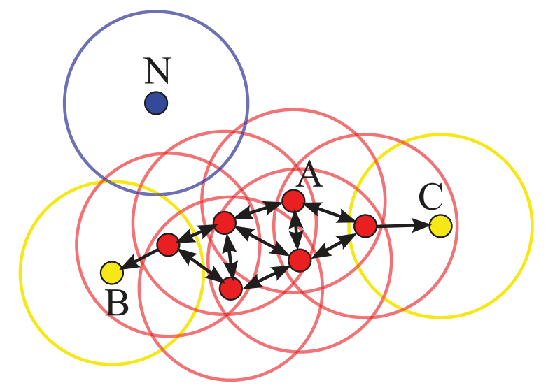

```{r setup, include=FALSE}
knitr::opts_chunk$set(echo = FALSE)
library(dplyr)
library(ggplot2)

set.seed(12345678)
n = 1000
data1 = tibble(exemple = 1, z = rbinom(n, 1, .5)) %>%
  mutate(x = rnorm(n, ifelse(z == 1, 1, 3), sd = 0.5), 
         y = rnorm(n, ifelse(z == 1, 1, 3), sd = 0.5))
# plot(data1[,c("x", "y")])

data2 = tibble(exemple = 2, z = rbinom(n, 1, .5)) %>%
  mutate(r = ifelse(z == 1, 0.5, 1.5), t = runif(n, 0, 2*pi)) %>%
  cbind(useful::pol2cart(.$r, .$t)[,c("x", "y")]) %>%
  select(-r, -t) %>%
  mutate(x = x + 2 + rnorm(n, sd = 0.15),
         y = y + 2 + rnorm(n, sd = 0.15))
# plot(data2[,c("x","y")])
```


## Introduction

Méthode classique de clustering : $k$-means

1. Association d'un point à la classe la plus proche
2. Calcul des nouveaux centres
3. Itération des étapes 1 et 2 jusqu'à convergence

**MAIS**

- Nombre de classes à définir en amont
- Tous les individus sont obligatoirement affectés à une classe, même les outliers
- Forme des classes devant être sphérique

---

## Exemples

2 exemples : 1 très classique et 1 plus difficile

```{r exemples, fig.align='center', fig.width=10}
ggplot(rbind(data1,data2), aes(x, y, color = factor(z))) +
  geom_point() +
  facet_grid(. ~ exemple, labeller = label_both) +
  theme_minimal() +
  labs(color = "Classe d'origine")
```

---

## DBSCAN

> Density-based spatial clustering of applications with noise

Martin Ester, Hans-Peter Kriegel, Jörg Sander, and Xiaowei Xu. 1996. *A density-based algorithm for discovering clusters in large spatial databases with noise*. In Proceedings of the 2nd ACM International Conference on Knowledge Discovery and Data Mining (KDD). 226–231.

- Basé sur la notion de densité
- Cherche à trouver des zones denses de points qu'on regroupera ensemble
- Regroupe de proche en proche les points
- Utilisation classiquement de la distance euclidienne (mais autre distance possible)

### 2 notions essentielles

- 2 points sont considérés comme directement connecté (*direct density reachable*) si la distance est faible
- 2 points sont considérés comme connecté (*density reachable*) s'il eiste un chemin de points directement proches entre les 2

---

## Illustration de la connection entre les points

.footnote[Source de la figure : <https://doi.org/10.1145/3068335>]
```{r fig1, fig.align="center", out.width="50%"}

```

- Cercles : rayon $\varepsilon$ 
- Flèches : *proximité* entre 2 points, basée sur $\varepsilon$ 
- En terme de proximité
  - Les points rouges sont directement connectés entre eux
  - $B$ et $C$ sont connectés entre eux (via le chemin entre les 2)
  - $N$ n'est connecté à aucun autre point


---

## Modèle 

2 paramètres à définir

- Le rayon $\varepsilon$
- Le nombre minimal de points $minPts$

Chaque individu peut être soit 

- un **core point** : point central ayant au moins $minPts - 1$ points dans un rayon $\varepsilon$ 
- un **border point** : point limite ayant moins de points dans un rayon $\varepsilon$, mais proche d'un **core point*
- un **outlier** (ou *noise*) : point ayant n'étant pas proche d'un **core point**

---

## Illustration des types de points

.footnote[Source de la figure : <https://doi.org/10.1145/3068335>]
```{r fig1bis, fig.align="center", out.width="50%"}

```

- Si on considère que le minimum de points est 4, alors
  - $A$ est un **core point** (proche d'au moins 3 autres)
  - $B$ et $C$ sont des **border points** (proche d'un seul point)
  - $N$ est considéré comme du bruit (**outlier**)

---

## Algorithme simplifié

L'algorithme proposé de base est un peu complexe à lire, il est optimisé pour fonctionner le plus rapidement possible dans le cadre d'une base de données potentiellement grande.

Voici une version simplifiée

1. Calculer le voisinage de chaque points
2. Identifier l'ensemble des *core points*
3. Regrouper les *core points* proches dans une même classe
4. Pour chaque autre point 
  - Ajouter à la classe d'un *core point* proche, si possible
  - Sinon, le définir comme un *outlier*


---

## Choix des paramètres

### $minPts$

- Détermine la taille minimale d'un cluster finalement
- Auteurs originaux proposent de le fixer à 4 pour les données en 2 dimensions
- Les auteurs d'une version généralisée proposent de le fixer à 2 $\times$ dimension des données
- Si les données sont très bruitées, ou très grandes ($n$ ou $p$), il est conseillé d'augmenter cette valeur

### $\varepsilon$

- Détermine le seuil du voisinage d'un point
- Assez complexe à définir, idéalement le plus faible possible
- Possiblement déterminé via une connaissance experte du domaine
- Heuristique proposée et basée sur $minPts$

---

## Heuristique du choix de $\varepsilon$

- Soit $k$ la valeur choisie pour $minPts$
- Soit $k\text{-}dist$ la distance d'un point à un son $k$ème plus proche voisin
- On calcule les $k\text{-}dist$ pour chaque point, qu'on trie ensuite de la plus grande à la plus petite
- On choisit $\varepsilon$ en se basant sur l'observation d'un coude dans le graphique produit

```{r heuristique,fig.align='center',fig.height=5,warning=FALSE}
s1 = apply(as.matrix(dist(data1[,c("x","y")])), 2, function(e) { 
    return (sort(e)[4])
  })
df1 = tibble(exemple = 1, kdist = sort(s1, decreasing = TRUE)) %>%
  mutate(n = row_number())
s2 = apply(as.matrix(dist(data2[,c("x","y")])), 2, function(e) { 
    return (sort(e)[4])
  })
df2 = tibble(exemple = 2, kdist = sort(s2, decreasing = TRUE)) %>%
  mutate(n = row_number())
ggplot(rbind(df1, df2), aes(n, kdist)) +
  geom_hline(data = data.frame(exemple = c(1, 2), y = c(0.18, 0.19)),
             aes(yintercept = y), alpha = 0.25) +
  geom_line(size = 1.5) +
  geom_line(data = rbind(df1 %>% mutate(diff = c(NA, diff(df1$kdist))),
                         df2 %>% mutate(diff = c(NA, diff(df2$kdist)))), 
            aes(n, -diff * 5), color = "red", alpha = .5) +
  scale_y_continuous(name = "4dist", sec.axis = sec_axis( trans=~./5, name="Différence (en rouge)")) +
  facet_grid(. ~ exemple, labeller = label_both) +
  labs(x = "") +
  theme_minimal()
```


---

## Application sur les exemples

### Sur l'exemple 1 

2 vraies classes, une très petite et plusieurs *outliers* 

```{r application1}
res1 = fpc::dbscan(data1[,c("x","y")], eps = 0.18, MinPts = 4)
res1
```

### Sur l'exemple 2

2 classes équilibrées et peu d'*outliers*

```{r application2}
res2 = fpc::dbscan(data2[,c("x","y")], eps = 0.19, MinPts = 4)
res2
```
  
  
---

## Application sur les exemples

```{r clusters, fig.align='center', fig.width=10}
ggplot(rbind(cbind(data1, cluster = res1$cluster), cbind(data2, cluster = res2$cluster)), 
       aes(x, y, color = factor(cluster))) +
  geom_point() +
  facet_grid(. ~ exemple, labeller = label_both) +
  theme_minimal() +
  labs(color = "Classe DBSCAN")
```

---

## $k$-means sur les exemples

```{r kmeans, fig.align='center', fig.width=10}
km1 = kmeans(data1[,c("x","y")], 2)
km2 = kmeans(data2[,c("x","y")], 2)

ggplot(rbind(cbind(data1, cluster = km1$cluster), cbind(data2, cluster = km2$cluster)), 
       aes(x, y, color = factor(cluster))) +
  geom_point() +
  facet_grid(. ~ exemple, labeller = label_both) +
  theme_minimal() +
  labs(color = "Classe k-means")
```


---

## Algorithmes dérivés de DBSCAN

### GDBSCAN : *Generalized* DBSCAN

Jörg Sander, Martin Ester, Hans-Peter Kriegel, and Xiaowei Xu. 1998. *Density-based clustering in spatial databases: The algorithm GDBSCAN and its applications*. Data Mining and Knowledge Discovery 2, 2 (1998), 169–194.

Extension de DBSCAN avec les éléments suivants :

- Utilisation d'une fonction prédicat potentiellement quelconque au lieu de la simple utilisation d'un seuil sur la distance
- Pondération possible des objets
- Utilisation d'un poids minimal à avoir plutôt qu'une cardinalité minimale

Utilisation pour segmenter des objets spatiaux en utilisation à la fois les informations spatiales et non-spatiales

---

## Algorithmes dérivés de DBSCAN

### DenClue

Alexander Hinneburg and Daniel A. Keim. 1998. *An efficient approach to clustering in large multimedia databases with noise*. In Proceedings of the 4th ACM International Conference on Knowledge Discovery and Data Mining (KDD). 58–65.

Utilisation sur des données en grande dimension

- Définition d'une fonction d'influence d'un point sur son environnement
  - Utilisation de fonctions paraboliques, d'ondes carrées, gaussienne...
- Densité de l'espace = somme des influences de tous les points
- Clusters définis en cherchant les attracteurs de densité, qui sont des maximums locaux de la densité
  - *Outliers* définis comme des points peu influencés par d'autres

---

## Algorithmes dérivés de DBSCAN

### OPTICS

Mihael Ankerst, Markus M. Breunig, Hans-Peter Kriegel, and Jörg Sander. 1999. *OPTICS: Ordering points to identify the clustering structure*. In Proceedings of the ACM International Conference on Management of Data (SIGMOD). 49–60.

Permettre de chercher des clusters de densité différente, un des poins faibles majeurs de DBSCAN

- Assignation d'une valeur à chaque point $p$ : distance au $MinPts$ème point le plus éloigné, si le point est un *core-point* (sinon indéfinie)
  - Notion de densité autour du *core-point* $p$
- Accessibilité entre deux points $o$ et $p$ définie par le maximum entre leur distance et la valeur précédente de $p$ (sinon indéfinie si $p$ n'est pas un *core-point*)
  - Notion de hiérarchie dans la proximité
  
---

## Algorithmes dérivés de DBSCAN

### LSDBC

Ergun Biçici and Deniz Yuret. 2007. *Locally scaled density based clustering*. In Proceedings of the 8th International Conference on Adaptive and Natural Computing Algorithms (ICANNGA). 739–748. 

Même objectif qu'OPTICS : analyser localement la densité des points

- Pour chaque point, estimation d'un seuil basé sur les $k$ plus proches voisins
  - Estimation locale de la densité
- Recherche des points les plus denses localement
  - Notion de centre d'une classe
- Etendre chaque cluster (en partant de son centre) en explorant le voisinage en gardant une certaine densité dans le cluster
  - Création de classes homogènes

---

## Algorithmes dérivés de DBSCAN

### HDBSCAN

Ricardo J. G. B. Campello, Davoud Moulavi, and Jörg Sander. 2013. *Density-based clustering based on hierarchical density estimates*. In Proceedings of the 17th Pacific-Asia Conference on Knowledge Discovery and Data Mining (PAKDD). 160–172.

Permettre la création d'une hiérarchie dans les clusters

- Suppression de la notion de *border points* (qui sont considérés comme *outliers* ici)
  - Définition plus consistente d'une classe : tous les points sont *density connected* à l'intérieur
- Peut être vu comme une amélioration de l'algo OPTICS
- Un seul paramètre nécessaire : $MinPts$
- Création d'un graphe de proximité en se basant sur l'accessibilité d'OPTICS entre deux points
  - Equivalent à un dendrogramme
- Simplification de cet arbre hiérarchique, basé sur une taille minimale de cluster


