# Introduction à `Python`

[`Python`](https://www.python.org/) est un langage de programmation en pleine croissance dans le domaine de la **Data Science** et du **Big Data**. Il a une syntaxe particulière pour certains aspects, avec des points communs tout de même avec de nombreux autres. Nous allons ici aborder les éléments suivants sur ce langage :

- les premiers éléments de syntaxe ;
- l'importation et la manipulation de données ;
- la visualisation de données.


## Eléments de base

### Utilisation en mode console

`python` est un langage scripté, dont l'exécution se fait dans une console. Dans celle-ci, il est donc possible d'exécuter les commandes les unes après les autres. Il est aussi possible (et recommander) d'écrire son script dans un fichier texte (souvent avec l'extension `.py`) et de l'exécuter via `execfile()`.

Pour accéder à l'aide d'une fonction, il existe la fonction `help()`, prenant éventuellement en paramètre une fonction directement, ou une chaîne de caractère. Si la fonction n'a pas de paramètre, elle démarre l'aide interactive.

### *Notebook*

Le module `jupyter` permet de travailler avec des *notebooks*, qui sont des documents contenant à la fois le code, les résultat et du texte. Ce document est ainsi un *notebook*. 

### Types de données

Comme tous les autres langages, `python` a plusieurs types de base possibles pour les données. En voici quelques uns. Vous pouvez exécuter les commandes dans une console pour voir le résultat.

| type | valeur | type() | commentaires |
|:-|:-:|:-|:-|
|entier | 1 |int | |
|réel | 1.234 | float | |
|chaîne de caractères | "un mot" | str | on peut utiliser indifférement `""` ou `''` |
|liste | [1, 2] | list | chaque élément peut être différent des autres |
|tuple | (1, 2) | tuple | similaire à une liste mais **constante** |
|dictionnaire | {"a": 1, "b": "deux"} | dict | ensemble de valeurs quelconques **nommées** |

Les `tuples`, `lists` et les `dicts` peuvent s'imbriquer les uns dans les autres.

```
(1, (2, 3), [4, 5], {"a": 1, "b": "deux"})
[1, [2, 3], (4, 5), {"a": 1, "b": "deux"}]
{"a": 1, "b": "deux", "c": (5, 6), "d": [7, 8]}
```

Il existe des fonctions permettant de passer d'un type à l'autre (quand cela est possible), telles que `int()`, `float()`, `str()`, `tuple()` et `list()`.

Il existe aussi des valeurs prédéfinies, telles que `True` (vrai), `False` (faux) et `None` (donnée absente).

### Création et suppression de variables

Il n'y a pas de mot-clé pour la définition d'une variable. Celle-ci est définie/créée lors de sa première affectation. Si elle n'existe pas mais qu'on essaie de l'utiliser, alors un message d'erreur apparaît. Il est aussi possible de la supprimer via la fonction `del()`.

### Type dynamique

Bien que `python` soit rigoureux dans l'évaluation des expressions (il ne fait pas de `cast` automatique - i.e. changement de type des données), le type d'une variable est dit **dynamique**. Le type d'une variable dépend uniquement de la valeur de son affectation. 

### Affichage

Comme vu précédemment, il existe la fonction `print()` permettant d'afficher du texte et/ou le contenu des variables dans la console. Celle-ci peut prendre les paramètres `sep`, qui permet d'indiquer le ou les caractères séparant les champs (un espace `" "` par défaut), et `end`, qui permet d'indiquer le caractère de fin de ligne (retour à la ligne `"\n"` par défaut).

### Opérateurs

Il existe bien évidemment tous les opérateurs classiques, tels que présentés ci-dessous.

| Type | Opérateurs |
|:-|:-|
| Arithmétiques | `+ - * / // % **` |
| Comparaisons | `> >= < <= == !=` |
| Booléens | `\| & not()` |


## Eléments de langage

### Traitement conditionnel

Comme dans tout langage, le traitement conditionnel se fait à partir d'un `if`. Une particularité de `python` est d'utiliser l'indentation (*i.e.* le décalage à droite à l'aide d'au moins une tabulation) pour définir les opérations à réaliser dans un bloc. Les clauses `elif` et `else` sont bien évidemment optionnelles.

```
if condition:
    ...
elif condition:
    ...
else:
    ...
```  

### Traitement itératif

On utilise en premier la boucle `for` dans laquelle on peut utiliser la fonction `range()` pour avoir les valeurs entre `0` (par défaut) et la valeur passée en paramètre - 1. Pour information, `i` est persistant à la boucle et garde la dernière valeur. 

```
for i in range(5):
    print(i)
```

La fonction `range()` peut prendre deux ou trois paramètres, et dans ce cas, génère la boucle entre les deux par pas de 1 (ou autre selon le troisième paramètres - celui-ci doit être cohérent par rapport aux deux premières valeurs).

Il est aussi possible d'utiliser :

- une chaîne de caractère (une itération par caractère) ;
- une `list` ou un `tuple` pour définir les valeurs à prendre ;
- un `dict`, l'itérateur prenant les valeurs des champs de celui-ci ;
- la fonction `enumerate()` sur une liste, permettant de récupérer 2 valeurs (dont 2 variables à mettre à gauche), qui seront l'indice de la position et la valeur ;
- la fonction `zip()` permettant de combiner 2 listes (élément par élément), et retournant elle aussi 2 valeurs.

Enfin, on dispose aussi de la boucle `while` qui teste en début de boucle si une condition est toujours vérifiée. 

```
while condition:
    ...
```

## Création et manipulations d'objets 

Comme indiqué, il existe différents types d'objets en `python`. Sont présentés ici des exemples de créations et de manipulations de chaînes (`str`), de `tuples`, de `list` et de dictionnaires (`dict`).

### Chaînes

Une chaîne de caractère se définit à l'aide des quotes simples (`''`) ou doubles (`""`). Par défaut, `python` présentera les chaînes avec des simples quotes. Mais en présence d'une apostrophe dans la chaîne, il faut la déclarer avec des doubles quotes. Il est possible de connaître la longueur de la chaîne avec la fonction `len()`.

Sur ces chaînes, on peut réaliser un certain nombre d'opérations classiques, telles que le changement de casse (`upper()` ou `lower()`), la mise en majuscule des premières lettres de chaque mot (`capitalize()`), la recherche d'une sous-chaîne (`find()` - première occurence), le remplacement d'une sous-chaîne (`replace()`), le dénombrement de sous-chaînes (`count()`) ou le découpage en sous-chaînes selon un caractère (`split()`). 

### Tuples

Un `tuple` en `python` est un ensemble déclaré via des `()`, composé de valeurs pas forcément de même type et éventuellement complexe, qu'il n'est pas possible de modifier. C'est une constante, une fois déclarée.

### Listes

Une `list` est aussi un ensemble déclarée via des `[]`, composé d'éléments pas forcément tous du même type et possiblement complexe. A la différence d'un tuple, une liste est modifiable.

Nous disposons sur ces listes de plusieurs fonctions tels que `reverse()` (pour inverser la liste), `sort()` (tri, avec l'option `reverse` pour le choix du tri), `pop()` (pour récupérer et supprimer le dernier élément), `append()` (pour ajouter un élément à la fin), `insert()` (pour insérer un élément dans la liste, à la position indiquée - paramètres = position suivie de la valeur), `remove()` (pour supprimer les valeurs passées en paramètre). Toutes ces fonctions modifient directement la liste sur laquelle on les applique.

Un autre moyen d'insérer une valeur, voire plusieurs, à une liste est d'utiliser l'opérateur `+`, tel qu'indiqué ci-dessous. Celui-ci permet une concaténation des deux listes en une seule. L'opérateur `*` permet lui de répéter une liste autant de fois que désiré.

Par contre, il faut faire très attention au **passage de référence** lorsqu'on copie une liste. En effet, dans le code suivant, on copie `a` dans `b`. Et en modifiant `a`, on remarque que `b` est aussi modifié. Et l'inverse est aussi vrai. Pour remédier à ce problème, on doit dupliquer la liste avec la fonction `copy()` de la liste initiale.

### Dictionnaires

Les **dictionnaires** (`dict` en `python`) sont des listes nommées (définies via des `{}`), c'est-à-dire que chaque élément a un nom (appelé aussi clé). Ces éléments ne sont pas forcément tous du même type, et peuvent aussi être complexe. Ils sont similaires (pour ne pas dire identique) à des littéraux **JSON**.

Pour accéder aux élements d'un dictionnaire, on utlise le nom du champs dont on veut la valeur entre `[]`. Il existe aussi des fonctions utiles sur ces objets, telles que `get()` (pour récupérer la valeur d'une clé), `keys()` (pour avoir la liste des clés de l'objet), `values()` (pour avoir les valeurs des clés, dans le même ordre que listé dans `keys()`), `popitem()` (pour récupérer un dictionnaire avec le dernier item, et le supprimer du dictionnaire initiale) et `pop()` (pour récupérer la valeur de l'item passé en paramètre, et le supprimer de l'élément de départ).

On peut ajouter facilement un item à un dictionnaire, en lui affectant simplement une valeur.

De même que pour les listes, il faut faire attention lors de l'affectation d'un dictionnaire à un autre. La fonction `copy()` permet donc d'obtenir une copie indépendante de l'objet initial.

### Indexation

Pour indexer une liste, un tuple, voire une chaîne de caractères, nous passons entre `[]` les valeurs de la position, avec plusieurs possibilités :

- `a[p]` : élément de `a` à la position `p` (pour rappel, 1ère position = 0)
- `a[:p]` : tous les élements de 0 à `p-1`
- `a[p:]` : tous les élements de `p` jusqu'à la fin
- `a[p:q]` :  tous les éléments de `p` à `q-1`
- `a[:]` ou `a[::]` : tous les élements
- `a[::-1]` : tous les éléments dans l'ordre inverse
- `a[p:q:r]` : les élements de `p` à `q` par pas `r` (celui-ci peut être négatif : dans ce cas `q`
 < `p`)

### Manipulation de type *comprehension*

On peut utiliser un mécanisme spécifique, appelé *list comprehension* (fonctionnant aussi sur les chaînes et les tuples), permettant de récupérer les valeurs (ou un calcul sur chaque valeur) pour tous les éléments de la liste (ou certains si on applique un `if`).


```python
a = [3, 1, 9, 7]
b = [x**2 for x in a]
print('b = ', b)

c = [x**2 for x in a if x >= 4]
print('c = ', c)
```

    b =  [9, 1, 81, 49]
    c =  [81, 49]


Le mécanisme de *list comprehension* est aussi utilisable pour créer un dictionnaire. Il faut dans ce cas indiquer deux valeus : la clé et sa valeur. Dans notre cas, la fonction `dict()` appliqué sur le résultat de la fonction `zip()` des deux listes nous permet d'avoir le même résultat.


```python
fruits = ["pommes", "bananes", "poires", "oranges"]
nombres = [5, 2, 10, 4]

d1 = {fruits[i]:nombres[i] for i in range(4)}
print('d1 = ', d1)

d2 = dict(zip(fruits, nombres))
print('d2 = ', d2)
```

    d1 =  {'pommes': 5, 'bananes': 2, 'poires': 10, 'oranges': 4}
    d2 =  {'pommes': 5, 'bananes': 2, 'poires': 10, 'oranges': 4}


## Fonctions

### Définition

L'opérateur `def` permet de créer une fonction (ou une procédure qui sera juste une fonction ne renvoyant rien). L'opérateur `return` indiquant le résultat à renvoyer le cas échéant. Comme pour un `if`, le bloc d'instructions est défini selon l'indentation. 

Il est bien évidemment possible de passer un paramètre à une fonction, sans qu'on ait à déclarer son type. 

Lorqu'il y a plus d'un paramètre, on peut faire un appel classique. Mais il est aussi possible de nommer explicitement les paramètres. Avec ce mécanisme, il est ainsi possible de les déclarer dans l'ordre que l'on veut. Mais si l'on nomme un paramètre, il est obligatoire de nommer les autres (erreur d'exécution sinon).

Il existe la possibilité de définir une valeur par défaut à un paramètre dans une fonction. Ceci permet d'appeler la fonction sans donner de valeur pour ce paramètre (la fonction utilisera la valeur par défaut donc). 

```
def f(...):
    ...
    return ...
```


Il est possible d'ajouter une condition `if` dans la fonction `lambda` avec un formalisme de type `valeurTrue if condition else valeurFalse`. Ci-après, nous calculons le carré de chaque valeur, multiplié par `-1` pour celles inférieur ou égale à 8.


```python
b = map(lambda v: v **2 if v > 8 else -(v ** 2), a)
print(list(b))
```

    [-9, -1, 81, -49]


## Manipulation de données

Nous allons utiliser dans ce TP le module `pandas` permettant la gestion de données avec Python dans un format (individus décrits par des variables) plus classique pour les méthodes statistiques. 

### Importation de données avec `pandas`

Nous allons travailler sur les données [tips](tips.csv). Vous pouvez trouver des informations ([ici](https://www.rdocumentation.org/packages/reshape2/versions/1.4.2/topics/tips)). Voici comment lire ces données dans `python` avec `read_csv()` de `pandas`.


```python
import pandas

# Lecture d'un fichier texte
tips = pandas.read_csv("tips.csv", header = 0, sep = ",")
tips.head()
```


<div>
<style scoped>
    .dataframe tbody tr th:only-of-type {
        vertical-align: middle;
    }

    .dataframe tbody tr th {
        vertical-align: top;
    }

    .dataframe thead th {
        text-align: right;
    }
</style>
<table border="1" class="dataframe">
  <thead>
    <tr style="text-align: right;">
      <th></th>
      <th>total_bill</th>
      <th>tip</th>
      <th>sex</th>
      <th>smoker</th>
      <th>day</th>
      <th>time</th>
      <th>size</th>
    </tr>
  </thead>
  <tbody>
    <tr>
      <th>0</th>
      <td>16.99</td>
      <td>1.01</td>
      <td>Female</td>
      <td>No</td>
      <td>Sun</td>
      <td>Dinner</td>
      <td>2</td>
    </tr>
    <tr>
      <th>1</th>
      <td>10.34</td>
      <td>1.66</td>
      <td>Male</td>
      <td>No</td>
      <td>Sun</td>
      <td>Dinner</td>
      <td>3</td>
    </tr>
    <tr>
      <th>2</th>
      <td>21.01</td>
      <td>3.50</td>
      <td>Male</td>
      <td>No</td>
      <td>Sun</td>
      <td>Dinner</td>
      <td>3</td>
    </tr>
    <tr>
      <th>3</th>
      <td>23.68</td>
      <td>3.31</td>
      <td>Male</td>
      <td>No</td>
      <td>Sun</td>
      <td>Dinner</td>
      <td>2</td>
    </tr>
    <tr>
      <th>4</th>
      <td>24.59</td>
      <td>3.61</td>
      <td>Female</td>
      <td>No</td>
      <td>Sun</td>
      <td>Dinner</td>
      <td>4</td>
    </tr>
  </tbody>
</table>
</div>


Sur ces données, il est bien évidemment possible de voir quelques informations classiques.


```python
# Type de la variable
type(tips)
```


    pandas.core.frame.DataFrame


```python
# nombre de lignes et de colonnes de la table
tips.shape
```


    (244, 7)


```python
# nombre de valeurs présentes dans chaque colonne
tips.count()
```


    total_bill    244
    tip           244
    sex           244
    smoker        244
    day           244
    time          244
    size          244
    dtype: int64


```python
# détail complet de la table
tips.info()
```

    <class 'pandas.core.frame.DataFrame'>
    RangeIndex: 244 entries, 0 to 243
    Data columns (total 7 columns):
     #   Column      Non-Null Count  Dtype  
    ---  ------      --------------  -----  
     0   total_bill  244 non-null    float64
     1   tip         244 non-null    float64
     2   sex         244 non-null    object 
     3   smoker      244 non-null    object 
     4   day         244 non-null    object 
     5   time        244 non-null    object 
     6   size        244 non-null    int64  
    dtypes: float64(2), int64(1), object(4)
    memory usage: 13.5+ KB


```python
# nom des colonnes (au format liste)
list(tips.columns)
```


    ['total_bill', 'tip', 'sex', 'smoker', 'day', 'time', 'size']


```python
# idem
list(tips)
```


    ['total_bill', 'tip', 'sex', 'smoker', 'day', 'time', 'size']


### Manipulation *à la SQL*

Une fois qu'on a des données, la première chose qu'on souhaite savoir faire souvent, est de pouvoir manipuler ces données; C'est-à-dire réaliser les opérations classiques en bases de données, à savoir :

- Restriction
- Projection
- Tri et limitation des résultats
- Ajout de nouvelles variables (via des valeurs ou un calcul à partir des autres)
- Agrégats
- Jointures

Il y a bien évidmement d'autres opérations possibles, spécifiques ou non à Python.

*Note Bene* : certaines fonctions renvoient un nouvel objet qu'il faudra donc stocker dans une variable (nouvelle ou la même). Par contre, d'autres fonctions modifient directement l'objet en question.

### Restriction

Première étape essentielle, cela consiste à sélectionner un certain nombre de lignes de la table, selon une condition sur les valeurs des variables. Il exite pour cela la fonction `query()` prenant en paramètre une chaîne de caractères contenant la condition à appliquer. Voici quelques exemples de condition. Il y a bien évidemment beaucoup d'autres fonctions existantes, en particuliers pour les chaînes.


```python
tips.query('total_bill > 48') # que les factures de plus de 48$
```


<div>
<style scoped>
    .dataframe tbody tr th:only-of-type {
        vertical-align: middle;
    }

    .dataframe tbody tr th {
        vertical-align: top;
    }

    .dataframe thead th {
        text-align: right;
    }
</style>
<table border="1" class="dataframe">
  <thead>
    <tr style="text-align: right;">
      <th></th>
      <th>total_bill</th>
      <th>tip</th>
      <th>sex</th>
      <th>smoker</th>
      <th>day</th>
      <th>time</th>
      <th>size</th>
    </tr>
  </thead>
  <tbody>
    <tr>
      <th>59</th>
      <td>48.27</td>
      <td>6.73</td>
      <td>Male</td>
      <td>No</td>
      <td>Sat</td>
      <td>Dinner</td>
      <td>4</td>
    </tr>
    <tr>
      <th>156</th>
      <td>48.17</td>
      <td>5.00</td>
      <td>Male</td>
      <td>No</td>
      <td>Sun</td>
      <td>Dinner</td>
      <td>6</td>
    </tr>
    <tr>
      <th>170</th>
      <td>50.81</td>
      <td>10.00</td>
      <td>Male</td>
      <td>Yes</td>
      <td>Sat</td>
      <td>Dinner</td>
      <td>3</td>
    </tr>
    <tr>
      <th>212</th>
      <td>48.33</td>
      <td>9.00</td>
      <td>Male</td>
      <td>No</td>
      <td>Sat</td>
      <td>Dinner</td>
      <td>4</td>
    </tr>
  </tbody>
</table>
</div>


```python
tips.query('day in ("Sat", "Sun")') # que les factures ayant eu lieu un samedi ou un dimanche
```


<div>
<style scoped>
    .dataframe tbody tr th:only-of-type {
        vertical-align: middle;
    }

    .dataframe tbody tr th {
        vertical-align: top;
    }

    .dataframe thead th {
        text-align: right;
    }
</style>
<table border="1" class="dataframe">
  <thead>
    <tr style="text-align: right;">
      <th></th>
      <th>total_bill</th>
      <th>tip</th>
      <th>sex</th>
      <th>smoker</th>
      <th>day</th>
      <th>time</th>
      <th>size</th>
    </tr>
  </thead>
  <tbody>
    <tr>
      <th>0</th>
      <td>16.99</td>
      <td>1.01</td>
      <td>Female</td>
      <td>No</td>
      <td>Sun</td>
      <td>Dinner</td>
      <td>2</td>
    </tr>
    <tr>
      <th>1</th>
      <td>10.34</td>
      <td>1.66</td>
      <td>Male</td>
      <td>No</td>
      <td>Sun</td>
      <td>Dinner</td>
      <td>3</td>
    </tr>
    <tr>
      <th>2</th>
      <td>21.01</td>
      <td>3.50</td>
      <td>Male</td>
      <td>No</td>
      <td>Sun</td>
      <td>Dinner</td>
      <td>3</td>
    </tr>
    <tr>
      <th>3</th>
      <td>23.68</td>
      <td>3.31</td>
      <td>Male</td>
      <td>No</td>
      <td>Sun</td>
      <td>Dinner</td>
      <td>2</td>
    </tr>
    <tr>
      <th>4</th>
      <td>24.59</td>
      <td>3.61</td>
      <td>Female</td>
      <td>No</td>
      <td>Sun</td>
      <td>Dinner</td>
      <td>4</td>
    </tr>
    <tr>
      <th>...</th>
      <td>...</td>
      <td>...</td>
      <td>...</td>
      <td>...</td>
      <td>...</td>
      <td>...</td>
      <td>...</td>
    </tr>
    <tr>
      <th>238</th>
      <td>35.83</td>
      <td>4.67</td>
      <td>Female</td>
      <td>No</td>
      <td>Sat</td>
      <td>Dinner</td>
      <td>3</td>
    </tr>
    <tr>
      <th>239</th>
      <td>29.03</td>
      <td>5.92</td>
      <td>Male</td>
      <td>No</td>
      <td>Sat</td>
      <td>Dinner</td>
      <td>3</td>
    </tr>
    <tr>
      <th>240</th>
      <td>27.18</td>
      <td>2.00</td>
      <td>Female</td>
      <td>Yes</td>
      <td>Sat</td>
      <td>Dinner</td>
      <td>2</td>
    </tr>
    <tr>
      <th>241</th>
      <td>22.67</td>
      <td>2.00</td>
      <td>Male</td>
      <td>Yes</td>
      <td>Sat</td>
      <td>Dinner</td>
      <td>2</td>
    </tr>
    <tr>
      <th>242</th>
      <td>17.82</td>
      <td>1.75</td>
      <td>Male</td>
      <td>No</td>
      <td>Sat</td>
      <td>Dinner</td>
      <td>2</td>
    </tr>
  </tbody>
</table>
<p>163 rows × 7 columns</p>
</div>


```python
tips.query('size > 4 & sex == "Male"') # que les tables de plus de 4 convives et payées par un homme
```


<div>
<style scoped>
    .dataframe tbody tr th:only-of-type {
        vertical-align: middle;
    }

    .dataframe tbody tr th {
        vertical-align: top;
    }

    .dataframe thead th {
        text-align: right;
    }
</style>
<table border="1" class="dataframe">
  <thead>
    <tr style="text-align: right;">
      <th></th>
      <th>total_bill</th>
      <th>tip</th>
      <th>sex</th>
      <th>smoker</th>
      <th>day</th>
      <th>time</th>
      <th>size</th>
    </tr>
  </thead>
  <tbody>
    <tr>
      <th>141</th>
      <td>34.30</td>
      <td>6.7</td>
      <td>Male</td>
      <td>No</td>
      <td>Thur</td>
      <td>Lunch</td>
      <td>6</td>
    </tr>
    <tr>
      <th>142</th>
      <td>41.19</td>
      <td>5.0</td>
      <td>Male</td>
      <td>No</td>
      <td>Thur</td>
      <td>Lunch</td>
      <td>5</td>
    </tr>
    <tr>
      <th>156</th>
      <td>48.17</td>
      <td>5.0</td>
      <td>Male</td>
      <td>No</td>
      <td>Sun</td>
      <td>Dinner</td>
      <td>6</td>
    </tr>
    <tr>
      <th>185</th>
      <td>20.69</td>
      <td>5.0</td>
      <td>Male</td>
      <td>No</td>
      <td>Sun</td>
      <td>Dinner</td>
      <td>5</td>
    </tr>
    <tr>
      <th>187</th>
      <td>30.46</td>
      <td>2.0</td>
      <td>Male</td>
      <td>Yes</td>
      <td>Sun</td>
      <td>Dinner</td>
      <td>5</td>
    </tr>
    <tr>
      <th>216</th>
      <td>28.15</td>
      <td>3.0</td>
      <td>Male</td>
      <td>Yes</td>
      <td>Sat</td>
      <td>Dinner</td>
      <td>5</td>
    </tr>
  </tbody>
</table>
</div>


### Projection

Deuxième étape, celle-ci consiste tout simple à sélectionner certaines colonnes de la tables. En python, on utilise la fonction `filter()`. Il faut noter que celle-ci peut aussi fonctionner sur les lignes (quand celles-ci ont un index - pas vu ici).


```python
tips.filter(["sex", "total_bill"])
```


<div>
<style scoped>
    .dataframe tbody tr th:only-of-type {
        vertical-align: middle;
    }

    .dataframe tbody tr th {
        vertical-align: top;
    }

    .dataframe thead th {
        text-align: right;
    }
</style>
<table border="1" class="dataframe">
  <thead>
    <tr style="text-align: right;">
      <th></th>
      <th>sex</th>
      <th>total_bill</th>
    </tr>
  </thead>
  <tbody>
    <tr>
      <th>0</th>
      <td>Female</td>
      <td>16.99</td>
    </tr>
    <tr>
      <th>1</th>
      <td>Male</td>
      <td>10.34</td>
    </tr>
    <tr>
      <th>2</th>
      <td>Male</td>
      <td>21.01</td>
    </tr>
    <tr>
      <th>3</th>
      <td>Male</td>
      <td>23.68</td>
    </tr>
    <tr>
      <th>4</th>
      <td>Female</td>
      <td>24.59</td>
    </tr>
    <tr>
      <th>...</th>
      <td>...</td>
      <td>...</td>
    </tr>
    <tr>
      <th>239</th>
      <td>Male</td>
      <td>29.03</td>
    </tr>
    <tr>
      <th>240</th>
      <td>Female</td>
      <td>27.18</td>
    </tr>
    <tr>
      <th>241</th>
      <td>Male</td>
      <td>22.67</td>
    </tr>
    <tr>
      <th>242</th>
      <td>Male</td>
      <td>17.82</td>
    </tr>
    <tr>
      <th>243</th>
      <td>Female</td>
      <td>18.78</td>
    </tr>
  </tbody>
</table>
<p>244 rows × 2 columns</p>
</div>


Quand on fait ce genre d'opérations, il est courant que nous nous retrouvions avec des lignes identiques. Pour supprimer les doublons, nous utilisons la fonction `drop_duplicates()` sur le résultat.


```python
tips.filter(["sex", "smoker"]).drop_duplicates()
```


<div>
<style scoped>
    .dataframe tbody tr th:only-of-type {
        vertical-align: middle;
    }

    .dataframe tbody tr th {
        vertical-align: top;
    }

    .dataframe thead th {
        text-align: right;
    }
</style>
<table border="1" class="dataframe">
  <thead>
    <tr style="text-align: right;">
      <th></th>
      <th>sex</th>
      <th>smoker</th>
    </tr>
  </thead>
  <tbody>
    <tr>
      <th>0</th>
      <td>Female</td>
      <td>No</td>
    </tr>
    <tr>
      <th>1</th>
      <td>Male</td>
      <td>No</td>
    </tr>
    <tr>
      <th>56</th>
      <td>Male</td>
      <td>Yes</td>
    </tr>
    <tr>
      <th>67</th>
      <td>Female</td>
      <td>Yes</td>
    </tr>
  </tbody>
</table>
</div>


On peut aussi utiliser le formalisme `dataframe.colonne` pour accéder aux valeurs d'une seule colonne


```python
tips.total_bill
```


    0      16.99
    1      10.34
    2      21.01
    3      23.68
    4      24.59
           ...  
    239    29.03
    240    27.18
    241    22.67
    242    17.82
    243    18.78
    Name: total_bill, Length: 244, dtype: float64


### Tri et limitation des résultats

Pour le tri, il existe la fonction `sort_values()`, dans laquelle on indique la ou les variables à utiliser pour le tri. Si on veut un tri descendant, on modifie la valeur du paramètre `ascending` (`True` par défaut).


```python
tips.sort_values(by = "total_bill")
```


<div>
<style scoped>
    .dataframe tbody tr th:only-of-type {
        vertical-align: middle;
    }

    .dataframe tbody tr th {
        vertical-align: top;
    }

    .dataframe thead th {
        text-align: right;
    }
</style>
<table border="1" class="dataframe">
  <thead>
    <tr style="text-align: right;">
      <th></th>
      <th>total_bill</th>
      <th>tip</th>
      <th>sex</th>
      <th>smoker</th>
      <th>day</th>
      <th>time</th>
      <th>size</th>
    </tr>
  </thead>
  <tbody>
    <tr>
      <th>67</th>
      <td>3.07</td>
      <td>1.00</td>
      <td>Female</td>
      <td>Yes</td>
      <td>Sat</td>
      <td>Dinner</td>
      <td>1</td>
    </tr>
    <tr>
      <th>92</th>
      <td>5.75</td>
      <td>1.00</td>
      <td>Female</td>
      <td>Yes</td>
      <td>Fri</td>
      <td>Dinner</td>
      <td>2</td>
    </tr>
    <tr>
      <th>111</th>
      <td>7.25</td>
      <td>1.00</td>
      <td>Female</td>
      <td>No</td>
      <td>Sat</td>
      <td>Dinner</td>
      <td>1</td>
    </tr>
    <tr>
      <th>172</th>
      <td>7.25</td>
      <td>5.15</td>
      <td>Male</td>
      <td>Yes</td>
      <td>Sun</td>
      <td>Dinner</td>
      <td>2</td>
    </tr>
    <tr>
      <th>149</th>
      <td>7.51</td>
      <td>2.00</td>
      <td>Male</td>
      <td>No</td>
      <td>Thur</td>
      <td>Lunch</td>
      <td>2</td>
    </tr>
    <tr>
      <th>...</th>
      <td>...</td>
      <td>...</td>
      <td>...</td>
      <td>...</td>
      <td>...</td>
      <td>...</td>
      <td>...</td>
    </tr>
    <tr>
      <th>182</th>
      <td>45.35</td>
      <td>3.50</td>
      <td>Male</td>
      <td>Yes</td>
      <td>Sun</td>
      <td>Dinner</td>
      <td>3</td>
    </tr>
    <tr>
      <th>156</th>
      <td>48.17</td>
      <td>5.00</td>
      <td>Male</td>
      <td>No</td>
      <td>Sun</td>
      <td>Dinner</td>
      <td>6</td>
    </tr>
    <tr>
      <th>59</th>
      <td>48.27</td>
      <td>6.73</td>
      <td>Male</td>
      <td>No</td>
      <td>Sat</td>
      <td>Dinner</td>
      <td>4</td>
    </tr>
    <tr>
      <th>212</th>
      <td>48.33</td>
      <td>9.00</td>
      <td>Male</td>
      <td>No</td>
      <td>Sat</td>
      <td>Dinner</td>
      <td>4</td>
    </tr>
    <tr>
      <th>170</th>
      <td>50.81</td>
      <td>10.00</td>
      <td>Male</td>
      <td>Yes</td>
      <td>Sat</td>
      <td>Dinner</td>
      <td>3</td>
    </tr>
  </tbody>
</table>
<p>244 rows × 7 columns</p>
</div>


```python
tips.sort_values(by = "total_bill", ascending = False)
```


<div>
<style scoped>
    .dataframe tbody tr th:only-of-type {
        vertical-align: middle;
    }

    .dataframe tbody tr th {
        vertical-align: top;
    }

    .dataframe thead th {
        text-align: right;
    }
</style>
<table border="1" class="dataframe">
  <thead>
    <tr style="text-align: right;">
      <th></th>
      <th>total_bill</th>
      <th>tip</th>
      <th>sex</th>
      <th>smoker</th>
      <th>day</th>
      <th>time</th>
      <th>size</th>
    </tr>
  </thead>
  <tbody>
    <tr>
      <th>170</th>
      <td>50.81</td>
      <td>10.00</td>
      <td>Male</td>
      <td>Yes</td>
      <td>Sat</td>
      <td>Dinner</td>
      <td>3</td>
    </tr>
    <tr>
      <th>212</th>
      <td>48.33</td>
      <td>9.00</td>
      <td>Male</td>
      <td>No</td>
      <td>Sat</td>
      <td>Dinner</td>
      <td>4</td>
    </tr>
    <tr>
      <th>59</th>
      <td>48.27</td>
      <td>6.73</td>
      <td>Male</td>
      <td>No</td>
      <td>Sat</td>
      <td>Dinner</td>
      <td>4</td>
    </tr>
    <tr>
      <th>156</th>
      <td>48.17</td>
      <td>5.00</td>
      <td>Male</td>
      <td>No</td>
      <td>Sun</td>
      <td>Dinner</td>
      <td>6</td>
    </tr>
    <tr>
      <th>182</th>
      <td>45.35</td>
      <td>3.50</td>
      <td>Male</td>
      <td>Yes</td>
      <td>Sun</td>
      <td>Dinner</td>
      <td>3</td>
    </tr>
    <tr>
      <th>...</th>
      <td>...</td>
      <td>...</td>
      <td>...</td>
      <td>...</td>
      <td>...</td>
      <td>...</td>
      <td>...</td>
    </tr>
    <tr>
      <th>149</th>
      <td>7.51</td>
      <td>2.00</td>
      <td>Male</td>
      <td>No</td>
      <td>Thur</td>
      <td>Lunch</td>
      <td>2</td>
    </tr>
    <tr>
      <th>111</th>
      <td>7.25</td>
      <td>1.00</td>
      <td>Female</td>
      <td>No</td>
      <td>Sat</td>
      <td>Dinner</td>
      <td>1</td>
    </tr>
    <tr>
      <th>172</th>
      <td>7.25</td>
      <td>5.15</td>
      <td>Male</td>
      <td>Yes</td>
      <td>Sun</td>
      <td>Dinner</td>
      <td>2</td>
    </tr>
    <tr>
      <th>92</th>
      <td>5.75</td>
      <td>1.00</td>
      <td>Female</td>
      <td>Yes</td>
      <td>Fri</td>
      <td>Dinner</td>
      <td>2</td>
    </tr>
    <tr>
      <th>67</th>
      <td>3.07</td>
      <td>1.00</td>
      <td>Female</td>
      <td>Yes</td>
      <td>Sat</td>
      <td>Dinner</td>
      <td>1</td>
    </tr>
  </tbody>
</table>
<p>244 rows × 7 columns</p>
</div>


Pour se limiter aux premières lignes (respectivement les dernières), on utilise la fonction `head()` (resp. `tail()`), qui affiche par défaut 5 lignes. Cette valeur est bien évidemment modifiable, comme vu ci-après.


```python
tips.head(10) # 5 premières lignes par défaut
```


<div>
<style scoped>
    .dataframe tbody tr th:only-of-type {
        vertical-align: middle;
    }

    .dataframe tbody tr th {
        vertical-align: top;
    }

    .dataframe thead th {
        text-align: right;
    }
</style>
<table border="1" class="dataframe">
  <thead>
    <tr style="text-align: right;">
      <th></th>
      <th>total_bill</th>
      <th>tip</th>
      <th>sex</th>
      <th>smoker</th>
      <th>day</th>
      <th>time</th>
      <th>size</th>
    </tr>
  </thead>
  <tbody>
    <tr>
      <th>0</th>
      <td>16.99</td>
      <td>1.01</td>
      <td>Female</td>
      <td>No</td>
      <td>Sun</td>
      <td>Dinner</td>
      <td>2</td>
    </tr>
    <tr>
      <th>1</th>
      <td>10.34</td>
      <td>1.66</td>
      <td>Male</td>
      <td>No</td>
      <td>Sun</td>
      <td>Dinner</td>
      <td>3</td>
    </tr>
    <tr>
      <th>2</th>
      <td>21.01</td>
      <td>3.50</td>
      <td>Male</td>
      <td>No</td>
      <td>Sun</td>
      <td>Dinner</td>
      <td>3</td>
    </tr>
    <tr>
      <th>3</th>
      <td>23.68</td>
      <td>3.31</td>
      <td>Male</td>
      <td>No</td>
      <td>Sun</td>
      <td>Dinner</td>
      <td>2</td>
    </tr>
    <tr>
      <th>4</th>
      <td>24.59</td>
      <td>3.61</td>
      <td>Female</td>
      <td>No</td>
      <td>Sun</td>
      <td>Dinner</td>
      <td>4</td>
    </tr>
    <tr>
      <th>5</th>
      <td>25.29</td>
      <td>4.71</td>
      <td>Male</td>
      <td>No</td>
      <td>Sun</td>
      <td>Dinner</td>
      <td>4</td>
    </tr>
    <tr>
      <th>6</th>
      <td>8.77</td>
      <td>2.00</td>
      <td>Male</td>
      <td>No</td>
      <td>Sun</td>
      <td>Dinner</td>
      <td>2</td>
    </tr>
    <tr>
      <th>7</th>
      <td>26.88</td>
      <td>3.12</td>
      <td>Male</td>
      <td>No</td>
      <td>Sun</td>
      <td>Dinner</td>
      <td>4</td>
    </tr>
    <tr>
      <th>8</th>
      <td>15.04</td>
      <td>1.96</td>
      <td>Male</td>
      <td>No</td>
      <td>Sun</td>
      <td>Dinner</td>
      <td>2</td>
    </tr>
    <tr>
      <th>9</th>
      <td>14.78</td>
      <td>3.23</td>
      <td>Male</td>
      <td>No</td>
      <td>Sun</td>
      <td>Dinner</td>
      <td>2</td>
    </tr>
  </tbody>
</table>
</div>


```python
tips.tail(3) # 5 dernières lignes par défaut
```


<div>
<style scoped>
    .dataframe tbody tr th:only-of-type {
        vertical-align: middle;
    }

    .dataframe tbody tr th {
        vertical-align: top;
    }

    .dataframe thead th {
        text-align: right;
    }
</style>
<table border="1" class="dataframe">
  <thead>
    <tr style="text-align: right;">
      <th></th>
      <th>total_bill</th>
      <th>tip</th>
      <th>sex</th>
      <th>smoker</th>
      <th>day</th>
      <th>time</th>
      <th>size</th>
    </tr>
  </thead>
  <tbody>
    <tr>
      <th>241</th>
      <td>22.67</td>
      <td>2.00</td>
      <td>Male</td>
      <td>Yes</td>
      <td>Sat</td>
      <td>Dinner</td>
      <td>2</td>
    </tr>
    <tr>
      <th>242</th>
      <td>17.82</td>
      <td>1.75</td>
      <td>Male</td>
      <td>No</td>
      <td>Sat</td>
      <td>Dinner</td>
      <td>2</td>
    </tr>
    <tr>
      <th>243</th>
      <td>18.78</td>
      <td>3.00</td>
      <td>Female</td>
      <td>No</td>
      <td>Thur</td>
      <td>Dinner</td>
      <td>2</td>
    </tr>
  </tbody>
</table>
</div>


### Ajout de nouvelles variables

Il y a 2 possibilités ici :

- à partir de valeurs déjà connues
- à partir d'un calcul basé sur les autres variables

A partir de valeurs, soit vous en fournissez autant que de lignes, soit une seule qui sera donc dupliquée à toutes les lignes


```python
tips['n_row'] = range(244)
tips['nouv'] = "nouvelle valeur"
tips.head()
```


<div>
<style scoped>
    .dataframe tbody tr th:only-of-type {
        vertical-align: middle;
    }

    .dataframe tbody tr th {
        vertical-align: top;
    }

    .dataframe thead th {
        text-align: right;
    }
</style>
<table border="1" class="dataframe">
  <thead>
    <tr style="text-align: right;">
      <th></th>
      <th>total_bill</th>
      <th>tip</th>
      <th>sex</th>
      <th>smoker</th>
      <th>day</th>
      <th>time</th>
      <th>size</th>
      <th>n_row</th>
      <th>nouv</th>
    </tr>
  </thead>
  <tbody>
    <tr>
      <th>0</th>
      <td>16.99</td>
      <td>1.01</td>
      <td>Female</td>
      <td>No</td>
      <td>Sun</td>
      <td>Dinner</td>
      <td>2</td>
      <td>0</td>
      <td>nouvelle valeur</td>
    </tr>
    <tr>
      <th>1</th>
      <td>10.34</td>
      <td>1.66</td>
      <td>Male</td>
      <td>No</td>
      <td>Sun</td>
      <td>Dinner</td>
      <td>3</td>
      <td>1</td>
      <td>nouvelle valeur</td>
    </tr>
    <tr>
      <th>2</th>
      <td>21.01</td>
      <td>3.50</td>
      <td>Male</td>
      <td>No</td>
      <td>Sun</td>
      <td>Dinner</td>
      <td>3</td>
      <td>2</td>
      <td>nouvelle valeur</td>
    </tr>
    <tr>
      <th>3</th>
      <td>23.68</td>
      <td>3.31</td>
      <td>Male</td>
      <td>No</td>
      <td>Sun</td>
      <td>Dinner</td>
      <td>2</td>
      <td>3</td>
      <td>nouvelle valeur</td>
    </tr>
    <tr>
      <th>4</th>
      <td>24.59</td>
      <td>3.61</td>
      <td>Female</td>
      <td>No</td>
      <td>Sun</td>
      <td>Dinner</td>
      <td>4</td>
      <td>4</td>
      <td>nouvelle valeur</td>
    </tr>
  </tbody>
</table>
</div>


Bien évidemment, on souhaite généralement faire un calcul à partir des autres variables. Ceci peut se faire avec la fonction `assign()`.

Notez l'utilisation du mot-clé `lambda` pour la définition d'une fonction anonyme.


```python
# attention ici, l.size fait référence à la taille de l, car c'est un mot clé de python
tips.assign(per_person = lambda l: round(l.total_bill / l['size'], 2)) 
```


<div>
<style scoped>
    .dataframe tbody tr th:only-of-type {
        vertical-align: middle;
    }

    .dataframe tbody tr th {
        vertical-align: top;
    }

    .dataframe thead th {
        text-align: right;
    }
</style>
<table border="1" class="dataframe">
  <thead>
    <tr style="text-align: right;">
      <th></th>
      <th>total_bill</th>
      <th>tip</th>
      <th>sex</th>
      <th>smoker</th>
      <th>day</th>
      <th>time</th>
      <th>size</th>
      <th>n_row</th>
      <th>nouv</th>
      <th>per_person</th>
    </tr>
  </thead>
  <tbody>
    <tr>
      <th>0</th>
      <td>16.99</td>
      <td>1.01</td>
      <td>Female</td>
      <td>No</td>
      <td>Sun</td>
      <td>Dinner</td>
      <td>2</td>
      <td>0</td>
      <td>nouvelle valeur</td>
      <td>8.49</td>
    </tr>
    <tr>
      <th>1</th>
      <td>10.34</td>
      <td>1.66</td>
      <td>Male</td>
      <td>No</td>
      <td>Sun</td>
      <td>Dinner</td>
      <td>3</td>
      <td>1</td>
      <td>nouvelle valeur</td>
      <td>3.45</td>
    </tr>
    <tr>
      <th>2</th>
      <td>21.01</td>
      <td>3.50</td>
      <td>Male</td>
      <td>No</td>
      <td>Sun</td>
      <td>Dinner</td>
      <td>3</td>
      <td>2</td>
      <td>nouvelle valeur</td>
      <td>7.00</td>
    </tr>
    <tr>
      <th>3</th>
      <td>23.68</td>
      <td>3.31</td>
      <td>Male</td>
      <td>No</td>
      <td>Sun</td>
      <td>Dinner</td>
      <td>2</td>
      <td>3</td>
      <td>nouvelle valeur</td>
      <td>11.84</td>
    </tr>
    <tr>
      <th>4</th>
      <td>24.59</td>
      <td>3.61</td>
      <td>Female</td>
      <td>No</td>
      <td>Sun</td>
      <td>Dinner</td>
      <td>4</td>
      <td>4</td>
      <td>nouvelle valeur</td>
      <td>6.15</td>
    </tr>
    <tr>
      <th>...</th>
      <td>...</td>
      <td>...</td>
      <td>...</td>
      <td>...</td>
      <td>...</td>
      <td>...</td>
      <td>...</td>
      <td>...</td>
      <td>...</td>
      <td>...</td>
    </tr>
    <tr>
      <th>239</th>
      <td>29.03</td>
      <td>5.92</td>
      <td>Male</td>
      <td>No</td>
      <td>Sat</td>
      <td>Dinner</td>
      <td>3</td>
      <td>239</td>
      <td>nouvelle valeur</td>
      <td>9.68</td>
    </tr>
    <tr>
      <th>240</th>
      <td>27.18</td>
      <td>2.00</td>
      <td>Female</td>
      <td>Yes</td>
      <td>Sat</td>
      <td>Dinner</td>
      <td>2</td>
      <td>240</td>
      <td>nouvelle valeur</td>
      <td>13.59</td>
    </tr>
    <tr>
      <th>241</th>
      <td>22.67</td>
      <td>2.00</td>
      <td>Male</td>
      <td>Yes</td>
      <td>Sat</td>
      <td>Dinner</td>
      <td>2</td>
      <td>241</td>
      <td>nouvelle valeur</td>
      <td>11.34</td>
    </tr>
    <tr>
      <th>242</th>
      <td>17.82</td>
      <td>1.75</td>
      <td>Male</td>
      <td>No</td>
      <td>Sat</td>
      <td>Dinner</td>
      <td>2</td>
      <td>242</td>
      <td>nouvelle valeur</td>
      <td>8.91</td>
    </tr>
    <tr>
      <th>243</th>
      <td>18.78</td>
      <td>3.00</td>
      <td>Female</td>
      <td>No</td>
      <td>Thur</td>
      <td>Dinner</td>
      <td>2</td>
      <td>243</td>
      <td>nouvelle valeur</td>
      <td>9.39</td>
    </tr>
  </tbody>
</table>
<p>244 rows × 10 columns</p>
</div>


### Agrégat

Le calcul d'un agrégat permet de calculer une statistique de base (dénombrement, somme, moyenne, minimum, maximum - rarement autre chose) sur un tableau de données. On peut soit calculer globalement, soit pour chaque modalité d'une variable (voire chaque couple de modalités de plusieurs variables). 

Pour le faire globalement, on utilise la fonction `aggregate()` (ou `agg()`).


```python
tips.filter(["total_bill", "tip", "size"]).aggregate(['count', "mean"])
```


<div>
<style scoped>
    .dataframe tbody tr th:only-of-type {
        vertical-align: middle;
    }

    .dataframe tbody tr th {
        vertical-align: top;
    }

    .dataframe thead th {
        text-align: right;
    }
</style>
<table border="1" class="dataframe">
  <thead>
    <tr style="text-align: right;">
      <th></th>
      <th>total_bill</th>
      <th>tip</th>
      <th>size</th>
    </tr>
  </thead>
  <tbody>
    <tr>
      <th>count</th>
      <td>244.000000</td>
      <td>244.000000</td>
      <td>244.000000</td>
    </tr>
    <tr>
      <th>mean</th>
      <td>19.785943</td>
      <td>2.998279</td>
      <td>2.569672</td>
    </tr>
  </tbody>
</table>
</div>


Pour le faire pour chaque modalité d'une variable, on utilise la fonction `groupby()` en plus. Si on ne réalise qu'un seul calcul, on a directement les fonctions associées.


```python
tips.filter(["sex", "total_bill", "tip", "size"]).groupby("sex").mean()
```


<div>
<style scoped>
    .dataframe tbody tr th:only-of-type {
        vertical-align: middle;
    }

    .dataframe tbody tr th {
        vertical-align: top;
    }

    .dataframe thead th {
        text-align: right;
    }
</style>
<table border="1" class="dataframe">
  <thead>
    <tr style="text-align: right;">
      <th></th>
      <th>total_bill</th>
      <th>tip</th>
      <th>size</th>
    </tr>
    <tr>
      <th>sex</th>
      <th></th>
      <th></th>
      <th></th>
    </tr>
  </thead>
  <tbody>
    <tr>
      <th>Female</th>
      <td>18.056897</td>
      <td>2.833448</td>
      <td>2.459770</td>
    </tr>
    <tr>
      <th>Male</th>
      <td>20.744076</td>
      <td>3.089618</td>
      <td>2.630573</td>
    </tr>
  </tbody>
</table>
</div>


On peut aussi définir plusieurs opérateurs d'agrégations.


```python
tips.filter(["sex", "total_bill", "tip", "size"]).groupby("sex").aggregate(['count', "mean"])
```


<div>
<style scoped>
    .dataframe tbody tr th:only-of-type {
        vertical-align: middle;
    }

    .dataframe tbody tr th {
        vertical-align: top;
    }

    .dataframe thead tr th {
        text-align: left;
    }

    .dataframe thead tr:last-of-type th {
        text-align: right;
    }
</style>
<table border="1" class="dataframe">
  <thead>
    <tr>
      <th></th>
      <th colspan="2" halign="left">total_bill</th>
      <th colspan="2" halign="left">tip</th>
      <th colspan="2" halign="left">size</th>
    </tr>
    <tr>
      <th></th>
      <th>count</th>
      <th>mean</th>
      <th>count</th>
      <th>mean</th>
      <th>count</th>
      <th>mean</th>
    </tr>
    <tr>
      <th>sex</th>
      <th></th>
      <th></th>
      <th></th>
      <th></th>
      <th></th>
      <th></th>
    </tr>
  </thead>
  <tbody>
    <tr>
      <th>Female</th>
      <td>87</td>
      <td>18.056897</td>
      <td>87</td>
      <td>2.833448</td>
      <td>87</td>
      <td>2.459770</td>
    </tr>
    <tr>
      <th>Male</th>
      <td>157</td>
      <td>20.744076</td>
      <td>157</td>
      <td>3.089618</td>
      <td>157</td>
      <td>2.630573</td>
    </tr>
  </tbody>
</table>
</div>


Si on a plusieurs variables dans le regroupement, le calcul se fait donc pour chaque couple de modalités de celles-ci.


```python
tips.filter(["sex", "smoker", "total_bill", "tip", "size"]).groupby(["sex", "smoker"]).mean()
```


<div>
<style scoped>
    .dataframe tbody tr th:only-of-type {
        vertical-align: middle;
    }

    .dataframe tbody tr th {
        vertical-align: top;
    }

    .dataframe thead th {
        text-align: right;
    }
</style>
<table border="1" class="dataframe">
  <thead>
    <tr style="text-align: right;">
      <th></th>
      <th></th>
      <th>total_bill</th>
      <th>tip</th>
      <th>size</th>
    </tr>
    <tr>
      <th>sex</th>
      <th>smoker</th>
      <th></th>
      <th></th>
      <th></th>
    </tr>
  </thead>
  <tbody>
    <tr>
      <th rowspan="2" valign="top">Female</th>
      <th>No</th>
      <td>18.105185</td>
      <td>2.773519</td>
      <td>2.592593</td>
    </tr>
    <tr>
      <th>Yes</th>
      <td>17.977879</td>
      <td>2.931515</td>
      <td>2.242424</td>
    </tr>
    <tr>
      <th rowspan="2" valign="top">Male</th>
      <th>No</th>
      <td>19.791237</td>
      <td>3.113402</td>
      <td>2.711340</td>
    </tr>
    <tr>
      <th>Yes</th>
      <td>22.284500</td>
      <td>3.051167</td>
      <td>2.500000</td>
    </tr>
  </tbody>
</table>
</div>


## Visualisation de données

Le module `seaborn` est basé sur matplotlib. Il faut donc ajouter la ligne %matplotlib inline dans un notebook, pour pouvoir voir les graphiques.

Ce module contient toutes les fonctions directement, l'importation est donc assez simple.


```python
import seaborn

%matplotlib inline
```

### Variable quantitative

La fonction `displot()` nous permet de réaliser les graphiques de distribution d'une variable quantitative. Par défaut, elle réaliser un histogramme.


```python
seaborn.displot(data = tips, x = "total_bill")
```


    <seaborn.axisgrid.FacetGrid at 0x1061193d0>


    

    


C'est la fonction `boxplot()` qui nous permet de réaliser une boîte à moustache (soit verticale en mettant la variable en `y`, soit horizontale en la mettant en `x`).


```python
seaborn.boxplot(data = tips, y = "total_bill")
```


    <AxesSubplot:ylabel='total_bill'>


    

    


```python
seaborn.boxplot(data = tips, x = "total_bill")
```


    <AxesSubplot:xlabel='total_bill'>


    
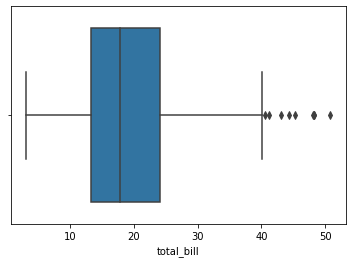
    


Une autre représentation possible est obtenue avec la fonction `pointplot()`, qui représente la moyenne et l'écarte-type, avec le choix entre vertical (y) ou horizontal (x).


```python
seaborn.pointplot(data = tips, y = "total_bill")
```


    <AxesSubplot:ylabel='total_bill'>


    
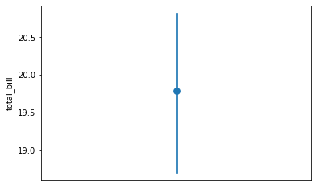
    


```python
seaborn.pointplot(data = tips, x = "total_bill")
```


    <AxesSubplot:xlabel='total_bill'>


    
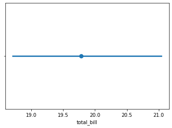
    


Un autre graphique possible est celui obtenu avec `violinplot()`, qui représente la densité d'une variable, toujours avec le choix vertical/horizontale (y/x).


```python
seaborn.violinplot(data = tips, y = "total_bill")
```


    <AxesSubplot:ylabel='total_bill'>


    
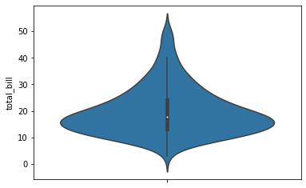
    


```python
seaborn.violinplot(data = tips, x = "total_bill")
```


    <AxesSubplot:xlabel='total_bill'>


    

    


Enfin, il est possible de représenter toutes les valeurs sur un pseudo nuage de points. Avec `striplot()` dont l'option `jitter` a été activée, les points sont aléatoirement répartis sur l'axe des $x$  (si on utilise y - inversement sinon).


```python
seaborn.stripplot(data = tips, y = "total_bill", jitter = True)
```


    <AxesSubplot:ylabel='total_bill'>


    
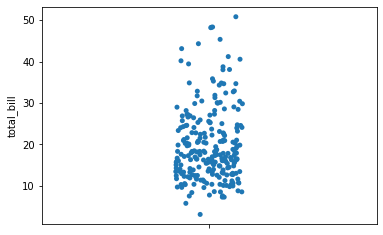
    


```python
seaborn.stripplot(data = tips, x = "total_bill", jitter = True)
```


    <AxesSubplot:xlabel='total_bill'>


    
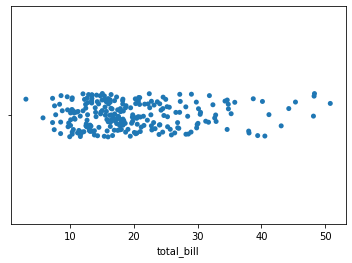
    


### Variable qualitative

Le diagramme en barres en effectifs est obtenu via la fonction `countplot()`. Il est soit horizontal (avec la variable en `x`), soit vertical (en `y`).


```python
seaborn.countplot(data = tips, x = "sex")
```


    <AxesSubplot:xlabel='sex', ylabel='count'>


    

    


```python
seaborn.countplot(data = tips, y = "sex")
```


    <AxesSubplot:xlabel='count', ylabel='sex'>


    
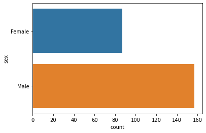
    


Pour avoir la version en pourcentages (ou en proportions) de ce graphique, nous devons utiliser la fonction `barplot()`, sur la table de proportions calculée avant. Cette fonction réalise un calcul (moyenne par défaut) sur une variable (ici `freq`) en fonction des modalités d'une autre variable (`sex` ici donc).


```python
t = pandas.crosstab(tips.sex, "freq", normalize=True)
t = t.assign(sex = t.index, freq = 100 * t.freq)
seaborn.barplot(data = t, x = "sex", y = "freq")
```


    <AxesSubplot:xlabel='sex', ylabel='freq'>


    
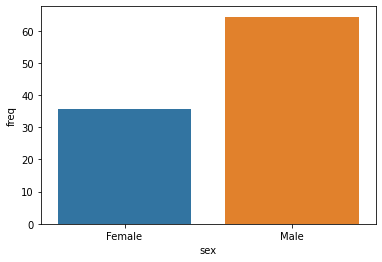
    


Pour réaliser un diagramme en barres empilées, il faudra le créer soi-même. Nous ne verrons pas ici.

### Var quantitative - Var quantitative

Pour réaliser le nuage de points, on utilise la fonction `jointplot()`. Elle a l'avantage d'ajouter par défaut les histogrammes de chaque variable. Elle réalise par défaut le nuage de points simple (scatter). 


```python
seaborn.jointplot(data = tips, x = "total_bill", y = "tip")
```


    <seaborn.axisgrid.JointGrid at 0x134a6e700>


    

    


En choississant le type `reg` avec le paramètre `kind`, on obtient en plus l'ajustement linéaire de la variable en y par celle en x.


```python
seaborn.jointplot(data = tips, x = "total_bill", y = "tip", kind = "reg")
```


    <seaborn.axisgrid.JointGrid at 0x134b663d0>


    
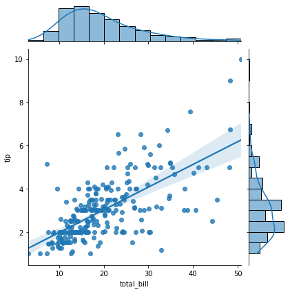
    


Si on souhaite ne pas avoir les distributions marginales, la fonction` regplot()` nous permet de réaliser le nuage de points avec ou sans ajustement (paramètre `fit_reg`).


```python
seaborn.regplot(data = tips, x = "total_bill", y = "tip")
```


    <AxesSubplot:xlabel='total_bill', ylabel='tip'>


    
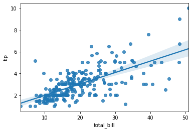
    


```python
seaborn.regplot(data = tips, x = "total_bill", y = "tip", fit_reg = False)
```


    <AxesSubplot:xlabel='total_bill', ylabel='tip'>


    
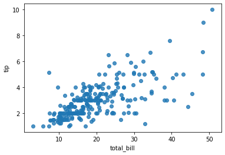
    


```python
seaborn.regplot(data = tips, x = "total_bill", y = "tip", scatter = False)
```


    <AxesSubplot:xlabel='total_bill', ylabel='tip'>


    
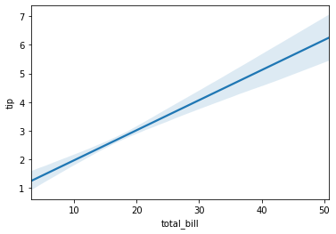
    


Il est possible d'obtenir directement tous les nuages de points 2 à 2, avec la fonction `pairplot()`. Le paramètre `vars` permet de sélectionner certaines variables. Par défaut, la fonction utilise toutes les variables numériques.


```python
seaborn.pairplot(data = tips, vars = ["total_bill", "tip", "size"])
```


    <seaborn.axisgrid.PairGrid at 0x134e1a9a0>


    

    


### Var qualitative - Var qualitative

Pour obtenir le diagramme en barres séparées (en effectifs), nous utilisons la fonction `countplot()` avec le paramètre `hue` pour indiquer la variable servant de *coloriage* aux barres.


```python
seaborn.countplot(data = tips, x = "sex", hue = "smoker")
```


    <AxesSubplot:xlabel='sex', ylabel='count'>


    
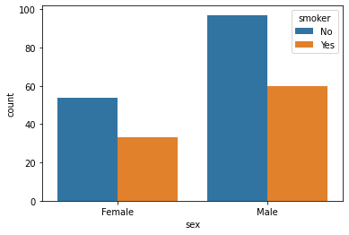
    


### Var quantitative - Var qualitative

Pour réaliser les boîtes à moustaches de la variable quantitative pour chaque modalité de la variable qualitative, on utilise la fonction `catplot()`.


```python
seaborn.catplot(data = tips, x = "sex", y = "total_bill", kind = "box")
```


    <seaborn.axisgrid.FacetGrid at 0x1352af790>


    

    


On peut aussi représenter la moyenne et l'écart-type à l'aide du graphique `pointplot` (qu'on réalise ici via `catplot()`).


```python
seaborn.catplot(data = tips, x = "sex", y = "total_bill", kind = "point", join = False)
```


    <seaborn.axisgrid.FacetGrid at 0x1351f5b80>


    
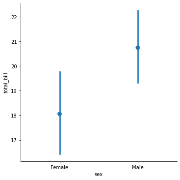
    


### Plusieurs variables quantitatives

Calcul de la corrélation ici pour chaque couple de variables.


```python
d = tips.filter(["total_bill", "tip", "size"]).corr()
d.round(2)
```


<div>
<style scoped>
    .dataframe tbody tr th:only-of-type {
        vertical-align: middle;
    }

    .dataframe tbody tr th {
        vertical-align: top;
    }

    .dataframe thead th {
        text-align: right;
    }
</style>
<table border="1" class="dataframe">
  <thead>
    <tr style="text-align: right;">
      <th></th>
      <th>total_bill</th>
      <th>tip</th>
      <th>size</th>
    </tr>
  </thead>
  <tbody>
    <tr>
      <th>total_bill</th>
      <td>1.00</td>
      <td>0.68</td>
      <td>0.60</td>
    </tr>
    <tr>
      <th>tip</th>
      <td>0.68</td>
      <td>1.00</td>
      <td>0.49</td>
    </tr>
    <tr>
      <th>size</th>
      <td>0.60</td>
      <td>0.49</td>
      <td>1.00</td>
    </tr>
  </tbody>
</table>
</div>


```python
d.style.background_gradient(cmap = "Blues")
```


<style  type="text/css" >
#T_6b2f7_row0_col0,#T_6b2f7_row1_col1,#T_6b2f7_row2_col2{
            background-color:  #08306b;
            color:  #f1f1f1;
        }#T_6b2f7_row0_col1{
            background-color:  #a1cbe2;
            color:  #000000;
        }#T_6b2f7_row0_col2{
            background-color:  #cde0f1;
            color:  #000000;
        }#T_6b2f7_row1_col0{
            background-color:  #d1e2f3;
            color:  #000000;
        }#T_6b2f7_row1_col2,#T_6b2f7_row2_col0,#T_6b2f7_row2_col1{
            background-color:  #f7fbff;
            color:  #000000;
        }</style><table id="T_6b2f7_" ><thead>    <tr>        <th class="blank level0" ></th>        <th class="col_heading level0 col0" >total_bill</th>        <th class="col_heading level0 col1" >tip</th>        <th class="col_heading level0 col2" >size</th>    </tr></thead><tbody>
                <tr>
                        <th id="T_6b2f7_level0_row0" class="row_heading level0 row0" >total_bill</th>
                        <td id="T_6b2f7_row0_col0" class="data row0 col0" >1.000000</td>
                        <td id="T_6b2f7_row0_col1" class="data row0 col1" >0.675734</td>
                        <td id="T_6b2f7_row0_col2" class="data row0 col2" >0.598315</td>
            </tr>
            <tr>
                        <th id="T_6b2f7_level0_row1" class="row_heading level0 row1" >tip</th>
                        <td id="T_6b2f7_row1_col0" class="data row1 col0" >0.675734</td>
                        <td id="T_6b2f7_row1_col1" class="data row1 col1" >1.000000</td>
                        <td id="T_6b2f7_row1_col2" class="data row1 col2" >0.489299</td>
            </tr>
            <tr>
                        <th id="T_6b2f7_level0_row2" class="row_heading level0 row2" >size</th>
                        <td id="T_6b2f7_row2_col0" class="data row2 col0" >0.598315</td>
                        <td id="T_6b2f7_row2_col1" class="data row2 col1" >0.489299</td>
                        <td id="T_6b2f7_row2_col2" class="data row2 col2" >1.000000</td>
            </tr>
    </tbody></table>


```python
seaborn.heatmap(d, annot = True, cmap = "Blues")
```


    <AxesSubplot:>


    
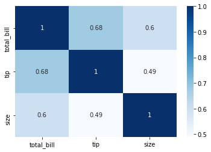
    


### Compléments

Il est bien évidemment possible de personnaliser le graphique de différentes façons, dont certains sont présentées ci-dessous. On accède aux fonctions de personnalisation soit via des paramètres de la fonction, soit via l'objet renvoyé par la fonction utilisée pour créer le graphique, soit via le module directement. Dans ce cas, ce sont des changements qui affecteront aussi les graphiques futurs.

- `suptitle` dans `fig` : titre global
- `set_axis_labels` : titre des axes
- `palette` : choix d'une palette de couleurs
- `size` et `aspect` : hauteur et ratio entre hauteur et largeur, pour chaque facette (une seule ici)


```python
seaborn.set_style("white")
p = seaborn.catplot(data = tips, x = "size", y = "tip", hue = "sex", 
                    kind = "box", 
                    palette = "Set2", height = 4, aspect = 2)
p.fig.suptitle("Taille et pourboire en fonction du sexe")
p.set_axis_labels("Nombre de convives", "Pourboire")
```


    <seaborn.axisgrid.FacetGrid at 0x1356cc8b0>


    
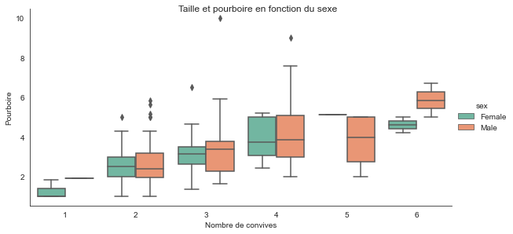
    


## Données Velib

Nous allons travailler sur des données Velib en temps réel, qui sont disponibles sur [cette page](https://opendata.paris.fr/explore/dataset/velib-disponibilite-en-temps-reel/).

Pour cela, nous avons besoin du module `requests`, tel qu'utilisé ci-dessous.


```python
import requests

url = "https://opendata.paris.fr/api/records/1.0/search/"
par = dict(
    dataset = "velib-disponibilite-en-temps-reel"
)
r = requests.get(url = url, params = par).json()
```


```python
r['nhits']
```


    1433


```python
r['parameters']
```


    {'dataset': 'velib-disponibilite-en-temps-reel',
     'rows': 10,
     'start': 0,
     'format': 'json',
     'timezone': 'UTC'}


```python
len(r['records'])
```


    10


Dans ce résultat, nous voyons qu'il y a 1433 enregistrements à récupérer (`nhits`), et que nous en avons récupérer ici uniquement 10 (`parameters.rows`). Pour avoir tous les résultats, on doit faire comme ci-dessous


```python
par = dict(
    dataset = "velib-disponibilite-en-temps-reel",
    rows = r['nhits']
)
r_tous = requests.get(url = url, params = par).json()
len(r_tous['records'])
```


    1433


Ce qui nous intéresse ici est le champ `records`, qui contient les enregistrements de 10 premières stations donc. En le transformant en data frame avec `pandas`, on voit que le tableau obtenu n'est pas très lisible.


```python
records = r['records']
df = pandas.DataFrame(records)

df
```


<div>
<style scoped>
    .dataframe tbody tr th:only-of-type {
        vertical-align: middle;
    }

    .dataframe tbody tr th {
        vertical-align: top;
    }

    .dataframe thead th {
        text-align: right;
    }
</style>
<table border="1" class="dataframe">
  <thead>
    <tr style="text-align: right;">
      <th></th>
      <th>datasetid</th>
      <th>recordid</th>
      <th>fields</th>
      <th>geometry</th>
      <th>record_timestamp</th>
    </tr>
  </thead>
  <tbody>
    <tr>
      <th>0</th>
      <td>velib-disponibilite-en-temps-reel</td>
      <td>360f6fe801ab1ad15396b068070ee850c3c305be</td>
      <td>{'name': 'Benjamin Godard - Victor Hugo', 'sta...</td>
      <td>{'type': 'Point', 'coordinates': [2.275725, 48...</td>
      <td>2022-04-04T09:25:00.577Z</td>
    </tr>
    <tr>
      <th>1</th>
      <td>velib-disponibilite-en-temps-reel</td>
      <td>a6d5b531286535d865d8f3f02203e289ea7204a1</td>
      <td>{'name': 'Charonne - Robert et Sonia Delauney'...</td>
      <td>{'type': 'Point', 'coordinates': [2.3925706744...</td>
      <td>2022-04-04T09:25:00.577Z</td>
    </tr>
    <tr>
      <th>2</th>
      <td>velib-disponibilite-en-temps-reel</td>
      <td>513930d73fee8ccf9f54fd126d0c6bbcc66c8273</td>
      <td>{'name': 'Harpe - Saint-Germain', 'stationcode...</td>
      <td>{'type': 'Point', 'coordinates': [2.3436703160...</td>
      <td>2022-04-04T09:25:00.577Z</td>
    </tr>
    <tr>
      <th>3</th>
      <td>velib-disponibilite-en-temps-reel</td>
      <td>70f2f9a25e05c24034ef04e7f270dab7530a95c7</td>
      <td>{'name': 'Alibert - Jemmapes', 'stationcode': ...</td>
      <td>{'type': 'Point', 'coordinates': [2.3661044619...</td>
      <td>2022-04-04T09:25:00.577Z</td>
    </tr>
    <tr>
      <th>4</th>
      <td>velib-disponibilite-en-temps-reel</td>
      <td>34bd58327354bedc8a72fb73ad19aed89a5a6caa</td>
      <td>{'name': 'Le Brun - Gobelins', 'stationcode': ...</td>
      <td>{'type': 'Point', 'coordinates': [2.3534681351...</td>
      <td>2022-04-04T09:25:00.577Z</td>
    </tr>
    <tr>
      <th>5</th>
      <td>velib-disponibilite-en-temps-reel</td>
      <td>cf6f49e14f57a1da7bbbfa8492ce1ed8ae327ea0</td>
      <td>{'name': 'Lacépède - Monge', 'stationcode': '5...</td>
      <td>{'type': 'Point', 'coordinates': [2.3519663885...</td>
      <td>2022-04-04T09:25:00.577Z</td>
    </tr>
    <tr>
      <th>6</th>
      <td>velib-disponibilite-en-temps-reel</td>
      <td>0fd65dcab7b38e9ff29c41438219b7c238a4d47f</td>
      <td>{'name': 'Beaux-Arts - Bonaparte', 'stationcod...</td>
      <td>{'type': 'Point', 'coordinates': [2.3348518833...</td>
      <td>2022-04-04T09:25:00.577Z</td>
    </tr>
    <tr>
      <th>7</th>
      <td>velib-disponibilite-en-temps-reel</td>
      <td>004331dc0c6fce0286f1ad78949477aa480a5403</td>
      <td>{'name': 'Grande Armée - Brunel', 'stationcode...</td>
      <td>{'type': 'Point', 'coordinates': [2.288124, 48...</td>
      <td>2022-04-04T09:25:00.577Z</td>
    </tr>
    <tr>
      <th>8</th>
      <td>velib-disponibilite-en-temps-reel</td>
      <td>a76a28b768f2e0e6db67cb7731dcd858bcbac6e8</td>
      <td>{'name': 'Guersant - Gouvion-Saint-Cyr', 'stat...</td>
      <td>{'type': 'Point', 'coordinates': [2.2876673708...</td>
      <td>2022-04-04T09:25:00.577Z</td>
    </tr>
    <tr>
      <th>9</th>
      <td>velib-disponibilite-en-temps-reel</td>
      <td>b6ed45dc385eae0c10e3918fbd5f5c19ac9f85d1</td>
      <td>{'name': 'Invalides - Duroc', 'stationcode': '...</td>
      <td>{'type': 'Point', 'coordinates': [2.3161920905...</td>
      <td>2022-04-04T09:25:00.577Z</td>
    </tr>
  </tbody>
</table>
</div>


On souhaite finalement se restreindre qu'aux informations contenues dans le champs `fields`. Pour cela, on utilise le mécanisme de *list comprehension*.


```python
pandas.DataFrame([s['fields'] for s in records])
```


<div>
<style scoped>
    .dataframe tbody tr th:only-of-type {
        vertical-align: middle;
    }

    .dataframe tbody tr th {
        vertical-align: top;
    }

    .dataframe thead th {
        text-align: right;
    }
</style>
<table border="1" class="dataframe">
  <thead>
    <tr style="text-align: right;">
      <th></th>
      <th>name</th>
      <th>stationcode</th>
      <th>ebike</th>
      <th>mechanical</th>
      <th>coordonnees_geo</th>
      <th>duedate</th>
      <th>numbikesavailable</th>
      <th>numdocksavailable</th>
      <th>capacity</th>
      <th>is_renting</th>
      <th>is_installed</th>
      <th>nom_arrondissement_communes</th>
      <th>is_returning</th>
    </tr>
  </thead>
  <tbody>
    <tr>
      <th>0</th>
      <td>Benjamin Godard - Victor Hugo</td>
      <td>16107</td>
      <td>15</td>
      <td>15</td>
      <td>[48.865983, 2.275725]</td>
      <td>2022-04-04T09:13:04+00:00</td>
      <td>30</td>
      <td>3</td>
      <td>35</td>
      <td>OUI</td>
      <td>OUI</td>
      <td>Paris</td>
      <td>OUI</td>
    </tr>
    <tr>
      <th>1</th>
      <td>Charonne - Robert et Sonia Delauney</td>
      <td>11104</td>
      <td>1</td>
      <td>0</td>
      <td>[48.85590755596891, 2.3925706744194035]</td>
      <td>2022-04-04T09:09:11+00:00</td>
      <td>1</td>
      <td>19</td>
      <td>20</td>
      <td>OUI</td>
      <td>OUI</td>
      <td>Paris</td>
      <td>OUI</td>
    </tr>
    <tr>
      <th>2</th>
      <td>Harpe - Saint-Germain</td>
      <td>5001</td>
      <td>6</td>
      <td>20</td>
      <td>[48.85151881501689, 2.343670316040516]</td>
      <td>2022-04-04T09:12:57+00:00</td>
      <td>26</td>
      <td>18</td>
      <td>45</td>
      <td>OUI</td>
      <td>OUI</td>
      <td>Paris</td>
      <td>OUI</td>
    </tr>
    <tr>
      <th>3</th>
      <td>Alibert - Jemmapes</td>
      <td>10013</td>
      <td>4</td>
      <td>6</td>
      <td>[48.8710440519842, 2.366104461987773]</td>
      <td>2022-04-04T09:10:47+00:00</td>
      <td>10</td>
      <td>47</td>
      <td>60</td>
      <td>OUI</td>
      <td>OUI</td>
      <td>Paris</td>
      <td>OUI</td>
    </tr>
    <tr>
      <th>4</th>
      <td>Le Brun - Gobelins</td>
      <td>13007</td>
      <td>4</td>
      <td>7</td>
      <td>[48.835092787823875, 2.353468135133752]</td>
      <td>2022-04-04T09:13:32+00:00</td>
      <td>11</td>
      <td>37</td>
      <td>48</td>
      <td>OUI</td>
      <td>OUI</td>
      <td>Paris</td>
      <td>OUI</td>
    </tr>
    <tr>
      <th>5</th>
      <td>Lacépède - Monge</td>
      <td>5110</td>
      <td>1</td>
      <td>0</td>
      <td>[48.84389286531899, 2.3519663885235786]</td>
      <td>2022-04-04T09:12:22+00:00</td>
      <td>1</td>
      <td>21</td>
      <td>23</td>
      <td>OUI</td>
      <td>OUI</td>
      <td>Paris</td>
      <td>OUI</td>
    </tr>
    <tr>
      <th>6</th>
      <td>Beaux-Arts - Bonaparte</td>
      <td>6021</td>
      <td>4</td>
      <td>15</td>
      <td>[48.856451985395786, 2.334851883351803]</td>
      <td>2022-04-04T09:13:46+00:00</td>
      <td>19</td>
      <td>1</td>
      <td>20</td>
      <td>OUI</td>
      <td>OUI</td>
      <td>Paris</td>
      <td>OUI</td>
    </tr>
    <tr>
      <th>7</th>
      <td>Grande Armée - Brunel</td>
      <td>17038</td>
      <td>10</td>
      <td>1</td>
      <td>[48.876116, 2.288124]</td>
      <td>2022-04-04T09:12:14+00:00</td>
      <td>11</td>
      <td>38</td>
      <td>62</td>
      <td>OUI</td>
      <td>OUI</td>
      <td>Paris</td>
      <td>OUI</td>
    </tr>
    <tr>
      <th>8</th>
      <td>Guersant - Gouvion-Saint-Cyr</td>
      <td>17041</td>
      <td>3</td>
      <td>2</td>
      <td>[48.88287775178599, 2.287667370814871]</td>
      <td>2022-04-04T09:12:48+00:00</td>
      <td>5</td>
      <td>30</td>
      <td>36</td>
      <td>OUI</td>
      <td>OUI</td>
      <td>Paris</td>
      <td>OUI</td>
    </tr>
    <tr>
      <th>9</th>
      <td>Invalides - Duroc</td>
      <td>7001</td>
      <td>8</td>
      <td>1</td>
      <td>[48.8477924732952, 2.3161920905113225]</td>
      <td>2022-04-04T09:13:30+00:00</td>
      <td>9</td>
      <td>20</td>
      <td>29</td>
      <td>OUI</td>
      <td>OUI</td>
      <td>Paris</td>
      <td>OUI</td>
    </tr>
  </tbody>
</table>
</div>


### Carte avec `leaflet`

Dans ce TP, nous allons aussi aborder l'aspect cartographie sous `python` avec le package `folium` (à installer donc). L'idée sera d'ajouter à un fond de carte des formes de couleurs, en fonction d'une information tierce. Le package `folium` est une interface entre `python` et la librairie [`leaflet`](https://leafletjs.com/). Elle s'utilise très facilement, comme nous pouvons le voir ci-dessous pour la création d'une carte. Les coordonnées indiquées sont la latitude et la longitude de Paris.


```python
import folium
centre = [48.87, 2.35]
paris = folium.Map(location = centre, zoom_start = 12)
paris
```


<div style="width:100%;"><div style="position:relative;width:100%;height:0;padding-bottom:60%;"><span style="color:#565656">Make this Notebook Trusted to load map: File -> Trust Notebook</span><iframe src="about:blank" style="position:absolute;width:100%;height:100%;left:0;top:0;border:none !important;" data-html=%3C%21DOCTYPE%20html%3E%0A%3Chead%3E%20%20%20%20%0A%20%20%20%20%3Cmeta%20http-equiv%3D%22content-type%22%20content%3D%22text/html%3B%20charset%3DUTF-8%22%20/%3E%0A%20%20%20%20%0A%20%20%20%20%20%20%20%20%3Cscript%3E%0A%20%20%20%20%20%20%20%20%20%20%20%20L_NO_TOUCH%20%3D%20false%3B%0A%20%20%20%20%20%20%20%20%20%20%20%20L_DISABLE_3D%20%3D%20false%3B%0A%20%20%20%20%20%20%20%20%3C/script%3E%0A%20%20%20%20%0A%20%20%20%20%3Cstyle%3Ehtml%2C%20body%20%7Bwidth%3A%20100%25%3Bheight%3A%20100%25%3Bmargin%3A%200%3Bpadding%3A%200%3B%7D%3C/style%3E%0A%20%20%20%20%3Cstyle%3E%23map%20%7Bposition%3Aabsolute%3Btop%3A0%3Bbottom%3A0%3Bright%3A0%3Bleft%3A0%3B%7D%3C/style%3E%0A%20%20%20%20%3Cscript%20src%3D%22https%3A//cdn.jsdelivr.net/npm/leaflet%401.6.0/dist/leaflet.js%22%3E%3C/script%3E%0A%20%20%20%20%3Cscript%20src%3D%22https%3A//code.jquery.com/jquery-1.12.4.min.js%22%3E%3C/script%3E%0A%20%20%20%20%3Cscript%20src%3D%22https%3A//maxcdn.bootstrapcdn.com/bootstrap/3.2.0/js/bootstrap.min.js%22%3E%3C/script%3E%0A%20%20%20%20%3Cscript%20src%3D%22https%3A//cdnjs.cloudflare.com/ajax/libs/Leaflet.awesome-markers/2.0.2/leaflet.awesome-markers.js%22%3E%3C/script%3E%0A%20%20%20%20%3Clink%20rel%3D%22stylesheet%22%20href%3D%22https%3A//cdn.jsdelivr.net/npm/leaflet%401.6.0/dist/leaflet.css%22/%3E%0A%20%20%20%20%3Clink%20rel%3D%22stylesheet%22%20href%3D%22https%3A//maxcdn.bootstrapcdn.com/bootstrap/3.2.0/css/bootstrap.min.css%22/%3E%0A%20%20%20%20%3Clink%20rel%3D%22stylesheet%22%20href%3D%22https%3A//maxcdn.bootstrapcdn.com/bootstrap/3.2.0/css/bootstrap-theme.min.css%22/%3E%0A%20%20%20%20%3Clink%20rel%3D%22stylesheet%22%20href%3D%22https%3A//maxcdn.bootstrapcdn.com/font-awesome/4.6.3/css/font-awesome.min.css%22/%3E%0A%20%20%20%20%3Clink%20rel%3D%22stylesheet%22%20href%3D%22https%3A//cdnjs.cloudflare.com/ajax/libs/Leaflet.awesome-markers/2.0.2/leaflet.awesome-markers.css%22/%3E%0A%20%20%20%20%3Clink%20rel%3D%22stylesheet%22%20href%3D%22https%3A//cdn.jsdelivr.net/gh/python-visualization/folium/folium/templates/leaflet.awesome.rotate.min.css%22/%3E%0A%20%20%20%20%0A%20%20%20%20%20%20%20%20%20%20%20%20%3Cmeta%20name%3D%22viewport%22%20content%3D%22width%3Ddevice-width%2C%0A%20%20%20%20%20%20%20%20%20%20%20%20%20%20%20%20initial-scale%3D1.0%2C%20maximum-scale%3D1.0%2C%20user-scalable%3Dno%22%20/%3E%0A%20%20%20%20%20%20%20%20%20%20%20%20%3Cstyle%3E%0A%20%20%20%20%20%20%20%20%20%20%20%20%20%20%20%20%23map_29a3f28b6df24689a0d207cf83fa4c95%20%7B%0A%20%20%20%20%20%20%20%20%20%20%20%20%20%20%20%20%20%20%20%20position%3A%20relative%3B%0A%20%20%20%20%20%20%20%20%20%20%20%20%20%20%20%20%20%20%20%20width%3A%20100.0%25%3B%0A%20%20%20%20%20%20%20%20%20%20%20%20%20%20%20%20%20%20%20%20height%3A%20100.0%25%3B%0A%20%20%20%20%20%20%20%20%20%20%20%20%20%20%20%20%20%20%20%20left%3A%200.0%25%3B%0A%20%20%20%20%20%20%20%20%20%20%20%20%20%20%20%20%20%20%20%20top%3A%200.0%25%3B%0A%20%20%20%20%20%20%20%20%20%20%20%20%20%20%20%20%7D%0A%20%20%20%20%20%20%20%20%20%20%20%20%3C/style%3E%0A%20%20%20%20%20%20%20%20%0A%3C/head%3E%0A%3Cbody%3E%20%20%20%20%0A%20%20%20%20%0A%20%20%20%20%20%20%20%20%20%20%20%20%3Cdiv%20class%3D%22folium-map%22%20id%3D%22map_29a3f28b6df24689a0d207cf83fa4c95%22%20%3E%3C/div%3E%0A%20%20%20%20%20%20%20%20%0A%3C/body%3E%0A%3Cscript%3E%20%20%20%20%0A%20%20%20%20%0A%20%20%20%20%20%20%20%20%20%20%20%20var%20map_29a3f28b6df24689a0d207cf83fa4c95%20%3D%20L.map%28%0A%20%20%20%20%20%20%20%20%20%20%20%20%20%20%20%20%22map_29a3f28b6df24689a0d207cf83fa4c95%22%2C%0A%20%20%20%20%20%20%20%20%20%20%20%20%20%20%20%20%7B%0A%20%20%20%20%20%20%20%20%20%20%20%20%20%20%20%20%20%20%20%20center%3A%20%5B48.87%2C%202.35%5D%2C%0A%20%20%20%20%20%20%20%20%20%20%20%20%20%20%20%20%20%20%20%20crs%3A%20L.CRS.EPSG3857%2C%0A%20%20%20%20%20%20%20%20%20%20%20%20%20%20%20%20%20%20%20%20zoom%3A%2012%2C%0A%20%20%20%20%20%20%20%20%20%20%20%20%20%20%20%20%20%20%20%20zoomControl%3A%20true%2C%0A%20%20%20%20%20%20%20%20%20%20%20%20%20%20%20%20%20%20%20%20preferCanvas%3A%20false%2C%0A%20%20%20%20%20%20%20%20%20%20%20%20%20%20%20%20%7D%0A%20%20%20%20%20%20%20%20%20%20%20%20%29%3B%0A%0A%20%20%20%20%20%20%20%20%20%20%20%20%0A%0A%20%20%20%20%20%20%20%20%0A%20%20%20%20%0A%20%20%20%20%20%20%20%20%20%20%20%20var%20tile_layer_0e6d4c33b0db4e84856f6afcc75a6cc4%20%3D%20L.tileLayer%28%0A%20%20%20%20%20%20%20%20%20%20%20%20%20%20%20%20%22https%3A//%7Bs%7D.tile.openstreetmap.org/%7Bz%7D/%7Bx%7D/%7By%7D.png%22%2C%0A%20%20%20%20%20%20%20%20%20%20%20%20%20%20%20%20%7B%22attribution%22%3A%20%22Data%20by%20%5Cu0026copy%3B%20%5Cu003ca%20href%3D%5C%22http%3A//openstreetmap.org%5C%22%5Cu003eOpenStreetMap%5Cu003c/a%5Cu003e%2C%20under%20%5Cu003ca%20href%3D%5C%22http%3A//www.openstreetmap.org/copyright%5C%22%5Cu003eODbL%5Cu003c/a%5Cu003e.%22%2C%20%22detectRetina%22%3A%20false%2C%20%22maxNativeZoom%22%3A%2018%2C%20%22maxZoom%22%3A%2018%2C%20%22minZoom%22%3A%200%2C%20%22noWrap%22%3A%20false%2C%20%22opacity%22%3A%201%2C%20%22subdomains%22%3A%20%22abc%22%2C%20%22tms%22%3A%20false%7D%0A%20%20%20%20%20%20%20%20%20%20%20%20%29.addTo%28map_29a3f28b6df24689a0d207cf83fa4c95%29%3B%0A%20%20%20%20%20%20%20%20%0A%3C/script%3E onload="this.contentDocument.open();this.contentDocument.write(    decodeURIComponent(this.getAttribute('data-html')));this.contentDocument.close();" allowfullscreen webkitallowfullscreen mozallowfullscreen></iframe></div></div>


### Avec des marqueurs

En reprenant le data frame des 10 premières stations vu juste avant (et en le stockant dans une variable), on peut créer une carte avec des marqueurs, qui affichent le nom de la station lorsqu'on passe la souris dessus, et le nom de la station + la ville en cliquant dessus (notez l'usage de code HTML possible dans la pop-up).


```python
def popup(n, v):
    return '<strong>'+n+'</strong> ('+v+')'

df = pandas.DataFrame([s['fields'] for s in records])
paris = folium.Map(location = centre, zoom_start = 12)
for station in [s['fields'] for s in records]:
    folium.Marker(station["coordonnees_geo"],
                  tooltip = station["name"],
                  popup = popup(station["name"], station["nom_arrondissement_communes"])).add_to(paris)
paris
```


<div style="width:100%;"><div style="position:relative;width:100%;height:0;padding-bottom:60%;"><span style="color:#565656">Make this Notebook Trusted to load map: File -> Trust Notebook</span><iframe src="about:blank" style="position:absolute;width:100%;height:100%;left:0;top:0;border:none !important;" data-html=%3C%21DOCTYPE%20html%3E%0A%3Chead%3E%20%20%20%20%0A%20%20%20%20%3Cmeta%20http-equiv%3D%22content-type%22%20content%3D%22text/html%3B%20charset%3DUTF-8%22%20/%3E%0A%20%20%20%20%0A%20%20%20%20%20%20%20%20%3Cscript%3E%0A%20%20%20%20%20%20%20%20%20%20%20%20L_NO_TOUCH%20%3D%20false%3B%0A%20%20%20%20%20%20%20%20%20%20%20%20L_DISABLE_3D%20%3D%20false%3B%0A%20%20%20%20%20%20%20%20%3C/script%3E%0A%20%20%20%20%0A%20%20%20%20%3Cstyle%3Ehtml%2C%20body%20%7Bwidth%3A%20100%25%3Bheight%3A%20100%25%3Bmargin%3A%200%3Bpadding%3A%200%3B%7D%3C/style%3E%0A%20%20%20%20%3Cstyle%3E%23map%20%7Bposition%3Aabsolute%3Btop%3A0%3Bbottom%3A0%3Bright%3A0%3Bleft%3A0%3B%7D%3C/style%3E%0A%20%20%20%20%3Cscript%20src%3D%22https%3A//cdn.jsdelivr.net/npm/leaflet%401.6.0/dist/leaflet.js%22%3E%3C/script%3E%0A%20%20%20%20%3Cscript%20src%3D%22https%3A//code.jquery.com/jquery-1.12.4.min.js%22%3E%3C/script%3E%0A%20%20%20%20%3Cscript%20src%3D%22https%3A//maxcdn.bootstrapcdn.com/bootstrap/3.2.0/js/bootstrap.min.js%22%3E%3C/script%3E%0A%20%20%20%20%3Cscript%20src%3D%22https%3A//cdnjs.cloudflare.com/ajax/libs/Leaflet.awesome-markers/2.0.2/leaflet.awesome-markers.js%22%3E%3C/script%3E%0A%20%20%20%20%3Clink%20rel%3D%22stylesheet%22%20href%3D%22https%3A//cdn.jsdelivr.net/npm/leaflet%401.6.0/dist/leaflet.css%22/%3E%0A%20%20%20%20%3Clink%20rel%3D%22stylesheet%22%20href%3D%22https%3A//maxcdn.bootstrapcdn.com/bootstrap/3.2.0/css/bootstrap.min.css%22/%3E%0A%20%20%20%20%3Clink%20rel%3D%22stylesheet%22%20href%3D%22https%3A//maxcdn.bootstrapcdn.com/bootstrap/3.2.0/css/bootstrap-theme.min.css%22/%3E%0A%20%20%20%20%3Clink%20rel%3D%22stylesheet%22%20href%3D%22https%3A//maxcdn.bootstrapcdn.com/font-awesome/4.6.3/css/font-awesome.min.css%22/%3E%0A%20%20%20%20%3Clink%20rel%3D%22stylesheet%22%20href%3D%22https%3A//cdnjs.cloudflare.com/ajax/libs/Leaflet.awesome-markers/2.0.2/leaflet.awesome-markers.css%22/%3E%0A%20%20%20%20%3Clink%20rel%3D%22stylesheet%22%20href%3D%22https%3A//cdn.jsdelivr.net/gh/python-visualization/folium/folium/templates/leaflet.awesome.rotate.min.css%22/%3E%0A%20%20%20%20%0A%20%20%20%20%20%20%20%20%20%20%20%20%3Cmeta%20name%3D%22viewport%22%20content%3D%22width%3Ddevice-width%2C%0A%20%20%20%20%20%20%20%20%20%20%20%20%20%20%20%20initial-scale%3D1.0%2C%20maximum-scale%3D1.0%2C%20user-scalable%3Dno%22%20/%3E%0A%20%20%20%20%20%20%20%20%20%20%20%20%3Cstyle%3E%0A%20%20%20%20%20%20%20%20%20%20%20%20%20%20%20%20%23map_bede4e215f1b453f85a71c01d1d7906c%20%7B%0A%20%20%20%20%20%20%20%20%20%20%20%20%20%20%20%20%20%20%20%20position%3A%20relative%3B%0A%20%20%20%20%20%20%20%20%20%20%20%20%20%20%20%20%20%20%20%20width%3A%20100.0%25%3B%0A%20%20%20%20%20%20%20%20%20%20%20%20%20%20%20%20%20%20%20%20height%3A%20100.0%25%3B%0A%20%20%20%20%20%20%20%20%20%20%20%20%20%20%20%20%20%20%20%20left%3A%200.0%25%3B%0A%20%20%20%20%20%20%20%20%20%20%20%20%20%20%20%20%20%20%20%20top%3A%200.0%25%3B%0A%20%20%20%20%20%20%20%20%20%20%20%20%20%20%20%20%7D%0A%20%20%20%20%20%20%20%20%20%20%20%20%3C/style%3E%0A%20%20%20%20%20%20%20%20%0A%3C/head%3E%0A%3Cbody%3E%20%20%20%20%0A%20%20%20%20%0A%20%20%20%20%20%20%20%20%20%20%20%20%3Cdiv%20class%3D%22folium-map%22%20id%3D%22map_bede4e215f1b453f85a71c01d1d7906c%22%20%3E%3C/div%3E%0A%20%20%20%20%20%20%20%20%0A%3C/body%3E%0A%3Cscript%3E%20%20%20%20%0A%20%20%20%20%0A%20%20%20%20%20%20%20%20%20%20%20%20var%20map_bede4e215f1b453f85a71c01d1d7906c%20%3D%20L.map%28%0A%20%20%20%20%20%20%20%20%20%20%20%20%20%20%20%20%22map_bede4e215f1b453f85a71c01d1d7906c%22%2C%0A%20%20%20%20%20%20%20%20%20%20%20%20%20%20%20%20%7B%0A%20%20%20%20%20%20%20%20%20%20%20%20%20%20%20%20%20%20%20%20center%3A%20%5B48.87%2C%202.35%5D%2C%0A%20%20%20%20%20%20%20%20%20%20%20%20%20%20%20%20%20%20%20%20crs%3A%20L.CRS.EPSG3857%2C%0A%20%20%20%20%20%20%20%20%20%20%20%20%20%20%20%20%20%20%20%20zoom%3A%2012%2C%0A%20%20%20%20%20%20%20%20%20%20%20%20%20%20%20%20%20%20%20%20zoomControl%3A%20true%2C%0A%20%20%20%20%20%20%20%20%20%20%20%20%20%20%20%20%20%20%20%20preferCanvas%3A%20false%2C%0A%20%20%20%20%20%20%20%20%20%20%20%20%20%20%20%20%7D%0A%20%20%20%20%20%20%20%20%20%20%20%20%29%3B%0A%0A%20%20%20%20%20%20%20%20%20%20%20%20%0A%0A%20%20%20%20%20%20%20%20%0A%20%20%20%20%0A%20%20%20%20%20%20%20%20%20%20%20%20var%20tile_layer_afdebe6bae954017a2118d03628b121e%20%3D%20L.tileLayer%28%0A%20%20%20%20%20%20%20%20%20%20%20%20%20%20%20%20%22https%3A//%7Bs%7D.tile.openstreetmap.org/%7Bz%7D/%7Bx%7D/%7By%7D.png%22%2C%0A%20%20%20%20%20%20%20%20%20%20%20%20%20%20%20%20%7B%22attribution%22%3A%20%22Data%20by%20%5Cu0026copy%3B%20%5Cu003ca%20href%3D%5C%22http%3A//openstreetmap.org%5C%22%5Cu003eOpenStreetMap%5Cu003c/a%5Cu003e%2C%20under%20%5Cu003ca%20href%3D%5C%22http%3A//www.openstreetmap.org/copyright%5C%22%5Cu003eODbL%5Cu003c/a%5Cu003e.%22%2C%20%22detectRetina%22%3A%20false%2C%20%22maxNativeZoom%22%3A%2018%2C%20%22maxZoom%22%3A%2018%2C%20%22minZoom%22%3A%200%2C%20%22noWrap%22%3A%20false%2C%20%22opacity%22%3A%201%2C%20%22subdomains%22%3A%20%22abc%22%2C%20%22tms%22%3A%20false%7D%0A%20%20%20%20%20%20%20%20%20%20%20%20%29.addTo%28map_bede4e215f1b453f85a71c01d1d7906c%29%3B%0A%20%20%20%20%20%20%20%20%0A%20%20%20%20%0A%20%20%20%20%20%20%20%20%20%20%20%20var%20marker_389328ff6dc44a9e808cc859cbd748a0%20%3D%20L.marker%28%0A%20%20%20%20%20%20%20%20%20%20%20%20%20%20%20%20%5B48.865983%2C%202.275725%5D%2C%0A%20%20%20%20%20%20%20%20%20%20%20%20%20%20%20%20%7B%7D%0A%20%20%20%20%20%20%20%20%20%20%20%20%29.addTo%28map_bede4e215f1b453f85a71c01d1d7906c%29%3B%0A%20%20%20%20%20%20%20%20%0A%20%20%20%20%0A%20%20%20%20%20%20%20%20var%20popup_df9766835cd7481db2a190943591dff6%20%3D%20L.popup%28%7B%22maxWidth%22%3A%20%22100%25%22%7D%29%3B%0A%0A%20%20%20%20%20%20%20%20%0A%20%20%20%20%20%20%20%20%20%20%20%20var%20html_a72ed909d4a945eaaa1208c1e43d028c%20%3D%20%24%28%60%3Cdiv%20id%3D%22html_a72ed909d4a945eaaa1208c1e43d028c%22%20style%3D%22width%3A%20100.0%25%3B%20height%3A%20100.0%25%3B%22%3E%3Cstrong%3EBenjamin%20Godard%20-%20Victor%20Hugo%3C/strong%3E%20%28Paris%29%3C/div%3E%60%29%5B0%5D%3B%0A%20%20%20%20%20%20%20%20%20%20%20%20popup_df9766835cd7481db2a190943591dff6.setContent%28html_a72ed909d4a945eaaa1208c1e43d028c%29%3B%0A%20%20%20%20%20%20%20%20%0A%0A%20%20%20%20%20%20%20%20marker_389328ff6dc44a9e808cc859cbd748a0.bindPopup%28popup_df9766835cd7481db2a190943591dff6%29%0A%20%20%20%20%20%20%20%20%3B%0A%0A%20%20%20%20%20%20%20%20%0A%20%20%20%20%0A%20%20%20%20%0A%20%20%20%20%20%20%20%20%20%20%20%20marker_389328ff6dc44a9e808cc859cbd748a0.bindTooltip%28%0A%20%20%20%20%20%20%20%20%20%20%20%20%20%20%20%20%60%3Cdiv%3E%0A%20%20%20%20%20%20%20%20%20%20%20%20%20%20%20%20%20%20%20%20%20Benjamin%20Godard%20-%20Victor%20Hugo%0A%20%20%20%20%20%20%20%20%20%20%20%20%20%20%20%20%20%3C/div%3E%60%2C%0A%20%20%20%20%20%20%20%20%20%20%20%20%20%20%20%20%7B%22sticky%22%3A%20true%7D%0A%20%20%20%20%20%20%20%20%20%20%20%20%29%3B%0A%20%20%20%20%20%20%20%20%0A%20%20%20%20%0A%20%20%20%20%20%20%20%20%20%20%20%20var%20marker_a603837370674e1a8fb85cd46efddfca%20%3D%20L.marker%28%0A%20%20%20%20%20%20%20%20%20%20%20%20%20%20%20%20%5B48.85590755596891%2C%202.3925706744194035%5D%2C%0A%20%20%20%20%20%20%20%20%20%20%20%20%20%20%20%20%7B%7D%0A%20%20%20%20%20%20%20%20%20%20%20%20%29.addTo%28map_bede4e215f1b453f85a71c01d1d7906c%29%3B%0A%20%20%20%20%20%20%20%20%0A%20%20%20%20%0A%20%20%20%20%20%20%20%20var%20popup_b20117fbd3f6427992e6d79bfda1d8e1%20%3D%20L.popup%28%7B%22maxWidth%22%3A%20%22100%25%22%7D%29%3B%0A%0A%20%20%20%20%20%20%20%20%0A%20%20%20%20%20%20%20%20%20%20%20%20var%20html_18486b47b21f4cbfa4d7d7b4d46fffad%20%3D%20%24%28%60%3Cdiv%20id%3D%22html_18486b47b21f4cbfa4d7d7b4d46fffad%22%20style%3D%22width%3A%20100.0%25%3B%20height%3A%20100.0%25%3B%22%3E%3Cstrong%3ECharonne%20-%20Robert%20et%20Sonia%20Delauney%3C/strong%3E%20%28Paris%29%3C/div%3E%60%29%5B0%5D%3B%0A%20%20%20%20%20%20%20%20%20%20%20%20popup_b20117fbd3f6427992e6d79bfda1d8e1.setContent%28html_18486b47b21f4cbfa4d7d7b4d46fffad%29%3B%0A%20%20%20%20%20%20%20%20%0A%0A%20%20%20%20%20%20%20%20marker_a603837370674e1a8fb85cd46efddfca.bindPopup%28popup_b20117fbd3f6427992e6d79bfda1d8e1%29%0A%20%20%20%20%20%20%20%20%3B%0A%0A%20%20%20%20%20%20%20%20%0A%20%20%20%20%0A%20%20%20%20%0A%20%20%20%20%20%20%20%20%20%20%20%20marker_a603837370674e1a8fb85cd46efddfca.bindTooltip%28%0A%20%20%20%20%20%20%20%20%20%20%20%20%20%20%20%20%60%3Cdiv%3E%0A%20%20%20%20%20%20%20%20%20%20%20%20%20%20%20%20%20%20%20%20%20Charonne%20-%20Robert%20et%20Sonia%20Delauney%0A%20%20%20%20%20%20%20%20%20%20%20%20%20%20%20%20%20%3C/div%3E%60%2C%0A%20%20%20%20%20%20%20%20%20%20%20%20%20%20%20%20%7B%22sticky%22%3A%20true%7D%0A%20%20%20%20%20%20%20%20%20%20%20%20%29%3B%0A%20%20%20%20%20%20%20%20%0A%20%20%20%20%0A%20%20%20%20%20%20%20%20%20%20%20%20var%20marker_a78fb0dd0a2b4c629a49b228297f504b%20%3D%20L.marker%28%0A%20%20%20%20%20%20%20%20%20%20%20%20%20%20%20%20%5B48.85151881501689%2C%202.343670316040516%5D%2C%0A%20%20%20%20%20%20%20%20%20%20%20%20%20%20%20%20%7B%7D%0A%20%20%20%20%20%20%20%20%20%20%20%20%29.addTo%28map_bede4e215f1b453f85a71c01d1d7906c%29%3B%0A%20%20%20%20%20%20%20%20%0A%20%20%20%20%0A%20%20%20%20%20%20%20%20var%20popup_8529aee04ad94bb3b25de2c932a23d0f%20%3D%20L.popup%28%7B%22maxWidth%22%3A%20%22100%25%22%7D%29%3B%0A%0A%20%20%20%20%20%20%20%20%0A%20%20%20%20%20%20%20%20%20%20%20%20var%20html_e8954cf893cb411986deb7367ed51b6e%20%3D%20%24%28%60%3Cdiv%20id%3D%22html_e8954cf893cb411986deb7367ed51b6e%22%20style%3D%22width%3A%20100.0%25%3B%20height%3A%20100.0%25%3B%22%3E%3Cstrong%3EHarpe%20-%20Saint-Germain%3C/strong%3E%20%28Paris%29%3C/div%3E%60%29%5B0%5D%3B%0A%20%20%20%20%20%20%20%20%20%20%20%20popup_8529aee04ad94bb3b25de2c932a23d0f.setContent%28html_e8954cf893cb411986deb7367ed51b6e%29%3B%0A%20%20%20%20%20%20%20%20%0A%0A%20%20%20%20%20%20%20%20marker_a78fb0dd0a2b4c629a49b228297f504b.bindPopup%28popup_8529aee04ad94bb3b25de2c932a23d0f%29%0A%20%20%20%20%20%20%20%20%3B%0A%0A%20%20%20%20%20%20%20%20%0A%20%20%20%20%0A%20%20%20%20%0A%20%20%20%20%20%20%20%20%20%20%20%20marker_a78fb0dd0a2b4c629a49b228297f504b.bindTooltip%28%0A%20%20%20%20%20%20%20%20%20%20%20%20%20%20%20%20%60%3Cdiv%3E%0A%20%20%20%20%20%20%20%20%20%20%20%20%20%20%20%20%20%20%20%20%20Harpe%20-%20Saint-Germain%0A%20%20%20%20%20%20%20%20%20%20%20%20%20%20%20%20%20%3C/div%3E%60%2C%0A%20%20%20%20%20%20%20%20%20%20%20%20%20%20%20%20%7B%22sticky%22%3A%20true%7D%0A%20%20%20%20%20%20%20%20%20%20%20%20%29%3B%0A%20%20%20%20%20%20%20%20%0A%20%20%20%20%0A%20%20%20%20%20%20%20%20%20%20%20%20var%20marker_07eb58ddfd6747cfa0e78355f3b81bb0%20%3D%20L.marker%28%0A%20%20%20%20%20%20%20%20%20%20%20%20%20%20%20%20%5B48.8710440519842%2C%202.366104461987773%5D%2C%0A%20%20%20%20%20%20%20%20%20%20%20%20%20%20%20%20%7B%7D%0A%20%20%20%20%20%20%20%20%20%20%20%20%29.addTo%28map_bede4e215f1b453f85a71c01d1d7906c%29%3B%0A%20%20%20%20%20%20%20%20%0A%20%20%20%20%0A%20%20%20%20%20%20%20%20var%20popup_f3148b924727469c808d9ed9aafbc27e%20%3D%20L.popup%28%7B%22maxWidth%22%3A%20%22100%25%22%7D%29%3B%0A%0A%20%20%20%20%20%20%20%20%0A%20%20%20%20%20%20%20%20%20%20%20%20var%20html_6487636070e947c3adc31949a6babe8c%20%3D%20%24%28%60%3Cdiv%20id%3D%22html_6487636070e947c3adc31949a6babe8c%22%20style%3D%22width%3A%20100.0%25%3B%20height%3A%20100.0%25%3B%22%3E%3Cstrong%3EAlibert%20-%20Jemmapes%3C/strong%3E%20%28Paris%29%3C/div%3E%60%29%5B0%5D%3B%0A%20%20%20%20%20%20%20%20%20%20%20%20popup_f3148b924727469c808d9ed9aafbc27e.setContent%28html_6487636070e947c3adc31949a6babe8c%29%3B%0A%20%20%20%20%20%20%20%20%0A%0A%20%20%20%20%20%20%20%20marker_07eb58ddfd6747cfa0e78355f3b81bb0.bindPopup%28popup_f3148b924727469c808d9ed9aafbc27e%29%0A%20%20%20%20%20%20%20%20%3B%0A%0A%20%20%20%20%20%20%20%20%0A%20%20%20%20%0A%20%20%20%20%0A%20%20%20%20%20%20%20%20%20%20%20%20marker_07eb58ddfd6747cfa0e78355f3b81bb0.bindTooltip%28%0A%20%20%20%20%20%20%20%20%20%20%20%20%20%20%20%20%60%3Cdiv%3E%0A%20%20%20%20%20%20%20%20%20%20%20%20%20%20%20%20%20%20%20%20%20Alibert%20-%20Jemmapes%0A%20%20%20%20%20%20%20%20%20%20%20%20%20%20%20%20%20%3C/div%3E%60%2C%0A%20%20%20%20%20%20%20%20%20%20%20%20%20%20%20%20%7B%22sticky%22%3A%20true%7D%0A%20%20%20%20%20%20%20%20%20%20%20%20%29%3B%0A%20%20%20%20%20%20%20%20%0A%20%20%20%20%0A%20%20%20%20%20%20%20%20%20%20%20%20var%20marker_e9d5e3231ede4bd6a7df27a94a1a0e39%20%3D%20L.marker%28%0A%20%20%20%20%20%20%20%20%20%20%20%20%20%20%20%20%5B48.835092787823875%2C%202.353468135133752%5D%2C%0A%20%20%20%20%20%20%20%20%20%20%20%20%20%20%20%20%7B%7D%0A%20%20%20%20%20%20%20%20%20%20%20%20%29.addTo%28map_bede4e215f1b453f85a71c01d1d7906c%29%3B%0A%20%20%20%20%20%20%20%20%0A%20%20%20%20%0A%20%20%20%20%20%20%20%20var%20popup_46247e49ad684d84a966b5786a85ccf5%20%3D%20L.popup%28%7B%22maxWidth%22%3A%20%22100%25%22%7D%29%3B%0A%0A%20%20%20%20%20%20%20%20%0A%20%20%20%20%20%20%20%20%20%20%20%20var%20html_9efe72e7ce88472b9ca93b410787447c%20%3D%20%24%28%60%3Cdiv%20id%3D%22html_9efe72e7ce88472b9ca93b410787447c%22%20style%3D%22width%3A%20100.0%25%3B%20height%3A%20100.0%25%3B%22%3E%3Cstrong%3ELe%20Brun%20-%20Gobelins%3C/strong%3E%20%28Paris%29%3C/div%3E%60%29%5B0%5D%3B%0A%20%20%20%20%20%20%20%20%20%20%20%20popup_46247e49ad684d84a966b5786a85ccf5.setContent%28html_9efe72e7ce88472b9ca93b410787447c%29%3B%0A%20%20%20%20%20%20%20%20%0A%0A%20%20%20%20%20%20%20%20marker_e9d5e3231ede4bd6a7df27a94a1a0e39.bindPopup%28popup_46247e49ad684d84a966b5786a85ccf5%29%0A%20%20%20%20%20%20%20%20%3B%0A%0A%20%20%20%20%20%20%20%20%0A%20%20%20%20%0A%20%20%20%20%0A%20%20%20%20%20%20%20%20%20%20%20%20marker_e9d5e3231ede4bd6a7df27a94a1a0e39.bindTooltip%28%0A%20%20%20%20%20%20%20%20%20%20%20%20%20%20%20%20%60%3Cdiv%3E%0A%20%20%20%20%20%20%20%20%20%20%20%20%20%20%20%20%20%20%20%20%20Le%20Brun%20-%20Gobelins%0A%20%20%20%20%20%20%20%20%20%20%20%20%20%20%20%20%20%3C/div%3E%60%2C%0A%20%20%20%20%20%20%20%20%20%20%20%20%20%20%20%20%7B%22sticky%22%3A%20true%7D%0A%20%20%20%20%20%20%20%20%20%20%20%20%29%3B%0A%20%20%20%20%20%20%20%20%0A%20%20%20%20%0A%20%20%20%20%20%20%20%20%20%20%20%20var%20marker_32b893f8063c40e7b7f81df3b96c169d%20%3D%20L.marker%28%0A%20%20%20%20%20%20%20%20%20%20%20%20%20%20%20%20%5B48.84389286531899%2C%202.3519663885235786%5D%2C%0A%20%20%20%20%20%20%20%20%20%20%20%20%20%20%20%20%7B%7D%0A%20%20%20%20%20%20%20%20%20%20%20%20%29.addTo%28map_bede4e215f1b453f85a71c01d1d7906c%29%3B%0A%20%20%20%20%20%20%20%20%0A%20%20%20%20%0A%20%20%20%20%20%20%20%20var%20popup_862adb470d15426a8d5a5bebf2c23b7e%20%3D%20L.popup%28%7B%22maxWidth%22%3A%20%22100%25%22%7D%29%3B%0A%0A%20%20%20%20%20%20%20%20%0A%20%20%20%20%20%20%20%20%20%20%20%20var%20html_40b4c44a6c0141ba8586cc5634bb07d9%20%3D%20%24%28%60%3Cdiv%20id%3D%22html_40b4c44a6c0141ba8586cc5634bb07d9%22%20style%3D%22width%3A%20100.0%25%3B%20height%3A%20100.0%25%3B%22%3E%3Cstrong%3ELac%C3%A9p%C3%A8de%20-%20Monge%3C/strong%3E%20%28Paris%29%3C/div%3E%60%29%5B0%5D%3B%0A%20%20%20%20%20%20%20%20%20%20%20%20popup_862adb470d15426a8d5a5bebf2c23b7e.setContent%28html_40b4c44a6c0141ba8586cc5634bb07d9%29%3B%0A%20%20%20%20%20%20%20%20%0A%0A%20%20%20%20%20%20%20%20marker_32b893f8063c40e7b7f81df3b96c169d.bindPopup%28popup_862adb470d15426a8d5a5bebf2c23b7e%29%0A%20%20%20%20%20%20%20%20%3B%0A%0A%20%20%20%20%20%20%20%20%0A%20%20%20%20%0A%20%20%20%20%0A%20%20%20%20%20%20%20%20%20%20%20%20marker_32b893f8063c40e7b7f81df3b96c169d.bindTooltip%28%0A%20%20%20%20%20%20%20%20%20%20%20%20%20%20%20%20%60%3Cdiv%3E%0A%20%20%20%20%20%20%20%20%20%20%20%20%20%20%20%20%20%20%20%20%20Lac%C3%A9p%C3%A8de%20-%20Monge%0A%20%20%20%20%20%20%20%20%20%20%20%20%20%20%20%20%20%3C/div%3E%60%2C%0A%20%20%20%20%20%20%20%20%20%20%20%20%20%20%20%20%7B%22sticky%22%3A%20true%7D%0A%20%20%20%20%20%20%20%20%20%20%20%20%29%3B%0A%20%20%20%20%20%20%20%20%0A%20%20%20%20%0A%20%20%20%20%20%20%20%20%20%20%20%20var%20marker_124bc7b221a64856a56c9789663085b2%20%3D%20L.marker%28%0A%20%20%20%20%20%20%20%20%20%20%20%20%20%20%20%20%5B48.856451985395786%2C%202.334851883351803%5D%2C%0A%20%20%20%20%20%20%20%20%20%20%20%20%20%20%20%20%7B%7D%0A%20%20%20%20%20%20%20%20%20%20%20%20%29.addTo%28map_bede4e215f1b453f85a71c01d1d7906c%29%3B%0A%20%20%20%20%20%20%20%20%0A%20%20%20%20%0A%20%20%20%20%20%20%20%20var%20popup_1532b57b43964c8799e977dff257ab09%20%3D%20L.popup%28%7B%22maxWidth%22%3A%20%22100%25%22%7D%29%3B%0A%0A%20%20%20%20%20%20%20%20%0A%20%20%20%20%20%20%20%20%20%20%20%20var%20html_d22b9007815e40c0838dc780c847abe4%20%3D%20%24%28%60%3Cdiv%20id%3D%22html_d22b9007815e40c0838dc780c847abe4%22%20style%3D%22width%3A%20100.0%25%3B%20height%3A%20100.0%25%3B%22%3E%3Cstrong%3EBeaux-Arts%20-%20Bonaparte%3C/strong%3E%20%28Paris%29%3C/div%3E%60%29%5B0%5D%3B%0A%20%20%20%20%20%20%20%20%20%20%20%20popup_1532b57b43964c8799e977dff257ab09.setContent%28html_d22b9007815e40c0838dc780c847abe4%29%3B%0A%20%20%20%20%20%20%20%20%0A%0A%20%20%20%20%20%20%20%20marker_124bc7b221a64856a56c9789663085b2.bindPopup%28popup_1532b57b43964c8799e977dff257ab09%29%0A%20%20%20%20%20%20%20%20%3B%0A%0A%20%20%20%20%20%20%20%20%0A%20%20%20%20%0A%20%20%20%20%0A%20%20%20%20%20%20%20%20%20%20%20%20marker_124bc7b221a64856a56c9789663085b2.bindTooltip%28%0A%20%20%20%20%20%20%20%20%20%20%20%20%20%20%20%20%60%3Cdiv%3E%0A%20%20%20%20%20%20%20%20%20%20%20%20%20%20%20%20%20%20%20%20%20Beaux-Arts%20-%20Bonaparte%0A%20%20%20%20%20%20%20%20%20%20%20%20%20%20%20%20%20%3C/div%3E%60%2C%0A%20%20%20%20%20%20%20%20%20%20%20%20%20%20%20%20%7B%22sticky%22%3A%20true%7D%0A%20%20%20%20%20%20%20%20%20%20%20%20%29%3B%0A%20%20%20%20%20%20%20%20%0A%20%20%20%20%0A%20%20%20%20%20%20%20%20%20%20%20%20var%20marker_953565a632174db885866f32417b5ea3%20%3D%20L.marker%28%0A%20%20%20%20%20%20%20%20%20%20%20%20%20%20%20%20%5B48.876116%2C%202.288124%5D%2C%0A%20%20%20%20%20%20%20%20%20%20%20%20%20%20%20%20%7B%7D%0A%20%20%20%20%20%20%20%20%20%20%20%20%29.addTo%28map_bede4e215f1b453f85a71c01d1d7906c%29%3B%0A%20%20%20%20%20%20%20%20%0A%20%20%20%20%0A%20%20%20%20%20%20%20%20var%20popup_5a1f8bb06a7e4f2386034dddb4e4aab9%20%3D%20L.popup%28%7B%22maxWidth%22%3A%20%22100%25%22%7D%29%3B%0A%0A%20%20%20%20%20%20%20%20%0A%20%20%20%20%20%20%20%20%20%20%20%20var%20html_a8da6124126f45f4bcd49851acf2600d%20%3D%20%24%28%60%3Cdiv%20id%3D%22html_a8da6124126f45f4bcd49851acf2600d%22%20style%3D%22width%3A%20100.0%25%3B%20height%3A%20100.0%25%3B%22%3E%3Cstrong%3EGrande%20Arm%C3%A9e%20-%20Brunel%3C/strong%3E%20%28Paris%29%3C/div%3E%60%29%5B0%5D%3B%0A%20%20%20%20%20%20%20%20%20%20%20%20popup_5a1f8bb06a7e4f2386034dddb4e4aab9.setContent%28html_a8da6124126f45f4bcd49851acf2600d%29%3B%0A%20%20%20%20%20%20%20%20%0A%0A%20%20%20%20%20%20%20%20marker_953565a632174db885866f32417b5ea3.bindPopup%28popup_5a1f8bb06a7e4f2386034dddb4e4aab9%29%0A%20%20%20%20%20%20%20%20%3B%0A%0A%20%20%20%20%20%20%20%20%0A%20%20%20%20%0A%20%20%20%20%0A%20%20%20%20%20%20%20%20%20%20%20%20marker_953565a632174db885866f32417b5ea3.bindTooltip%28%0A%20%20%20%20%20%20%20%20%20%20%20%20%20%20%20%20%60%3Cdiv%3E%0A%20%20%20%20%20%20%20%20%20%20%20%20%20%20%20%20%20%20%20%20%20Grande%20Arm%C3%A9e%20-%20Brunel%0A%20%20%20%20%20%20%20%20%20%20%20%20%20%20%20%20%20%3C/div%3E%60%2C%0A%20%20%20%20%20%20%20%20%20%20%20%20%20%20%20%20%7B%22sticky%22%3A%20true%7D%0A%20%20%20%20%20%20%20%20%20%20%20%20%29%3B%0A%20%20%20%20%20%20%20%20%0A%20%20%20%20%0A%20%20%20%20%20%20%20%20%20%20%20%20var%20marker_3ca9bec3076943c9b6b79eb5cdad05f8%20%3D%20L.marker%28%0A%20%20%20%20%20%20%20%20%20%20%20%20%20%20%20%20%5B48.88287775178599%2C%202.287667370814871%5D%2C%0A%20%20%20%20%20%20%20%20%20%20%20%20%20%20%20%20%7B%7D%0A%20%20%20%20%20%20%20%20%20%20%20%20%29.addTo%28map_bede4e215f1b453f85a71c01d1d7906c%29%3B%0A%20%20%20%20%20%20%20%20%0A%20%20%20%20%0A%20%20%20%20%20%20%20%20var%20popup_0a9028d850d1458a9a8a210d1b5b2502%20%3D%20L.popup%28%7B%22maxWidth%22%3A%20%22100%25%22%7D%29%3B%0A%0A%20%20%20%20%20%20%20%20%0A%20%20%20%20%20%20%20%20%20%20%20%20var%20html_0a233d4ff8db41c3916764cd07ced56f%20%3D%20%24%28%60%3Cdiv%20id%3D%22html_0a233d4ff8db41c3916764cd07ced56f%22%20style%3D%22width%3A%20100.0%25%3B%20height%3A%20100.0%25%3B%22%3E%3Cstrong%3EGuersant%20-%20Gouvion-Saint-Cyr%3C/strong%3E%20%28Paris%29%3C/div%3E%60%29%5B0%5D%3B%0A%20%20%20%20%20%20%20%20%20%20%20%20popup_0a9028d850d1458a9a8a210d1b5b2502.setContent%28html_0a233d4ff8db41c3916764cd07ced56f%29%3B%0A%20%20%20%20%20%20%20%20%0A%0A%20%20%20%20%20%20%20%20marker_3ca9bec3076943c9b6b79eb5cdad05f8.bindPopup%28popup_0a9028d850d1458a9a8a210d1b5b2502%29%0A%20%20%20%20%20%20%20%20%3B%0A%0A%20%20%20%20%20%20%20%20%0A%20%20%20%20%0A%20%20%20%20%0A%20%20%20%20%20%20%20%20%20%20%20%20marker_3ca9bec3076943c9b6b79eb5cdad05f8.bindTooltip%28%0A%20%20%20%20%20%20%20%20%20%20%20%20%20%20%20%20%60%3Cdiv%3E%0A%20%20%20%20%20%20%20%20%20%20%20%20%20%20%20%20%20%20%20%20%20Guersant%20-%20Gouvion-Saint-Cyr%0A%20%20%20%20%20%20%20%20%20%20%20%20%20%20%20%20%20%3C/div%3E%60%2C%0A%20%20%20%20%20%20%20%20%20%20%20%20%20%20%20%20%7B%22sticky%22%3A%20true%7D%0A%20%20%20%20%20%20%20%20%20%20%20%20%29%3B%0A%20%20%20%20%20%20%20%20%0A%20%20%20%20%0A%20%20%20%20%20%20%20%20%20%20%20%20var%20marker_296693e8bd8e46a1a6aa250f5995e080%20%3D%20L.marker%28%0A%20%20%20%20%20%20%20%20%20%20%20%20%20%20%20%20%5B48.8477924732952%2C%202.3161920905113225%5D%2C%0A%20%20%20%20%20%20%20%20%20%20%20%20%20%20%20%20%7B%7D%0A%20%20%20%20%20%20%20%20%20%20%20%20%29.addTo%28map_bede4e215f1b453f85a71c01d1d7906c%29%3B%0A%20%20%20%20%20%20%20%20%0A%20%20%20%20%0A%20%20%20%20%20%20%20%20var%20popup_909366d8c6b344c88df01fd4581458e0%20%3D%20L.popup%28%7B%22maxWidth%22%3A%20%22100%25%22%7D%29%3B%0A%0A%20%20%20%20%20%20%20%20%0A%20%20%20%20%20%20%20%20%20%20%20%20var%20html_2492bcd7ac8344659ad333d013e7c8fb%20%3D%20%24%28%60%3Cdiv%20id%3D%22html_2492bcd7ac8344659ad333d013e7c8fb%22%20style%3D%22width%3A%20100.0%25%3B%20height%3A%20100.0%25%3B%22%3E%3Cstrong%3EInvalides%20-%20Duroc%3C/strong%3E%20%28Paris%29%3C/div%3E%60%29%5B0%5D%3B%0A%20%20%20%20%20%20%20%20%20%20%20%20popup_909366d8c6b344c88df01fd4581458e0.setContent%28html_2492bcd7ac8344659ad333d013e7c8fb%29%3B%0A%20%20%20%20%20%20%20%20%0A%0A%20%20%20%20%20%20%20%20marker_296693e8bd8e46a1a6aa250f5995e080.bindPopup%28popup_909366d8c6b344c88df01fd4581458e0%29%0A%20%20%20%20%20%20%20%20%3B%0A%0A%20%20%20%20%20%20%20%20%0A%20%20%20%20%0A%20%20%20%20%0A%20%20%20%20%20%20%20%20%20%20%20%20marker_296693e8bd8e46a1a6aa250f5995e080.bindTooltip%28%0A%20%20%20%20%20%20%20%20%20%20%20%20%20%20%20%20%60%3Cdiv%3E%0A%20%20%20%20%20%20%20%20%20%20%20%20%20%20%20%20%20%20%20%20%20Invalides%20-%20Duroc%0A%20%20%20%20%20%20%20%20%20%20%20%20%20%20%20%20%20%3C/div%3E%60%2C%0A%20%20%20%20%20%20%20%20%20%20%20%20%20%20%20%20%7B%22sticky%22%3A%20true%7D%0A%20%20%20%20%20%20%20%20%20%20%20%20%29%3B%0A%20%20%20%20%20%20%20%20%0A%3C/script%3E onload="this.contentDocument.open();this.contentDocument.write(    decodeURIComponent(this.getAttribute('data-html')));this.contentDocument.close();" allowfullscreen webkitallowfullscreen mozallowfullscreen></iframe></div></div>


## A faire

- Ecrire le code permettant d'importer les informations de toutes les stations et stocker celles-ci dans un data frame `pandas`
- Représenter la distribution des capacités (`capacity`) des stations
- Faire de même en comparant les villes
- Afficher les stations sur une carte
- Pour chaque ville (`nom_arrondissement_communes`), calculer :
    - le nombre de stations
    - le nombre total de places (`capacity`)
    - le nombre total de vélos disponibles (`numbikesavailable`)
    - le nombre total de places disponibles (`numdocksavailable`) 
    - les coordonnées moyennes (pour permettre un affichage)
- Afficher un marqueur pour chaque ville (positionné au centre des stations de celle-ci), avec les informations récupérées ci-dessous


```python

```
