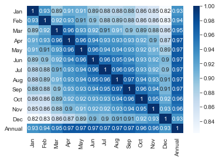
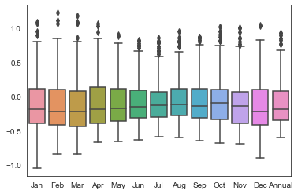
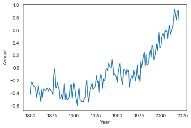
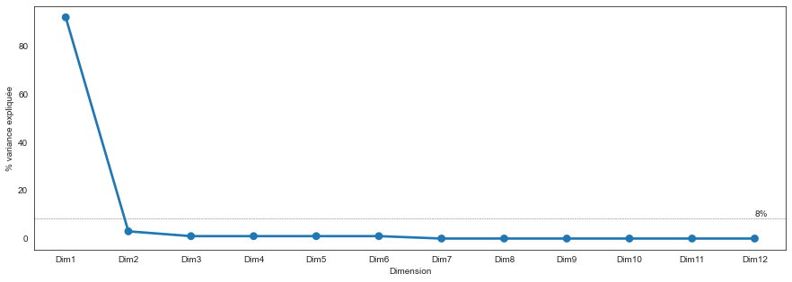
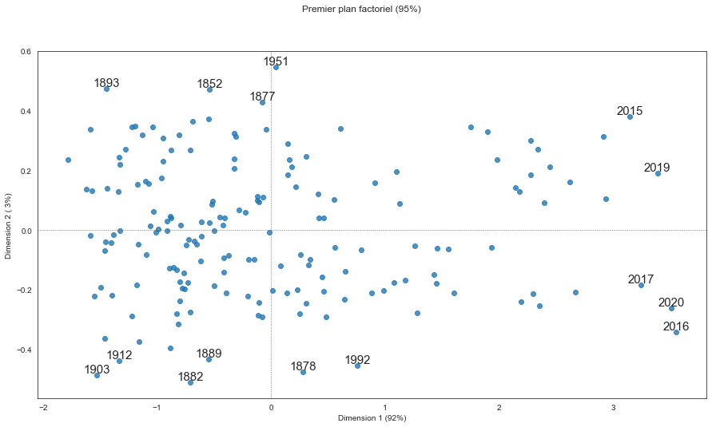
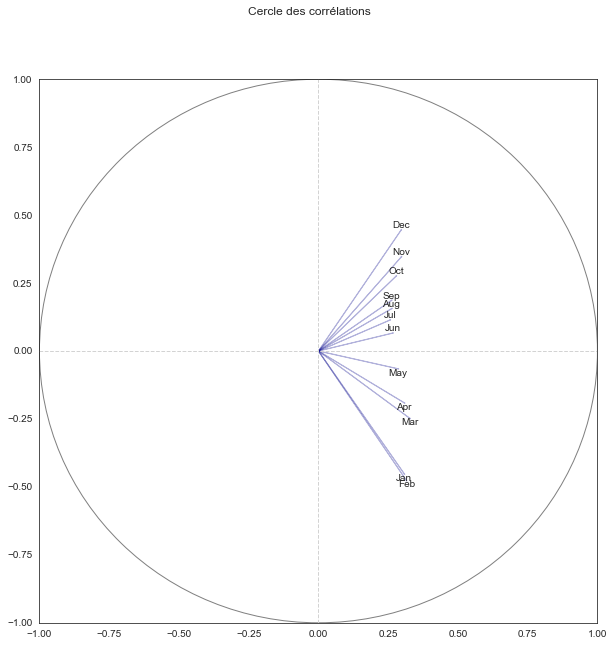

# Analyse de données sous `Python` - *correction*


```python
import numpy
import pandas
import matplotlib.pyplot as plt
import seaborn
seaborn.set_style("white") # change le style par défaut des graphiques seaborn

%matplotlib inline
```


```python
from sklearn.decomposition import PCA
from sklearn.preprocessing import scale
```

## A faire

### Températures mondiales (anomalies)

Nous allons travailler ici sur les données de température mondiale HadCRUT4, fournies par [Climate Research Unit](https://crudata.uea.ac.uk/). Vous trouverez plus d’informations sur ces données sur ce [lien](https://crudata.uea.ac.uk/cru/data/temperature/). Nous avons ici plus exactement l'historique des anomalies moyennes mensuelles et annuelles depuis 1850, au niveau mondial, par rapport à la période de référence 1961-1990.

Le code ci-dessous télécharge directement les dernières données disponibles et les met dans un DataFrame dont vous avez un aperçu en dessous.

> **ATTENTION** Nouvelle version des données par rapport au sujet de TP, pour information. On supprime l'année 2022 (forcément incomplète)


```python
had = pandas.read_csv("https://crudata.uea.ac.uk/cru/data/temperature/HadCRUT5.0Analysis_gl.txt", header=None)
donnees = pandas.DataFrame(
    [list(map(lambda v: float(v), filter(lambda v: v!= "", h.split(" ")))) for h in had[0][::2]],
    columns = ["Year", "Jan", "Feb", "Mar", "Apr", "May", "Jun", "Jul", "Aug", "Sep", "Oct", "Nov", "Dec", "Annual"]
).query("Year < 2022")
donnees.tail()
```


<div>
<style scoped>
    .dataframe tbody tr th:only-of-type {
        vertical-align: middle;
    }

    .dataframe tbody tr th {
        vertical-align: top;
    }

    .dataframe thead th {
        text-align: right;
    }
</style>
<table border="1" class="dataframe">
  <thead>
    <tr style="text-align: right;">
      <th></th>
      <th>Year</th>
      <th>Jan</th>
      <th>Feb</th>
      <th>Mar</th>
      <th>Apr</th>
      <th>May</th>
      <th>Jun</th>
      <th>Jul</th>
      <th>Aug</th>
      <th>Sep</th>
      <th>Oct</th>
      <th>Nov</th>
      <th>Dec</th>
      <th>Annual</th>
    </tr>
  </thead>
  <tbody>
    <tr>
      <th>167</th>
      <td>2017.0</td>
      <td>0.952</td>
      <td>1.067</td>
      <td>1.065</td>
      <td>0.846</td>
      <td>0.780</td>
      <td>0.658</td>
      <td>0.805</td>
      <td>0.811</td>
      <td>0.729</td>
      <td>0.809</td>
      <td>0.806</td>
      <td>0.815</td>
      <td>0.845</td>
    </tr>
    <tr>
      <th>168</th>
      <td>2018.0</td>
      <td>0.711</td>
      <td>0.796</td>
      <td>0.790</td>
      <td>0.822</td>
      <td>0.713</td>
      <td>0.738</td>
      <td>0.733</td>
      <td>0.735</td>
      <td>0.676</td>
      <td>0.869</td>
      <td>0.745</td>
      <td>0.824</td>
      <td>0.763</td>
    </tr>
    <tr>
      <th>169</th>
      <td>2019.0</td>
      <td>0.800</td>
      <td>0.844</td>
      <td>1.076</td>
      <td>0.939</td>
      <td>0.778</td>
      <td>0.809</td>
      <td>0.857</td>
      <td>0.858</td>
      <td>0.803</td>
      <td>0.956</td>
      <td>0.937</td>
      <td>1.037</td>
      <td>0.891</td>
    </tr>
    <tr>
      <th>170</th>
      <td>2020.0</td>
      <td>1.069</td>
      <td>1.113</td>
      <td>1.094</td>
      <td>1.063</td>
      <td>0.908</td>
      <td>0.825</td>
      <td>0.816</td>
      <td>0.801</td>
      <td>0.867</td>
      <td>0.811</td>
      <td>1.013</td>
      <td>0.693</td>
      <td>0.923</td>
    </tr>
    <tr>
      <th>171</th>
      <td>2021.0</td>
      <td>0.701</td>
      <td>0.565</td>
      <td>0.726</td>
      <td>0.760</td>
      <td>0.706</td>
      <td>0.713</td>
      <td>0.792</td>
      <td>0.799</td>
      <td>0.867</td>
      <td>0.907</td>
      <td>0.854</td>
      <td>0.751</td>
      <td>0.762</td>
    </tr>
  </tbody>
</table>
</div>


## Décrire les données (statistiques de base sur chaque mois et sur l'année, corrélations entre les variables)


```python
donnees.drop(columns = "Year").describe().round(2)
```


<div>
<style scoped>
    .dataframe tbody tr th:only-of-type {
        vertical-align: middle;
    }

    .dataframe tbody tr th {
        vertical-align: top;
    }

    .dataframe thead th {
        text-align: right;
    }
</style>
<table border="1" class="dataframe">
  <thead>
    <tr style="text-align: right;">
      <th></th>
      <th>Jan</th>
      <th>Feb</th>
      <th>Mar</th>
      <th>Apr</th>
      <th>May</th>
      <th>Jun</th>
      <th>Jul</th>
      <th>Aug</th>
      <th>Sep</th>
      <th>Oct</th>
      <th>Nov</th>
      <th>Dec</th>
      <th>Annual</th>
    </tr>
  </thead>
  <tbody>
    <tr>
      <th>count</th>
      <td>172.00</td>
      <td>172.00</td>
      <td>172.00</td>
      <td>172.00</td>
      <td>172.00</td>
      <td>172.00</td>
      <td>172.00</td>
      <td>172.00</td>
      <td>172.00</td>
      <td>172.00</td>
      <td>172.00</td>
      <td>172.00</td>
      <td>172.00</td>
    </tr>
    <tr>
      <th>mean</th>
      <td>-0.11</td>
      <td>-0.11</td>
      <td>-0.13</td>
      <td>-0.10</td>
      <td>-0.10</td>
      <td>-0.07</td>
      <td>-0.05</td>
      <td>-0.03</td>
      <td>-0.05</td>
      <td>-0.05</td>
      <td>-0.09</td>
      <td>-0.12</td>
      <td>-0.08</td>
    </tr>
    <tr>
      <th>std</th>
      <td>0.42</td>
      <td>0.42</td>
      <td>0.43</td>
      <td>0.40</td>
      <td>0.37</td>
      <td>0.35</td>
      <td>0.33</td>
      <td>0.34</td>
      <td>0.34</td>
      <td>0.37</td>
      <td>0.39</td>
      <td>0.40</td>
      <td>0.36</td>
    </tr>
    <tr>
      <th>min</th>
      <td>-1.04</td>
      <td>-0.84</td>
      <td>-0.84</td>
      <td>-0.66</td>
      <td>-0.66</td>
      <td>-0.64</td>
      <td>-0.59</td>
      <td>-0.60</td>
      <td>-0.64</td>
      <td>-0.68</td>
      <td>-0.68</td>
      <td>-0.90</td>
      <td>-0.60</td>
    </tr>
    <tr>
      <th>25%</th>
      <td>-0.39</td>
      <td>-0.42</td>
      <td>-0.43</td>
      <td>-0.39</td>
      <td>-0.36</td>
      <td>-0.31</td>
      <td>-0.29</td>
      <td>-0.27</td>
      <td>-0.31</td>
      <td>-0.33</td>
      <td>-0.39</td>
      <td>-0.42</td>
      <td>-0.34</td>
    </tr>
    <tr>
      <th>50%</th>
      <td>-0.19</td>
      <td>-0.22</td>
      <td>-0.22</td>
      <td>-0.18</td>
      <td>-0.18</td>
      <td>-0.15</td>
      <td>-0.13</td>
      <td>-0.11</td>
      <td>-0.13</td>
      <td>-0.10</td>
      <td>-0.14</td>
      <td>-0.22</td>
      <td>-0.18</td>
    </tr>
    <tr>
      <th>75%</th>
      <td>0.12</td>
      <td>0.11</td>
      <td>0.08</td>
      <td>0.14</td>
      <td>0.11</td>
      <td>0.09</td>
      <td>0.06</td>
      <td>0.12</td>
      <td>0.12</td>
      <td>0.10</td>
      <td>0.06</td>
      <td>0.10</td>
      <td>0.08</td>
    </tr>
    <tr>
      <th>max</th>
      <td>1.09</td>
      <td>1.22</td>
      <td>1.18</td>
      <td>1.06</td>
      <td>0.91</td>
      <td>0.82</td>
      <td>0.86</td>
      <td>0.95</td>
      <td>0.87</td>
      <td>1.01</td>
      <td>1.01</td>
      <td>1.04</td>
      <td>0.93</td>
    </tr>
  </tbody>
</table>
</div>


```python
seaborn.heatmap(donnees.drop(columns = "Year").corr(), annot = True, cmap = "Blues")
```


    <AxesSubplot:>


    

    


```python
seaborn.boxplot(data = donnees.drop(columns = "Year"))
```


    <AxesSubplot:>


    

    


## Réprésenter l'évolution des anomalies annuelles sur un graphique


```python
seaborn.lineplot(data = donnees, x = "Year", y = "Annual")
```


    <AxesSubplot:xlabel='Year', ylabel='Annual'>


    

    


## Réaliser une ACP sur les données mensuelles


```python
donnees_mens = donnees.drop(columns = ["Year", "Annual"])
pca = PCA()
pca.fit(donnees_mens)
```


    PCA()


```python
eig = pandas.DataFrame(
    {
        "Dimension" : ["Dim" + str(x + 1) for x in range(donnees_mens.shape[1])], 
        "Variance expliquée" : pca.explained_variance_,
        "% variance expliquée" : numpy.round(pca.explained_variance_ratio_ * 100),
        "% cum. var. expliquée" : numpy.round(numpy.cumsum(pca.explained_variance_ratio_) * 100)
    }
)
eig
```


<div>
<style scoped>
    .dataframe tbody tr th:only-of-type {
        vertical-align: middle;
    }

    .dataframe tbody tr th {
        vertical-align: top;
    }

    .dataframe thead th {
        text-align: right;
    }
</style>
<table border="1" class="dataframe">
  <thead>
    <tr style="text-align: right;">
      <th></th>
      <th>Dimension</th>
      <th>Variance expliquée</th>
      <th>% variance expliquée</th>
      <th>% cum. var. expliquée</th>
    </tr>
  </thead>
  <tbody>
    <tr>
      <th>0</th>
      <td>Dim1</td>
      <td>1.603991</td>
      <td>92.0</td>
      <td>92.0</td>
    </tr>
    <tr>
      <th>1</th>
      <td>Dim2</td>
      <td>0.051223</td>
      <td>3.0</td>
      <td>95.0</td>
    </tr>
    <tr>
      <th>2</th>
      <td>Dim3</td>
      <td>0.021914</td>
      <td>1.0</td>
      <td>96.0</td>
    </tr>
    <tr>
      <th>3</th>
      <td>Dim4</td>
      <td>0.018167</td>
      <td>1.0</td>
      <td>97.0</td>
    </tr>
    <tr>
      <th>4</th>
      <td>Dim5</td>
      <td>0.013254</td>
      <td>1.0</td>
      <td>98.0</td>
    </tr>
    <tr>
      <th>5</th>
      <td>Dim6</td>
      <td>0.011655</td>
      <td>1.0</td>
      <td>98.0</td>
    </tr>
    <tr>
      <th>6</th>
      <td>Dim7</td>
      <td>0.007956</td>
      <td>0.0</td>
      <td>99.0</td>
    </tr>
    <tr>
      <th>7</th>
      <td>Dim8</td>
      <td>0.006674</td>
      <td>0.0</td>
      <td>99.0</td>
    </tr>
    <tr>
      <th>8</th>
      <td>Dim9</td>
      <td>0.005077</td>
      <td>0.0</td>
      <td>99.0</td>
    </tr>
    <tr>
      <th>9</th>
      <td>Dim10</td>
      <td>0.004324</td>
      <td>0.0</td>
      <td>100.0</td>
    </tr>
    <tr>
      <th>10</th>
      <td>Dim11</td>
      <td>0.003775</td>
      <td>0.0</td>
      <td>100.0</td>
    </tr>
    <tr>
      <th>11</th>
      <td>Dim12</td>
      <td>0.003059</td>
      <td>0.0</td>
      <td>100.0</td>
    </tr>
  </tbody>
</table>
</div>


```python
plt.figure(figsize = (15, 5)) # modifie la taille du graphique
seaborn.pointplot(data = eig, x = "Dimension", y = "% variance expliquée")
seuil = 100 / donnees_mens.shape[1]
plt.text(donnees_mens.shape[1] - 1, seuil + 1, str(round(seuil)) + "%")
plt.axhline(y = seuil, linewidth = .5, color = "dimgray", linestyle = "--")
plt.show() # cette ligne supprime l'affichage inutile en amont du graphique
```


    

    


```python
donnees_pca = pca.transform(donnees_mens)
donnees_pca_df = pandas.DataFrame({
    "Dim1" : donnees_pca[:,0], 
    "Dim2" : donnees_pca[:,1],
    "Year" : donnees["Year"]
})
donnees_pca_df.head()

```


<div>
<style scoped>
    .dataframe tbody tr th:only-of-type {
        vertical-align: middle;
    }

    .dataframe tbody tr th {
        vertical-align: top;
    }

    .dataframe thead th {
        text-align: right;
    }
</style>
<table border="1" class="dataframe">
  <thead>
    <tr style="text-align: right;">
      <th></th>
      <th>Dim1</th>
      <th>Dim2</th>
      <th>Year</th>
    </tr>
  </thead>
  <tbody>
    <tr>
      <th>0</th>
      <td>-1.171450</td>
      <td>0.153951</td>
      <td>1850.0</td>
    </tr>
    <tr>
      <th>1</th>
      <td>-0.550981</td>
      <td>0.373087</td>
      <td>1851.0</td>
    </tr>
    <tr>
      <th>2</th>
      <td>-0.542449</td>
      <td>0.471982</td>
      <td>1852.0</td>
    </tr>
    <tr>
      <th>3</th>
      <td>-0.656835</td>
      <td>-0.048071</td>
      <td>1853.0</td>
    </tr>
    <tr>
      <th>4</th>
      <td>-0.722970</td>
      <td>-0.030784</td>
      <td>1854.0</td>
    </tr>
  </tbody>
</table>
</div>


## Produire les graphiques nécessaires à l’interprétation


```python
fig, ax = plt.subplots(figsize=(15,8))
plt.axvline(x = 0, linewidth = .5, color = "dimgray", linestyle = "--")
plt.axhline(y = 0, linewidth = .5, color = "dimgray", linestyle = "--")

seaborn.regplot(data = donnees_pca_df, x = "Dim1", y = "Dim2", fit_reg = False, ax = ax)

for k in donnees_pca_df.iterrows():
    if (abs(k[1]['Dim1']) > 3) | (abs(k[1]['Dim2']) > .4):
        ax.annotate(round(k[1]["Year"]), (k[1]['Dim1'], k[1]['Dim2']), fontsize = 15, ha = "center", va = "bottom")
plt.xlabel("Dimension 1 (92%)") 
plt.ylabel("Dimension 2 ( 3%)")
plt.suptitle("Premier plan factoriel (95%)")
plt.show()
```


    

    


```python
fig, axes = plt.subplots(figsize = (10, 10))
fig.suptitle("Cercle des corrélations")
axes.set_xlim(-1, 1)
axes.set_ylim(-1, 1)

axes.axvline(x = 0, color = 'lightgray', linestyle = '--', linewidth = 1)
axes.axhline(y = 0, color = 'lightgray', linestyle = '--', linewidth = 1)

for j in range(donnees_mens.shape[1]):
    axes.arrow(0, 0, pca.components_[0, j], pca.components_[1, j], width = .001, color = "darkblue", alpha = .25)
    if (pca.components_[1, j] > 0):
        va = "bottom"
    else:
        va = "top"
    axes.text(pca.components_[0, j], pca.components_[1, j], donnees_mens.columns.values[j], ha = "center", va = va)

    # Ajout du cercle
plt.gca().add_artist(plt.Circle((0,0), 1, color = 'gray', fill = False))

plt.show()
```


    

    


## Identifier des années particulières

Voir le graphique des individus (années)

## Que peut-on dire globalement ?

Ca se réchauffe...
