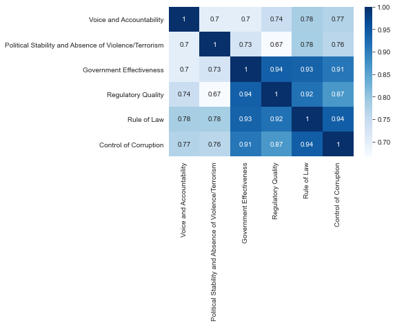
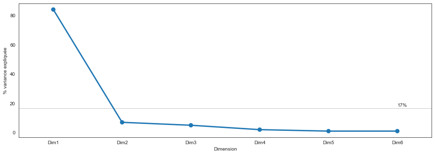
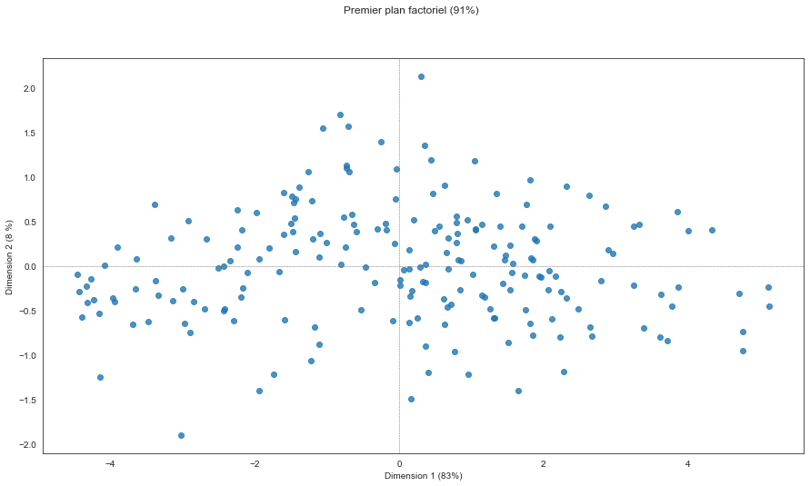
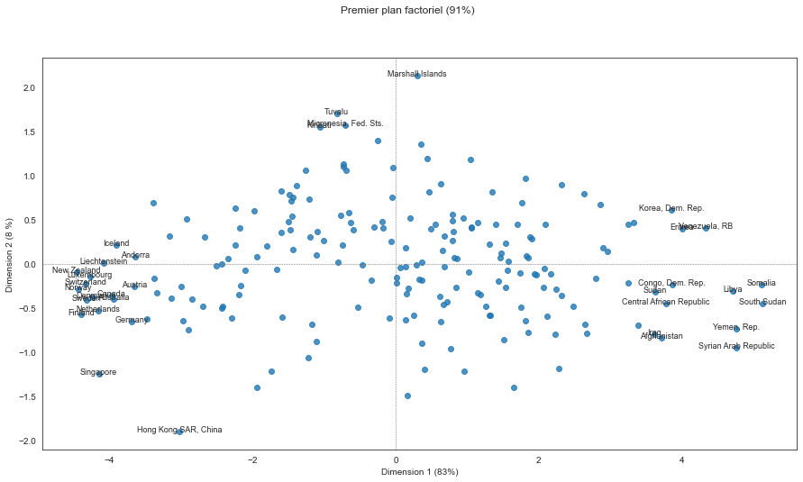
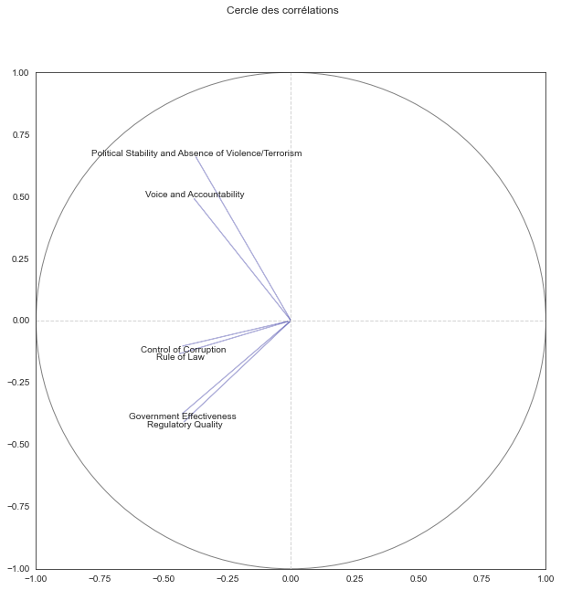

# Analyse de données sous `Python`

Nous utilisons dans ce TP le module [`scikit-learn`](http://scikit-learn.org/), dédié au *Machine Learning*. Pour l'utiliser, nous importons les éléments un par un lorsqu'on en a besoin. Et nous allons aussi utiliser d'autres modules, que nous importons ici.


```python
import numpy
import pandas
import matplotlib.pyplot as plt
import seaborn
seaborn.set_style("white") # change le style par défaut des graphiques seaborn

%matplotlib inline
```

Pour appliquer les deux méthodes, nous allons réaliser une étude de cas, avec les données [`WGI`](https://fxjollois.github.io/donnees/WGI/wgi2019.csv). Celles-ci donnent certains indicateurs sur la gouvernance des pays (plus d'infos sur [cette page](http://info.worldbank.org/governance/wgi/#home)). Voici donc le code pour les importer dans un data frame `pandas`, et leur aperçu. Pour information, plus la valeur est haute, meilleur est le pays sur cet indicateur (et inversement).


```python
# le dropna() permet de supprimer les pays pour lesquels il manque des informations
WGI_complet = pandas.read_csv("https://fxjollois.github.io/donnees/WGI/wgi2019.csv").dropna()
WGI_complet
```


<div>
<style scoped>
    .dataframe tbody tr th:only-of-type {
        vertical-align: middle;
    }

    .dataframe tbody tr th {
        vertical-align: top;
    }

    .dataframe thead th {
        text-align: right;
    }
</style>
<table border="1" class="dataframe">
  <thead>
    <tr style="text-align: right;">
      <th></th>
      <th>Country</th>
      <th>Code</th>
      <th>Voice and Accountability</th>
      <th>Political Stability and Absence of Violence/Terrorism</th>
      <th>Government Effectiveness</th>
      <th>Regulatory Quality</th>
      <th>Rule of Law</th>
      <th>Control of Corruption</th>
    </tr>
  </thead>
  <tbody>
    <tr>
      <th>0</th>
      <td>Aruba</td>
      <td>ABW</td>
      <td>1.294189</td>
      <td>1.357372</td>
      <td>1.029933</td>
      <td>0.857360</td>
      <td>1.263128</td>
      <td>1.217238</td>
    </tr>
    <tr>
      <th>1</th>
      <td>Andorra</td>
      <td>ADO</td>
      <td>1.139154</td>
      <td>1.615139</td>
      <td>1.908749</td>
      <td>1.228176</td>
      <td>1.579939</td>
      <td>1.234392</td>
    </tr>
    <tr>
      <th>2</th>
      <td>Afghanistan</td>
      <td>AFG</td>
      <td>-0.988032</td>
      <td>-2.649407</td>
      <td>-1.463875</td>
      <td>-1.120555</td>
      <td>-1.713527</td>
      <td>-1.401076</td>
    </tr>
    <tr>
      <th>3</th>
      <td>Angola</td>
      <td>AGO</td>
      <td>-0.777283</td>
      <td>-0.311101</td>
      <td>-1.117144</td>
      <td>-0.893871</td>
      <td>-1.054343</td>
      <td>-1.054683</td>
    </tr>
    <tr>
      <th>5</th>
      <td>Albania</td>
      <td>ALB</td>
      <td>0.151805</td>
      <td>0.118570</td>
      <td>-0.061331</td>
      <td>0.274380</td>
      <td>-0.411179</td>
      <td>-0.528758</td>
    </tr>
    <tr>
      <th>...</th>
      <td>...</td>
      <td>...</td>
      <td>...</td>
      <td>...</td>
      <td>...</td>
      <td>...</td>
      <td>...</td>
      <td>...</td>
    </tr>
    <tr>
      <th>209</th>
      <td>Serbia</td>
      <td>SRB</td>
      <td>0.026626</td>
      <td>-0.091665</td>
      <td>0.019079</td>
      <td>0.113867</td>
      <td>-0.119070</td>
      <td>-0.445551</td>
    </tr>
    <tr>
      <th>210</th>
      <td>South Africa</td>
      <td>ZAF</td>
      <td>0.670388</td>
      <td>-0.217931</td>
      <td>0.367380</td>
      <td>0.156172</td>
      <td>-0.076408</td>
      <td>0.084924</td>
    </tr>
    <tr>
      <th>211</th>
      <td>Congo, Dem. Rep.</td>
      <td>ZAR</td>
      <td>-1.365966</td>
      <td>-1.808007</td>
      <td>-1.627429</td>
      <td>-1.509667</td>
      <td>-1.786088</td>
      <td>-1.538931</td>
    </tr>
    <tr>
      <th>212</th>
      <td>Zambia</td>
      <td>ZMB</td>
      <td>-0.286199</td>
      <td>-0.102216</td>
      <td>-0.675215</td>
      <td>-0.554269</td>
      <td>-0.462069</td>
      <td>-0.640345</td>
    </tr>
    <tr>
      <th>213</th>
      <td>Zimbabwe</td>
      <td>ZWE</td>
      <td>-1.141875</td>
      <td>-0.920179</td>
      <td>-1.205337</td>
      <td>-1.463199</td>
      <td>-1.257009</td>
      <td>-1.238796</td>
    </tr>
  </tbody>
</table>
<p>202 rows × 8 columns</p>
</div>


```python
WGI_complet.corr()
```


<div>
<style scoped>
    .dataframe tbody tr th:only-of-type {
        vertical-align: middle;
    }

    .dataframe tbody tr th {
        vertical-align: top;
    }

    .dataframe thead th {
        text-align: right;
    }
</style>
<table border="1" class="dataframe">
  <thead>
    <tr style="text-align: right;">
      <th></th>
      <th>Voice and Accountability</th>
      <th>Political Stability and Absence of Violence/Terrorism</th>
      <th>Government Effectiveness</th>
      <th>Regulatory Quality</th>
      <th>Rule of Law</th>
      <th>Control of Corruption</th>
    </tr>
  </thead>
  <tbody>
    <tr>
      <th>Voice and Accountability</th>
      <td>1.000000</td>
      <td>0.701400</td>
      <td>0.699666</td>
      <td>0.741906</td>
      <td>0.782504</td>
      <td>0.770459</td>
    </tr>
    <tr>
      <th>Political Stability and Absence of Violence/Terrorism</th>
      <td>0.701400</td>
      <td>1.000000</td>
      <td>0.726165</td>
      <td>0.666708</td>
      <td>0.783312</td>
      <td>0.762406</td>
    </tr>
    <tr>
      <th>Government Effectiveness</th>
      <td>0.699666</td>
      <td>0.726165</td>
      <td>1.000000</td>
      <td>0.938556</td>
      <td>0.934389</td>
      <td>0.909035</td>
    </tr>
    <tr>
      <th>Regulatory Quality</th>
      <td>0.741906</td>
      <td>0.666708</td>
      <td>0.938556</td>
      <td>1.000000</td>
      <td>0.916644</td>
      <td>0.865925</td>
    </tr>
    <tr>
      <th>Rule of Law</th>
      <td>0.782504</td>
      <td>0.783312</td>
      <td>0.934389</td>
      <td>0.916644</td>
      <td>1.000000</td>
      <td>0.940869</td>
    </tr>
    <tr>
      <th>Control of Corruption</th>
      <td>0.770459</td>
      <td>0.762406</td>
      <td>0.909035</td>
      <td>0.865925</td>
      <td>0.940869</td>
      <td>1.000000</td>
    </tr>
  </tbody>
</table>
</div>


```python
seaborn.heatmap(WGI_complet.corr(), annot = True, cmap = "Blues")
```


    <AxesSubplot:>


    

    


## ACP

Dans le sous-module `decomposition`, nous allons importer la fonction [`PCA()`](http://scikit-learn.org/stable/modules/generated/sklearn.decomposition.PCA.html). Le fonctionnement de celle-ci est similaire à toutes les autres dans `scikit-learn`. 

1. On créé d'abord un objet (nommé ici `pca`) qui va contenir le résultat de l'ACP. Dans la fonction `PCA()`, on pourra aussi indiquer les paramètres tels que le nombre de composants à retenir (`n_components` - ici on garde tout).
2. Ensuite, on ajuste (*fit*  en anglais) sur des données avec la fonction `fit()` de l'objet précédemment créé. Dans cette fonction, nous devons donc passer les données à utiliser (variables uniquement quantitatives).

Si l'on souhaite une ACP normée (ce qui n'est pas le cas ici), il nous faut standardiser les données en amont, avec par exemple la fonction `scale()` du sous-module `preprocessing` (importée aussi ici). Bien évidemment, il ne faut passer que des variables quantitatives, sans données manquantes.


```python
from sklearn.decomposition import PCA
from sklearn.preprocessing import scale

# suppression des colonnes non numériques
WGI_num = WGI_complet.drop(columns = ["Country", "Code"])
pca = PCA()
pca.fit(WGI_num)
```


    PCA()


### Variance expliquée

L'objet `pca` comprend maintenant un certain nombre d'objets et de fonctions. Le premier objet est le tableau des variances expliquées (`explained_variance_` - proportionnelles aux valeurs propres) par chaque dimension, et le ratio (proportion) de variance expliquée par dimension (`explained_variance_ratio_`).


```python
print(pca.explained_variance_)
print(pca.explained_variance_ratio_)
```

    [5.04959218 0.41467898 0.30759716 0.12165034 0.04965011 0.04069217]
    [0.84386857 0.06929957 0.05140446 0.02032974 0.00829734 0.00680032]


Bien évidemment, il est possible (et préférable) de faire un tableau récapitulatif, avec les variances expliquées, les proportions de variance expliquée simples et cumulées. Voici un petit code permettant de faire ceci.


```python
eig = pandas.DataFrame(
    {
        "Dimension" : ["Dim" + str(x + 1) for x in range(WGI_num.shape[1])], 
        "Variance expliquée" : pca.explained_variance_,
        "% variance expliquée" : numpy.round(pca.explained_variance_ratio_ * 100),
        "% cum. var. expliquée" : numpy.round(numpy.cumsum(pca.explained_variance_ratio_) * 100)
    }
)
eig
```


<div>
<style scoped>
    .dataframe tbody tr th:only-of-type {
        vertical-align: middle;
    }

    .dataframe tbody tr th {
        vertical-align: top;
    }

    .dataframe thead th {
        text-align: right;
    }
</style>
<table border="1" class="dataframe">
  <thead>
    <tr style="text-align: right;">
      <th></th>
      <th>Dimension</th>
      <th>Variance expliquée</th>
      <th>% variance expliquée</th>
      <th>% cum. var. expliquée</th>
    </tr>
  </thead>
  <tbody>
    <tr>
      <th>0</th>
      <td>Dim1</td>
      <td>5.049592</td>
      <td>84.0</td>
      <td>84.0</td>
    </tr>
    <tr>
      <th>1</th>
      <td>Dim2</td>
      <td>0.414679</td>
      <td>7.0</td>
      <td>91.0</td>
    </tr>
    <tr>
      <th>2</th>
      <td>Dim3</td>
      <td>0.307597</td>
      <td>5.0</td>
      <td>96.0</td>
    </tr>
    <tr>
      <th>3</th>
      <td>Dim4</td>
      <td>0.121650</td>
      <td>2.0</td>
      <td>98.0</td>
    </tr>
    <tr>
      <th>4</th>
      <td>Dim5</td>
      <td>0.049650</td>
      <td>1.0</td>
      <td>99.0</td>
    </tr>
    <tr>
      <th>5</th>
      <td>Dim6</td>
      <td>0.040692</td>
      <td>1.0</td>
      <td>100.0</td>
    </tr>
  </tbody>
</table>
</div>


L'idée est de représenter graphiquement ces proportions de variances expliquées (qu'on passe en pourcentage par convenance).


```python
plt.figure(figsize = (15, 5)) # modifie la taille du graphique
seaborn.pointplot(data = eig, x = "Dimension", y = "% variance expliquée")
seuil = 100 / WGI_num.shape[1]
plt.text(WGI_num.shape[1] - 1, seuil + 1, str(round(seuil)) + "%")
plt.axhline(y = seuil, linewidth = .5, color = "dimgray", linestyle = "--")
plt.show() # cette ligne supprime l'affichage inutile en amont du graphique
```


    

    


On remarque ici qu'avec seulement deux dimensions suffisent à expliquer 91 %  de la variance des données. 

### Représentation des individus

Nous allons maintenant calculer les coordonnées des iris sur les dimensions, avec la fonction `transform()` de l'objet `pca`.


```python
WGI_pca = pca.transform(WGI_num)
```

Afin de manipuler plus facilement l'objet obtenu par la suite, nous allons créer un `DataFrame` `pandas` en ne prenant que les deux premières dimensions, ainsi que les espèces.


```python
# Transformation en DataFrame pandas
WGI_pca_df = pandas.DataFrame({
    "Dim1" : WGI_pca[:,0], 
    "Dim2" : WGI_pca[:,1],
    "Country" : WGI_complet["Country"]
})

# Résultat (premières lignes)
WGI_pca_df.head()
```


<div>
<style scoped>
    .dataframe tbody tr th:only-of-type {
        vertical-align: middle;
    }

    .dataframe tbody tr th {
        vertical-align: top;
    }

    .dataframe thead th {
        text-align: right;
    }
</style>
<table border="1" class="dataframe">
  <thead>
    <tr style="text-align: right;">
      <th></th>
      <th>Dim1</th>
      <th>Dim2</th>
      <th>Country</th>
    </tr>
  </thead>
  <tbody>
    <tr>
      <th>0</th>
      <td>-2.921523</td>
      <td>0.503627</td>
      <td>Aruba</td>
    </tr>
    <tr>
      <th>1</th>
      <td>-3.630601</td>
      <td>0.075195</td>
      <td>Andorra</td>
    </tr>
    <tr>
      <th>2</th>
      <td>3.704414</td>
      <td>-0.846353</td>
      <td>Afghanistan</td>
    </tr>
    <tr>
      <th>3</th>
      <td>2.083839</td>
      <td>0.446336</td>
      <td>Angola</td>
    </tr>
    <tr>
      <th>5</th>
      <td>0.137824</td>
      <td>0.175896</td>
      <td>Albania</td>
    </tr>
  </tbody>
</table>
</div>


Il est maintenant possible de représenter les données sur le premier plan factoriel. Dans ce graphique, il est important de noter le pourcentage de variance expliquée.


```python
plt.figure(figsize = (15, 8))
plt.axvline(x = 0, linewidth = .5, color = "dimgray", linestyle = "--")
plt.axhline(y = 0, linewidth = .5, color = "dimgray", linestyle = "--")
seaborn.regplot(data = WGI_pca_df, x = "Dim1", y = "Dim2", fit_reg = False)
plt.xlabel("Dimension 1 (83%)") # modification du nom de l'axe X
plt.ylabel("Dimension 2 (8 %)") # idem pour axe Y
plt.suptitle("Premier plan factoriel (91%)") # titre général
plt.show()
```


    

    


Dans ce même graphique, on veut repérer les individus aux extrêmes. Ci-dessous, nous affichons donc les noms des pays ayant des valeurs absolues élevées pour chaque composante.


```python
# utilisation de subplots nécessaire car annotation du graphique
fig, ax = plt.subplots(figsize=(15,8))
plt.axvline(x = 0, linewidth = .5, color = "dimgray", linestyle = "--")
plt.axhline(y = 0, linewidth = .5, color = "dimgray", linestyle = "--")

# l'option ax permet de placer les points et le texte sur le même graphique
seaborn.regplot(data = WGI_pca_df, x = "Dim1", y = "Dim2", fit_reg = False, ax = ax)

# boucle sur chaque pays
for k in WGI_pca_df.iterrows():
    # annotation uniquement si valeur absolue sur une de 2 dimensions importantes (valeurs choisies empiriquement)
    if (abs(k[1]['Dim1']) > 3.5) | (abs(k[1]['Dim2']) > 1.5):
        ax.annotate(k[1]["Country"], (k[1]['Dim1'], k[1]['Dim2']), fontsize = 9, ha = "center")
plt.xlabel("Dimension 1 (83%)") 
plt.ylabel("Dimension 2 (8 %)")
plt.suptitle("Premier plan factoriel (91%)")
plt.show()
```


    

    


### Représentation des variables

Lorsqu'on réalise une ACP, surtout dans un contexte exploratoire (et non de compression), il est absolument nécessaire de décrire les axes à partir des variables, afin de comprendre ce qu'ils représentent. Pour cela, nous devons réaliser le *cercle des corrélations*. Malheureusement, il faut le réaliser *à la main*.


```python
pca.components_
```


    array([[-0.37750239, -0.37087719, -0.42378854, -0.41732608, -0.43430217,
            -0.42138568],
           [ 0.48844396,  0.65583402, -0.37286018, -0.40542468, -0.13257594,
            -0.10165618],
           [-0.76537562,  0.60350415,  0.16241413, -0.12927521,  0.06087085,
             0.05645548],
           [-0.05176049, -0.23361868, -0.14986293, -0.55342169,  0.18333703,
             0.76183741],
           [-0.13050531, -0.02085703, -0.61015461,  0.17529628,  0.73828359,
            -0.18561589],
           [ 0.11577491, -0.11446349,  0.51014965, -0.5547552 ,  0.45980959,
            -0.44052629]])


Une fois ces coordonnées récupérées, on peut donc afficher ce cercle des corrélations comme ci-dessous.


```python
# Création d'une figure vide (avec des axes entre -1 et 1 + le titre)
fig, axes = plt.subplots(figsize = (10, 10))
fig.suptitle("Cercle des corrélations")
axes.set_xlim(-1, 1)
axes.set_ylim(-1, 1)

# Ajout des axes
axes.axvline(x = 0, color = 'lightgray', linestyle = '--', linewidth = 1)
axes.axhline(y = 0, color = 'lightgray', linestyle = '--', linewidth = 1)

# Ajout des noms des variables
for j in range(WGI_num.shape[1]):
    axes.arrow(0, 0, pca.components_[0, j], pca.components_[1, j], width = .001, color = "darkblue", alpha = .25)
    if (pca.components_[1, j] > 0):
        va = "bottom"
    else:
        va = "top"
    axes.text(pca.components_[0, j], pca.components_[1, j], WGI_num.columns.values[j], ha = "center", va = va)

    # Ajout du cercle
plt.gca().add_artist(plt.Circle((0,0), 1, color = 'gray', fill = False))

plt.show()
```


    

    


Ici, on va en déduire que l'axe 1 oppose à gauche les pays avec une forte valeur dans tous les indicateurs (ils sont tous à gauche), et à droite les pays à faible valeur pour ces indicateurs.

L'axe 2 semble opposer les pays avec une valeur positive pour les indicateurs sur la statibilité politique et la prise en compte de l'avis des citoyens en haut, avec les pays avec une valeur négative pour ces 2 indicateurs en bas. 

Vous pouvez revenir sur le graphique des pays pour mieux comprendre.

## A faire

### Températures mondiales (anomalies)

Nous allons travailler ici sur les données de température mondiale HadCRUT4, fournies par [Climate Research Unit](https://crudata.uea.ac.uk/). Vous trouverez plus d’informations sur ces données sur ce [lien](https://crudata.uea.ac.uk/cru/data/temperature/). Nous avons ici plus exactement l'historique des anomalies moyennes mensuelles et annuelles depuis 1850, au niveau mondial, par rapport à la période de référence 1961-1990.

Le code ci-dessous télécharge directement les dernières données disponibles et les met dans un DataFrame dont vous avez un aperçu en dessous.


```python
had = pandas.read_csv("https://crudata.uea.ac.uk/cru/data/temperature/HadCRUT4-gl.dat", header=None)
donnees = pandas.DataFrame(
    [list(map(lambda v: float(v), filter(lambda v: v!= "", h.split(" ")))) for h in had[0][::2]],
    columns = ["Year", "Jan", "Feb", "Mar", "Apr", "May", "Jun", "Jul", "Aug", "Sep", "Oct", "Nov", "Dec", "Annual"]
)
donnees.tail()
```


<div>
<style scoped>
    .dataframe tbody tr th:only-of-type {
        vertical-align: middle;
    }

    .dataframe tbody tr th {
        vertical-align: top;
    }

    .dataframe thead th {
        text-align: right;
    }
</style>
<table border="1" class="dataframe">
  <thead>
    <tr style="text-align: right;">
      <th></th>
      <th>Year</th>
      <th>Jan</th>
      <th>Feb</th>
      <th>Mar</th>
      <th>Apr</th>
      <th>May</th>
      <th>Jun</th>
      <th>Jul</th>
      <th>Aug</th>
      <th>Sep</th>
      <th>Oct</th>
      <th>Nov</th>
      <th>Dec</th>
      <th>Annual</th>
    </tr>
  </thead>
  <tbody>
    <tr>
      <th>167</th>
      <td>2017.0</td>
      <td>0.739</td>
      <td>0.845</td>
      <td>0.873</td>
      <td>0.737</td>
      <td>0.659</td>
      <td>0.641</td>
      <td>0.651</td>
      <td>0.714</td>
      <td>0.557</td>
      <td>0.571</td>
      <td>0.554</td>
      <td>0.600</td>
      <td>0.677</td>
    </tr>
    <tr>
      <th>168</th>
      <td>2018.0</td>
      <td>0.554</td>
      <td>0.528</td>
      <td>0.615</td>
      <td>0.627</td>
      <td>0.587</td>
      <td>0.573</td>
      <td>0.594</td>
      <td>0.586</td>
      <td>0.598</td>
      <td>0.678</td>
      <td>0.590</td>
      <td>0.638</td>
      <td>0.597</td>
    </tr>
    <tr>
      <th>169</th>
      <td>2019.0</td>
      <td>0.738</td>
      <td>0.662</td>
      <td>0.874</td>
      <td>0.780</td>
      <td>0.610</td>
      <td>0.708</td>
      <td>0.706</td>
      <td>0.719</td>
      <td>0.713</td>
      <td>0.752</td>
      <td>0.693</td>
      <td>0.880</td>
      <td>0.736</td>
    </tr>
    <tr>
      <th>170</th>
      <td>2020.0</td>
      <td>0.982</td>
      <td>1.001</td>
      <td>1.017</td>
      <td>0.800</td>
      <td>0.714</td>
      <td>0.682</td>
      <td>0.695</td>
      <td>0.735</td>
      <td>0.714</td>
      <td>0.617</td>
      <td>0.761</td>
      <td>0.516</td>
      <td>0.768</td>
    </tr>
    <tr>
      <th>171</th>
      <td>2021.0</td>
      <td>0.539</td>
      <td>0.000</td>
      <td>0.000</td>
      <td>0.000</td>
      <td>0.000</td>
      <td>0.000</td>
      <td>0.000</td>
      <td>0.000</td>
      <td>0.000</td>
      <td>0.000</td>
      <td>0.000</td>
      <td>0.000</td>
      <td>0.539</td>
    </tr>
  </tbody>
</table>
</div>


Vous devez donc réaliser les étapes suivantes, au propre dans un notebook :

- Décrire les données (statistiques de base sur chaque mois et sur l'année, corrélations entre les variables)
- Réprésenter l'évolution des anomalies annuelles sur un graphique
- Réaliser une ACP sur les données mensuelles
- Produire les graphiques nécessaires à l’interprétation
- Identifier des années particulières

Que peut-on dire globalement ?


```python

```
