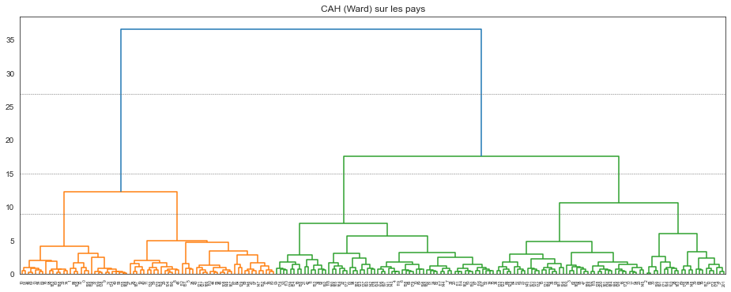
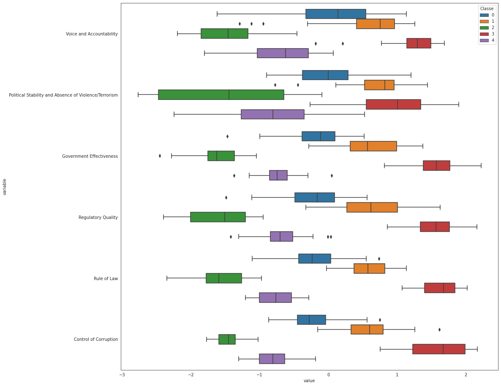
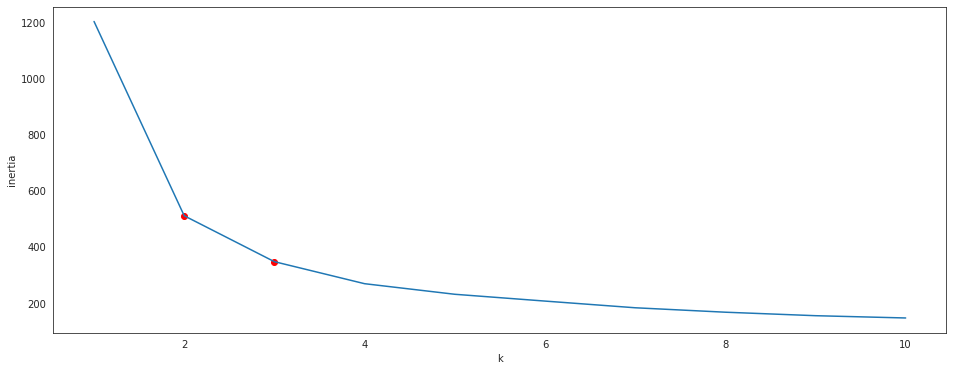
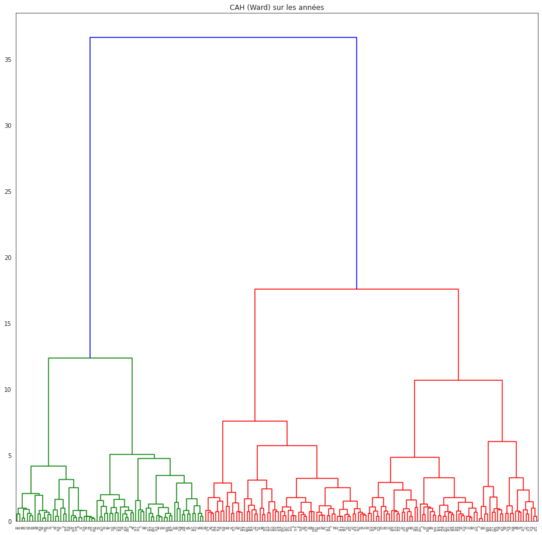
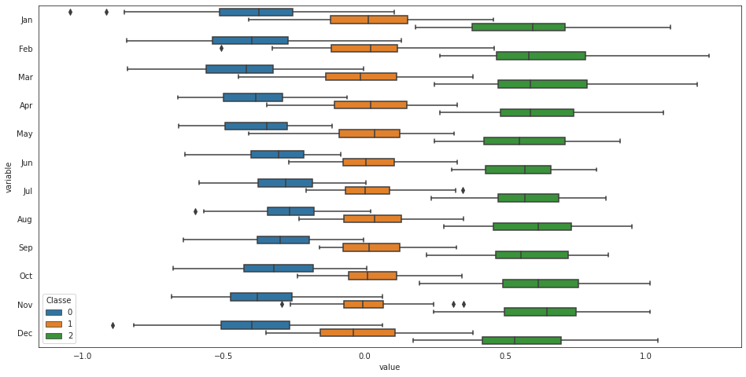
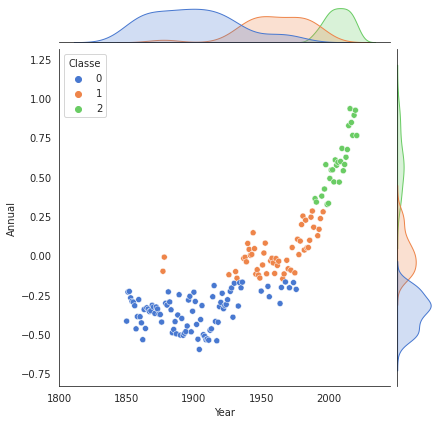
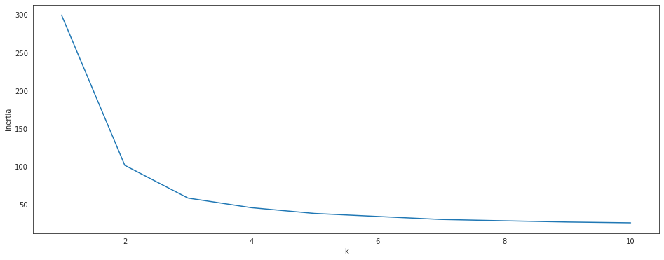

# Classification - *travail en séance*


```python
import numpy
import pandas
import matplotlib.pyplot as plt
import seaborn
seaborn.set_style("white") # change le style par défaut des graphiques seaborn

%matplotlib inline
```


```python
WGI_complet = pandas.read_csv("https://fxjollois.github.io/donnees/WGI/wgi2019.csv").dropna()
WGI_complet
```


<div>
<style scoped>
    .dataframe tbody tr th:only-of-type {
        vertical-align: middle;
    }

    .dataframe tbody tr th {
        vertical-align: top;
    }

    .dataframe thead th {
        text-align: right;
    }
</style>
<table border="1" class="dataframe">
  <thead>
    <tr style="text-align: right;">
      <th></th>
      <th>Country</th>
      <th>Code</th>
      <th>Voice and Accountability</th>
      <th>Political Stability and Absence of Violence/Terrorism</th>
      <th>Government Effectiveness</th>
      <th>Regulatory Quality</th>
      <th>Rule of Law</th>
      <th>Control of Corruption</th>
    </tr>
  </thead>
  <tbody>
    <tr>
      <th>0</th>
      <td>Aruba</td>
      <td>ABW</td>
      <td>1.294189</td>
      <td>1.357372</td>
      <td>1.029933</td>
      <td>0.857360</td>
      <td>1.263128</td>
      <td>1.217238</td>
    </tr>
    <tr>
      <th>1</th>
      <td>Andorra</td>
      <td>ADO</td>
      <td>1.139154</td>
      <td>1.615139</td>
      <td>1.908749</td>
      <td>1.228176</td>
      <td>1.579939</td>
      <td>1.234392</td>
    </tr>
    <tr>
      <th>2</th>
      <td>Afghanistan</td>
      <td>AFG</td>
      <td>-0.988032</td>
      <td>-2.649407</td>
      <td>-1.463875</td>
      <td>-1.120555</td>
      <td>-1.713527</td>
      <td>-1.401076</td>
    </tr>
    <tr>
      <th>3</th>
      <td>Angola</td>
      <td>AGO</td>
      <td>-0.777283</td>
      <td>-0.311101</td>
      <td>-1.117144</td>
      <td>-0.893871</td>
      <td>-1.054343</td>
      <td>-1.054683</td>
    </tr>
    <tr>
      <th>5</th>
      <td>Albania</td>
      <td>ALB</td>
      <td>0.151805</td>
      <td>0.118570</td>
      <td>-0.061331</td>
      <td>0.274380</td>
      <td>-0.411179</td>
      <td>-0.528758</td>
    </tr>
    <tr>
      <th>...</th>
      <td>...</td>
      <td>...</td>
      <td>...</td>
      <td>...</td>
      <td>...</td>
      <td>...</td>
      <td>...</td>
      <td>...</td>
    </tr>
    <tr>
      <th>209</th>
      <td>Serbia</td>
      <td>SRB</td>
      <td>0.026626</td>
      <td>-0.091665</td>
      <td>0.019079</td>
      <td>0.113867</td>
      <td>-0.119070</td>
      <td>-0.445551</td>
    </tr>
    <tr>
      <th>210</th>
      <td>South Africa</td>
      <td>ZAF</td>
      <td>0.670388</td>
      <td>-0.217931</td>
      <td>0.367380</td>
      <td>0.156172</td>
      <td>-0.076408</td>
      <td>0.084924</td>
    </tr>
    <tr>
      <th>211</th>
      <td>Congo, Dem. Rep.</td>
      <td>ZAR</td>
      <td>-1.365966</td>
      <td>-1.808007</td>
      <td>-1.627429</td>
      <td>-1.509667</td>
      <td>-1.786088</td>
      <td>-1.538931</td>
    </tr>
    <tr>
      <th>212</th>
      <td>Zambia</td>
      <td>ZMB</td>
      <td>-0.286199</td>
      <td>-0.102216</td>
      <td>-0.675215</td>
      <td>-0.554269</td>
      <td>-0.462069</td>
      <td>-0.640345</td>
    </tr>
    <tr>
      <th>213</th>
      <td>Zimbabwe</td>
      <td>ZWE</td>
      <td>-1.141875</td>
      <td>-0.920179</td>
      <td>-1.205337</td>
      <td>-1.463199</td>
      <td>-1.257009</td>
      <td>-1.238796</td>
    </tr>
  </tbody>
</table>
<p>202 rows × 8 columns</p>
</div>


```python
from sklearn.cluster import AgglomerativeClustering

WGI_num = WGI_complet.drop(columns = ["Country", "Code"])
hac = AgglomerativeClustering(distance_threshold = 0, n_clusters = None)
hac.fit(WGI_num)
```


    AgglomerativeClustering(distance_threshold=0, n_clusters=None)


```python
from scipy.cluster.hierarchy import dendrogram

def plot_dendrogram(model, **kwargs):
    # Create linkage matrix and then plot the dendrogram

    # create the counts of samples under each node
    counts = numpy.zeros(model.children_.shape[0])
    n_samples = len(model.labels_)
    for i, merge in enumerate(model.children_):
        current_count = 0
        for child_idx in merge:
            if child_idx < n_samples:
                current_count += 1  # leaf node
            else:
                current_count += counts[child_idx - n_samples]
        counts[i] = current_count

    linkage_matrix = numpy.column_stack([model.children_, model.distances_, counts]).astype(float)

    # Plot the corresponding dendrogram
    dendrogram(linkage_matrix, **kwargs)
```


```python
plt.figure(figsize = (16, 6))
plt.title("CAH (Ward) sur les pays")
# plot the top three levels of the dendrogram
plot_dendrogram(hac)
plt.axhline(y = 27, linewidth = .5, color = "dimgray", linestyle = "--")
plt.axhline(y = 15, linewidth = .5, color = "dimgray", linestyle = "--")
plt.axhline(y = 9, linewidth = .5, color = "dimgray", linestyle = "--")
plt.show()
```


    

    


```python
hac5 = AgglomerativeClustering(n_clusters = 5).fit(WGI_num)
```


```python
hac5.labels_
```


    array([3, 3, 2, 4, 0, 1, 0, 0, 1, 3, 3, 0, 2, 3, 0, 4, 4, 1, 0, 1, 0, 0,
           0, 4, 0, 1, 1, 1, 2, 1, 2, 3, 3, 3, 0, 4, 4, 2, 0, 2, 1, 1, 0, 1,
           1, 1, 3, 4, 1, 3, 0, 4, 0, 4, 2, 1, 3, 4, 3, 1, 3, 0, 4, 3, 1, 0,
           4, 0, 2, 2, 0, 1, 3, 4, 3, 0, 3, 4, 1, 2, 1, 0, 0, 3, 4, 2, 3, 1,
           1, 0, 0, 3, 0, 4, 4, 4, 0, 1, 3, 0, 4, 4, 4, 2, 1, 3, 0, 0, 1, 3,
           1, 0, 1, 0, 0, 4, 0, 0, 0, 0, 4, 1, 4, 0, 0, 4, 4, 1, 4, 1, 1, 4,
           4, 4, 3, 3, 4, 0, 3, 0, 4, 0, 0, 0, 0, 4, 1, 1, 2, 1, 0, 1, 1, 0,
           0, 1, 0, 2, 0, 3, 0, 4, 0, 2, 0, 0, 1, 1, 3, 4, 1, 2, 2, 4, 0, 2,
           2, 0, 0, 0, 0, 4, 0, 3, 4, 4, 4, 1, 3, 4, 1, 2, 0, 0, 4, 3, 2, 0,
           0, 2, 4, 2])


```python
pandas.DataFrame(hac5.labels_, columns = ["Classe"])\
  .assign(Effectif = 1).groupby("Classe").count()
```


  <div id="df-020372a3-d973-4fba-bdeb-ab34d664da4d">
    <div class="colab-df-container">
      <div>
<style scoped>
    .dataframe tbody tr th:only-of-type {
        vertical-align: middle;
    }

    .dataframe tbody tr th {
        vertical-align: top;
    }

    .dataframe thead th {
        text-align: right;
    }
</style>
<table border="1" class="dataframe">
  <thead>
    <tr style="text-align: right;">
      <th></th>
      <th>Effectif</th>
    </tr>
    <tr>
      <th>Classe</th>
      <th></th>
    </tr>
  </thead>
  <tbody>
    <tr>
      <th>0</th>
      <td>63</td>
    </tr>
    <tr>
      <th>1</th>
      <td>42</td>
    </tr>
    <tr>
      <th>2</th>
      <td>23</td>
    </tr>
    <tr>
      <th>3</th>
      <td>31</td>
    </tr>
    <tr>
      <th>4</th>
      <td>43</td>
    </tr>
  </tbody>
</table>
</div>
      <button class="colab-df-convert" onclick="convertToInteractive('df-020372a3-d973-4fba-bdeb-ab34d664da4d')"
              title="Convert this dataframe to an interactive table."
              style="display:none;">

  <svg xmlns="http://www.w3.org/2000/svg" height="24px"viewBox="0 0 24 24"
       width="24px">
    <path d="M0 0h24v24H0V0z" fill="none"/>
    <path d="M18.56 5.44l.94 2.06.94-2.06 2.06-.94-2.06-.94-.94-2.06-.94 2.06-2.06.94zm-11 1L8.5 8.5l.94-2.06 2.06-.94-2.06-.94L8.5 2.5l-.94 2.06-2.06.94zm10 10l.94 2.06.94-2.06 2.06-.94-2.06-.94-.94-2.06-.94 2.06-2.06.94z"/><path d="M17.41 7.96l-1.37-1.37c-.4-.4-.92-.59-1.43-.59-.52 0-1.04.2-1.43.59L10.3 9.45l-7.72 7.72c-.78.78-.78 2.05 0 2.83L4 21.41c.39.39.9.59 1.41.59.51 0 1.02-.2 1.41-.59l7.78-7.78 2.81-2.81c.8-.78.8-2.07 0-2.86zM5.41 20L4 18.59l7.72-7.72 1.47 1.35L5.41 20z"/>
  </svg>
      </button>

  <style>
    .colab-df-container {
      display:flex;
      flex-wrap:wrap;
      gap: 12px;
    }

    .colab-df-convert {
      background-color: #E8F0FE;
      border: none;
      border-radius: 50%;
      cursor: pointer;
      display: none;
      fill: #1967D2;
      height: 32px;
      padding: 0 0 0 0;
      width: 32px;
    }

    .colab-df-convert:hover {
      background-color: #E2EBFA;
      box-shadow: 0px 1px 2px rgba(60, 64, 67, 0.3), 0px 1px 3px 1px rgba(60, 64, 67, 0.15);
      fill: #174EA6;
    }

    [theme=dark] .colab-df-convert {
      background-color: #3B4455;
      fill: #D2E3FC;
    }

    [theme=dark] .colab-df-convert:hover {
      background-color: #434B5C;
      box-shadow: 0px 1px 3px 1px rgba(0, 0, 0, 0.15);
      filter: drop-shadow(0px 1px 2px rgba(0, 0, 0, 0.3));
      fill: #FFFFFF;
    }
  </style>

      <script>
        const buttonEl =
          document.querySelector('#df-020372a3-d973-4fba-bdeb-ab34d664da4d button.colab-df-convert');
        buttonEl.style.display =
          google.colab.kernel.accessAllowed ? 'block' : 'none';

        async function convertToInteractive(key) {
          const element = document.querySelector('#df-020372a3-d973-4fba-bdeb-ab34d664da4d');
          const dataTable =
            await google.colab.kernel.invokeFunction('convertToInteractive',
                                                     [key], {});
          if (!dataTable) return;

          const docLinkHtml = 'Like what you see? Visit the ' +
            '<a target="_blank" href=https://colab.research.google.com/notebooks/data_table.ipynb>data table notebook</a>'
            + ' to learn more about interactive tables.';
          element.innerHTML = '';
          dataTable['output_type'] = 'display_data';
          await google.colab.output.renderOutput(dataTable, element);
          const docLink = document.createElement('div');
          docLink.innerHTML = docLinkHtml;
          element.appendChild(docLink);
        }
      </script>
    </div>
  </div>


```python
WGI_num.assign(Classe = hac5.labels_).groupby("Classe").mean()

```


  <div id="df-e77dfd02-9a52-4c37-8c87-7bbb339e965a">
    <div class="colab-df-container">
      <div>
<style scoped>
    .dataframe tbody tr th:only-of-type {
        vertical-align: middle;
    }

    .dataframe tbody tr th {
        vertical-align: top;
    }

    .dataframe thead th {
        text-align: right;
    }
</style>
<table border="1" class="dataframe">
  <thead>
    <tr style="text-align: right;">
      <th></th>
      <th>Voice and Accountability</th>
      <th>Political Stability and Absence of Violence/Terrorism</th>
      <th>Government Effectiveness</th>
      <th>Regulatory Quality</th>
      <th>Rule of Law</th>
      <th>Control of Corruption</th>
    </tr>
    <tr>
      <th>Classe</th>
      <th></th>
      <th></th>
      <th></th>
      <th></th>
      <th></th>
      <th></th>
    </tr>
  </thead>
  <tbody>
    <tr>
      <th>0</th>
      <td>-0.015602</td>
      <td>0.014461</td>
      <td>-0.158030</td>
      <td>-0.198332</td>
      <td>-0.206592</td>
      <td>-0.235281</td>
    </tr>
    <tr>
      <th>1</th>
      <td>0.580336</td>
      <td>0.729324</td>
      <td>0.608124</td>
      <td>0.599383</td>
      <td>0.601206</td>
      <td>0.590638</td>
    </tr>
    <tr>
      <th>2</th>
      <td>-1.485970</td>
      <td>-1.456686</td>
      <td>-1.628032</td>
      <td>-1.601844</td>
      <td>-1.573268</td>
      <td>-1.466098</td>
    </tr>
    <tr>
      <th>3</th>
      <td>1.227123</td>
      <td>0.953535</td>
      <td>1.545378</td>
      <td>1.534222</td>
      <td>1.615845</td>
      <td>1.609885</td>
    </tr>
    <tr>
      <th>4</th>
      <td>-0.677504</td>
      <td>-0.850993</td>
      <td>-0.744915</td>
      <td>-0.664125</td>
      <td>-0.756953</td>
      <td>-0.795385</td>
    </tr>
  </tbody>
</table>
</div>
      <button class="colab-df-convert" onclick="convertToInteractive('df-e77dfd02-9a52-4c37-8c87-7bbb339e965a')"
              title="Convert this dataframe to an interactive table."
              style="display:none;">

  <svg xmlns="http://www.w3.org/2000/svg" height="24px"viewBox="0 0 24 24"
       width="24px">
    <path d="M0 0h24v24H0V0z" fill="none"/>
    <path d="M18.56 5.44l.94 2.06.94-2.06 2.06-.94-2.06-.94-.94-2.06-.94 2.06-2.06.94zm-11 1L8.5 8.5l.94-2.06 2.06-.94-2.06-.94L8.5 2.5l-.94 2.06-2.06.94zm10 10l.94 2.06.94-2.06 2.06-.94-2.06-.94-.94-2.06-.94 2.06-2.06.94z"/><path d="M17.41 7.96l-1.37-1.37c-.4-.4-.92-.59-1.43-.59-.52 0-1.04.2-1.43.59L10.3 9.45l-7.72 7.72c-.78.78-.78 2.05 0 2.83L4 21.41c.39.39.9.59 1.41.59.51 0 1.02-.2 1.41-.59l7.78-7.78 2.81-2.81c.8-.78.8-2.07 0-2.86zM5.41 20L4 18.59l7.72-7.72 1.47 1.35L5.41 20z"/>
  </svg>
      </button>

  <style>
    .colab-df-container {
      display:flex;
      flex-wrap:wrap;
      gap: 12px;
    }

    .colab-df-convert {
      background-color: #E8F0FE;
      border: none;
      border-radius: 50%;
      cursor: pointer;
      display: none;
      fill: #1967D2;
      height: 32px;
      padding: 0 0 0 0;
      width: 32px;
    }

    .colab-df-convert:hover {
      background-color: #E2EBFA;
      box-shadow: 0px 1px 2px rgba(60, 64, 67, 0.3), 0px 1px 3px 1px rgba(60, 64, 67, 0.15);
      fill: #174EA6;
    }

    [theme=dark] .colab-df-convert {
      background-color: #3B4455;
      fill: #D2E3FC;
    }

    [theme=dark] .colab-df-convert:hover {
      background-color: #434B5C;
      box-shadow: 0px 1px 3px 1px rgba(0, 0, 0, 0.15);
      filter: drop-shadow(0px 1px 2px rgba(0, 0, 0, 0.3));
      fill: #FFFFFF;
    }
  </style>

      <script>
        const buttonEl =
          document.querySelector('#df-e77dfd02-9a52-4c37-8c87-7bbb339e965a button.colab-df-convert');
        buttonEl.style.display =
          google.colab.kernel.accessAllowed ? 'block' : 'none';

        async function convertToInteractive(key) {
          const element = document.querySelector('#df-e77dfd02-9a52-4c37-8c87-7bbb339e965a');
          const dataTable =
            await google.colab.kernel.invokeFunction('convertToInteractive',
                                                     [key], {});
          if (!dataTable) return;

          const docLinkHtml = 'Like what you see? Visit the ' +
            '<a target="_blank" href=https://colab.research.google.com/notebooks/data_table.ipynb>data table notebook</a>'
            + ' to learn more about interactive tables.';
          element.innerHTML = '';
          dataTable['output_type'] = 'display_data';
          await google.colab.output.renderOutput(dataTable, element);
          const docLink = document.createElement('div');
          docLink.innerHTML = docLinkHtml;
          element.appendChild(docLink);
        }
      </script>
    </div>
  </div>


```python
plt.figure(figsize = (16, 16))
df = pandas.melt(WGI_num.assign(Classe = hac5.labels_), id_vars = 'Classe')
seaborn.boxplot(data = df, y = "variable", x = "value", hue = "Classe")
plt.show()
```


    

    


```python
pandas.melt(WGI_num.assign(Classe = hac5.labels_), id_vars = 'Classe')
```


  <div id="df-a3e78f2e-428d-4aac-80cd-49902637198d">
    <div class="colab-df-container">
      <div>
<style scoped>
    .dataframe tbody tr th:only-of-type {
        vertical-align: middle;
    }

    .dataframe tbody tr th {
        vertical-align: top;
    }

    .dataframe thead th {
        text-align: right;
    }
</style>
<table border="1" class="dataframe">
  <thead>
    <tr style="text-align: right;">
      <th></th>
      <th>Classe</th>
      <th>variable</th>
      <th>value</th>
    </tr>
  </thead>
  <tbody>
    <tr>
      <th>0</th>
      <td>3</td>
      <td>Voice and Accountability</td>
      <td>1.294189</td>
    </tr>
    <tr>
      <th>1</th>
      <td>3</td>
      <td>Voice and Accountability</td>
      <td>1.139154</td>
    </tr>
    <tr>
      <th>2</th>
      <td>2</td>
      <td>Voice and Accountability</td>
      <td>-0.988032</td>
    </tr>
    <tr>
      <th>3</th>
      <td>4</td>
      <td>Voice and Accountability</td>
      <td>-0.777283</td>
    </tr>
    <tr>
      <th>4</th>
      <td>0</td>
      <td>Voice and Accountability</td>
      <td>0.151805</td>
    </tr>
    <tr>
      <th>...</th>
      <td>...</td>
      <td>...</td>
      <td>...</td>
    </tr>
    <tr>
      <th>1207</th>
      <td>0</td>
      <td>Control of Corruption</td>
      <td>-0.445551</td>
    </tr>
    <tr>
      <th>1208</th>
      <td>0</td>
      <td>Control of Corruption</td>
      <td>0.084924</td>
    </tr>
    <tr>
      <th>1209</th>
      <td>2</td>
      <td>Control of Corruption</td>
      <td>-1.538931</td>
    </tr>
    <tr>
      <th>1210</th>
      <td>4</td>
      <td>Control of Corruption</td>
      <td>-0.640345</td>
    </tr>
    <tr>
      <th>1211</th>
      <td>2</td>
      <td>Control of Corruption</td>
      <td>-1.238796</td>
    </tr>
  </tbody>
</table>
<p>1212 rows × 3 columns</p>
</div>
      <button class="colab-df-convert" onclick="convertToInteractive('df-a3e78f2e-428d-4aac-80cd-49902637198d')"
              title="Convert this dataframe to an interactive table."
              style="display:none;">

  <svg xmlns="http://www.w3.org/2000/svg" height="24px"viewBox="0 0 24 24"
       width="24px">
    <path d="M0 0h24v24H0V0z" fill="none"/>
    <path d="M18.56 5.44l.94 2.06.94-2.06 2.06-.94-2.06-.94-.94-2.06-.94 2.06-2.06.94zm-11 1L8.5 8.5l.94-2.06 2.06-.94-2.06-.94L8.5 2.5l-.94 2.06-2.06.94zm10 10l.94 2.06.94-2.06 2.06-.94-2.06-.94-.94-2.06-.94 2.06-2.06.94z"/><path d="M17.41 7.96l-1.37-1.37c-.4-.4-.92-.59-1.43-.59-.52 0-1.04.2-1.43.59L10.3 9.45l-7.72 7.72c-.78.78-.78 2.05 0 2.83L4 21.41c.39.39.9.59 1.41.59.51 0 1.02-.2 1.41-.59l7.78-7.78 2.81-2.81c.8-.78.8-2.07 0-2.86zM5.41 20L4 18.59l7.72-7.72 1.47 1.35L5.41 20z"/>
  </svg>
      </button>

  <style>
    .colab-df-container {
      display:flex;
      flex-wrap:wrap;
      gap: 12px;
    }

    .colab-df-convert {
      background-color: #E8F0FE;
      border: none;
      border-radius: 50%;
      cursor: pointer;
      display: none;
      fill: #1967D2;
      height: 32px;
      padding: 0 0 0 0;
      width: 32px;
    }

    .colab-df-convert:hover {
      background-color: #E2EBFA;
      box-shadow: 0px 1px 2px rgba(60, 64, 67, 0.3), 0px 1px 3px 1px rgba(60, 64, 67, 0.15);
      fill: #174EA6;
    }

    [theme=dark] .colab-df-convert {
      background-color: #3B4455;
      fill: #D2E3FC;
    }

    [theme=dark] .colab-df-convert:hover {
      background-color: #434B5C;
      box-shadow: 0px 1px 3px 1px rgba(0, 0, 0, 0.15);
      filter: drop-shadow(0px 1px 2px rgba(0, 0, 0, 0.3));
      fill: #FFFFFF;
    }
  </style>

      <script>
        const buttonEl =
          document.querySelector('#df-a3e78f2e-428d-4aac-80cd-49902637198d button.colab-df-convert');
        buttonEl.style.display =
          google.colab.kernel.accessAllowed ? 'block' : 'none';

        async function convertToInteractive(key) {
          const element = document.querySelector('#df-a3e78f2e-428d-4aac-80cd-49902637198d');
          const dataTable =
            await google.colab.kernel.invokeFunction('convertToInteractive',
                                                     [key], {});
          if (!dataTable) return;

          const docLinkHtml = 'Like what you see? Visit the ' +
            '<a target="_blank" href=https://colab.research.google.com/notebooks/data_table.ipynb>data table notebook</a>'
            + ' to learn more about interactive tables.';
          element.innerHTML = '';
          dataTable['output_type'] = 'display_data';
          await google.colab.output.renderOutput(dataTable, element);
          const docLink = document.createElement('div');
          docLink.innerHTML = docLinkHtml;
          element.appendChild(docLink);
        }
      </script>
    </div>
  </div>


```python
WGI_num
```


  <div id="df-26ad35c3-6473-4c59-b0d2-db9b157b5c54">
    <div class="colab-df-container">
      <div>
<style scoped>
    .dataframe tbody tr th:only-of-type {
        vertical-align: middle;
    }

    .dataframe tbody tr th {
        vertical-align: top;
    }

    .dataframe thead th {
        text-align: right;
    }
</style>
<table border="1" class="dataframe">
  <thead>
    <tr style="text-align: right;">
      <th></th>
      <th>Voice and Accountability</th>
      <th>Political Stability and Absence of Violence/Terrorism</th>
      <th>Government Effectiveness</th>
      <th>Regulatory Quality</th>
      <th>Rule of Law</th>
      <th>Control of Corruption</th>
    </tr>
  </thead>
  <tbody>
    <tr>
      <th>0</th>
      <td>1.294189</td>
      <td>1.357372</td>
      <td>1.029933</td>
      <td>0.857360</td>
      <td>1.263128</td>
      <td>1.217238</td>
    </tr>
    <tr>
      <th>1</th>
      <td>1.139154</td>
      <td>1.615139</td>
      <td>1.908749</td>
      <td>1.228176</td>
      <td>1.579939</td>
      <td>1.234392</td>
    </tr>
    <tr>
      <th>2</th>
      <td>-0.988032</td>
      <td>-2.649407</td>
      <td>-1.463875</td>
      <td>-1.120555</td>
      <td>-1.713527</td>
      <td>-1.401076</td>
    </tr>
    <tr>
      <th>3</th>
      <td>-0.777283</td>
      <td>-0.311101</td>
      <td>-1.117144</td>
      <td>-0.893871</td>
      <td>-1.054343</td>
      <td>-1.054683</td>
    </tr>
    <tr>
      <th>5</th>
      <td>0.151805</td>
      <td>0.118570</td>
      <td>-0.061331</td>
      <td>0.274380</td>
      <td>-0.411179</td>
      <td>-0.528758</td>
    </tr>
    <tr>
      <th>...</th>
      <td>...</td>
      <td>...</td>
      <td>...</td>
      <td>...</td>
      <td>...</td>
      <td>...</td>
    </tr>
    <tr>
      <th>209</th>
      <td>0.026626</td>
      <td>-0.091665</td>
      <td>0.019079</td>
      <td>0.113867</td>
      <td>-0.119070</td>
      <td>-0.445551</td>
    </tr>
    <tr>
      <th>210</th>
      <td>0.670388</td>
      <td>-0.217931</td>
      <td>0.367380</td>
      <td>0.156172</td>
      <td>-0.076408</td>
      <td>0.084924</td>
    </tr>
    <tr>
      <th>211</th>
      <td>-1.365966</td>
      <td>-1.808007</td>
      <td>-1.627429</td>
      <td>-1.509667</td>
      <td>-1.786088</td>
      <td>-1.538931</td>
    </tr>
    <tr>
      <th>212</th>
      <td>-0.286199</td>
      <td>-0.102216</td>
      <td>-0.675215</td>
      <td>-0.554269</td>
      <td>-0.462069</td>
      <td>-0.640345</td>
    </tr>
    <tr>
      <th>213</th>
      <td>-1.141875</td>
      <td>-0.920179</td>
      <td>-1.205337</td>
      <td>-1.463199</td>
      <td>-1.257009</td>
      <td>-1.238796</td>
    </tr>
  </tbody>
</table>
<p>202 rows × 6 columns</p>
</div>
      <button class="colab-df-convert" onclick="convertToInteractive('df-26ad35c3-6473-4c59-b0d2-db9b157b5c54')"
              title="Convert this dataframe to an interactive table."
              style="display:none;">

  <svg xmlns="http://www.w3.org/2000/svg" height="24px"viewBox="0 0 24 24"
       width="24px">
    <path d="M0 0h24v24H0V0z" fill="none"/>
    <path d="M18.56 5.44l.94 2.06.94-2.06 2.06-.94-2.06-.94-.94-2.06-.94 2.06-2.06.94zm-11 1L8.5 8.5l.94-2.06 2.06-.94-2.06-.94L8.5 2.5l-.94 2.06-2.06.94zm10 10l.94 2.06.94-2.06 2.06-.94-2.06-.94-.94-2.06-.94 2.06-2.06.94z"/><path d="M17.41 7.96l-1.37-1.37c-.4-.4-.92-.59-1.43-.59-.52 0-1.04.2-1.43.59L10.3 9.45l-7.72 7.72c-.78.78-.78 2.05 0 2.83L4 21.41c.39.39.9.59 1.41.59.51 0 1.02-.2 1.41-.59l7.78-7.78 2.81-2.81c.8-.78.8-2.07 0-2.86zM5.41 20L4 18.59l7.72-7.72 1.47 1.35L5.41 20z"/>
  </svg>
      </button>

  <style>
    .colab-df-container {
      display:flex;
      flex-wrap:wrap;
      gap: 12px;
    }

    .colab-df-convert {
      background-color: #E8F0FE;
      border: none;
      border-radius: 50%;
      cursor: pointer;
      display: none;
      fill: #1967D2;
      height: 32px;
      padding: 0 0 0 0;
      width: 32px;
    }

    .colab-df-convert:hover {
      background-color: #E2EBFA;
      box-shadow: 0px 1px 2px rgba(60, 64, 67, 0.3), 0px 1px 3px 1px rgba(60, 64, 67, 0.15);
      fill: #174EA6;
    }

    [theme=dark] .colab-df-convert {
      background-color: #3B4455;
      fill: #D2E3FC;
    }

    [theme=dark] .colab-df-convert:hover {
      background-color: #434B5C;
      box-shadow: 0px 1px 3px 1px rgba(0, 0, 0, 0.15);
      filter: drop-shadow(0px 1px 2px rgba(0, 0, 0, 0.3));
      fill: #FFFFFF;
    }
  </style>

      <script>
        const buttonEl =
          document.querySelector('#df-26ad35c3-6473-4c59-b0d2-db9b157b5c54 button.colab-df-convert');
        buttonEl.style.display =
          google.colab.kernel.accessAllowed ? 'block' : 'none';

        async function convertToInteractive(key) {
          const element = document.querySelector('#df-26ad35c3-6473-4c59-b0d2-db9b157b5c54');
          const dataTable =
            await google.colab.kernel.invokeFunction('convertToInteractive',
                                                     [key], {});
          if (!dataTable) return;

          const docLinkHtml = 'Like what you see? Visit the ' +
            '<a target="_blank" href=https://colab.research.google.com/notebooks/data_table.ipynb>data table notebook</a>'
            + ' to learn more about interactive tables.';
          element.innerHTML = '';
          dataTable['output_type'] = 'display_data';
          await google.colab.output.renderOutput(dataTable, element);
          const docLink = document.createElement('div');
          docLink.innerHTML = docLinkHtml;
          element.appendChild(docLink);
        }
      </script>
    </div>
  </div>


```python
list(WGI_complet.assign(Classe = hac5.labels_).groupby("Classe").Country)

```


```python
from sklearn.cluster import KMeans

kmeans3 = KMeans(n_clusters = 3)
kmeans3.fit(WGI_num)
```


    KMeans(n_clusters=3)


```python
plt.figure(figsize = (16, 6))
inertia = []
for k in range(1, 11):
    kmeans = KMeans(n_clusters = k, init = "random", n_init = 20).fit(WGI_num)
    inertia = inertia + [kmeans.inertia_]
inertia = pandas.DataFrame({"k": range(1, 11), "inertia": inertia})
seaborn.lineplot(data = inertia, x = "k", y = "inertia")
plt.scatter(2, inertia.query('k == 2')["inertia"], c = "red")
plt.scatter(3, inertia.query('k == 3')["inertia"], c = "red")
plt.show()
```


    

    


## Application


```python
had = pandas.read_csv("https://crudata.uea.ac.uk/cru/data/temperature/HadCRUT5.0Analysis_gl.txt", header=None)
donnees = pandas.DataFrame(
    [list(map(lambda v: float(v), filter(lambda v: v!= "", h.split(" ")))) for h in had[0][::2]],
    columns = ["Year", "Jan", "Feb", "Mar", "Apr", "May", "Jun", "Jul", "Aug", "Sep", "Oct", "Nov", "Dec", "Annual"]
).query("Year < 2022")
donnees.tail()
```


  <div id="df-a0c5a1a9-a61f-4472-8dda-f285b9d937f5">
    <div class="colab-df-container">
      <div>
<style scoped>
    .dataframe tbody tr th:only-of-type {
        vertical-align: middle;
    }

    .dataframe tbody tr th {
        vertical-align: top;
    }

    .dataframe thead th {
        text-align: right;
    }
</style>
<table border="1" class="dataframe">
  <thead>
    <tr style="text-align: right;">
      <th></th>
      <th>Year</th>
      <th>Jan</th>
      <th>Feb</th>
      <th>Mar</th>
      <th>Apr</th>
      <th>May</th>
      <th>Jun</th>
      <th>Jul</th>
      <th>Aug</th>
      <th>Sep</th>
      <th>Oct</th>
      <th>Nov</th>
      <th>Dec</th>
      <th>Annual</th>
    </tr>
  </thead>
  <tbody>
    <tr>
      <th>167</th>
      <td>2017.0</td>
      <td>0.952</td>
      <td>1.067</td>
      <td>1.065</td>
      <td>0.846</td>
      <td>0.780</td>
      <td>0.658</td>
      <td>0.805</td>
      <td>0.811</td>
      <td>0.729</td>
      <td>0.809</td>
      <td>0.806</td>
      <td>0.815</td>
      <td>0.845</td>
    </tr>
    <tr>
      <th>168</th>
      <td>2018.0</td>
      <td>0.711</td>
      <td>0.796</td>
      <td>0.790</td>
      <td>0.822</td>
      <td>0.713</td>
      <td>0.738</td>
      <td>0.733</td>
      <td>0.735</td>
      <td>0.676</td>
      <td>0.869</td>
      <td>0.745</td>
      <td>0.824</td>
      <td>0.763</td>
    </tr>
    <tr>
      <th>169</th>
      <td>2019.0</td>
      <td>0.800</td>
      <td>0.844</td>
      <td>1.076</td>
      <td>0.939</td>
      <td>0.778</td>
      <td>0.809</td>
      <td>0.857</td>
      <td>0.858</td>
      <td>0.803</td>
      <td>0.956</td>
      <td>0.937</td>
      <td>1.037</td>
      <td>0.891</td>
    </tr>
    <tr>
      <th>170</th>
      <td>2020.0</td>
      <td>1.069</td>
      <td>1.113</td>
      <td>1.094</td>
      <td>1.063</td>
      <td>0.908</td>
      <td>0.825</td>
      <td>0.816</td>
      <td>0.801</td>
      <td>0.867</td>
      <td>0.811</td>
      <td>1.013</td>
      <td>0.693</td>
      <td>0.923</td>
    </tr>
    <tr>
      <th>171</th>
      <td>2021.0</td>
      <td>0.701</td>
      <td>0.565</td>
      <td>0.726</td>
      <td>0.760</td>
      <td>0.706</td>
      <td>0.713</td>
      <td>0.792</td>
      <td>0.799</td>
      <td>0.867</td>
      <td>0.907</td>
      <td>0.854</td>
      <td>0.751</td>
      <td>0.762</td>
    </tr>
  </tbody>
</table>
</div>
      <button class="colab-df-convert" onclick="convertToInteractive('df-a0c5a1a9-a61f-4472-8dda-f285b9d937f5')"
              title="Convert this dataframe to an interactive table."
              style="display:none;">

  <svg xmlns="http://www.w3.org/2000/svg" height="24px"viewBox="0 0 24 24"
       width="24px">
    <path d="M0 0h24v24H0V0z" fill="none"/>
    <path d="M18.56 5.44l.94 2.06.94-2.06 2.06-.94-2.06-.94-.94-2.06-.94 2.06-2.06.94zm-11 1L8.5 8.5l.94-2.06 2.06-.94-2.06-.94L8.5 2.5l-.94 2.06-2.06.94zm10 10l.94 2.06.94-2.06 2.06-.94-2.06-.94-.94-2.06-.94 2.06-2.06.94z"/><path d="M17.41 7.96l-1.37-1.37c-.4-.4-.92-.59-1.43-.59-.52 0-1.04.2-1.43.59L10.3 9.45l-7.72 7.72c-.78.78-.78 2.05 0 2.83L4 21.41c.39.39.9.59 1.41.59.51 0 1.02-.2 1.41-.59l7.78-7.78 2.81-2.81c.8-.78.8-2.07 0-2.86zM5.41 20L4 18.59l7.72-7.72 1.47 1.35L5.41 20z"/>
  </svg>
      </button>

  <style>
    .colab-df-container {
      display:flex;
      flex-wrap:wrap;
      gap: 12px;
    }

    .colab-df-convert {
      background-color: #E8F0FE;
      border: none;
      border-radius: 50%;
      cursor: pointer;
      display: none;
      fill: #1967D2;
      height: 32px;
      padding: 0 0 0 0;
      width: 32px;
    }

    .colab-df-convert:hover {
      background-color: #E2EBFA;
      box-shadow: 0px 1px 2px rgba(60, 64, 67, 0.3), 0px 1px 3px 1px rgba(60, 64, 67, 0.15);
      fill: #174EA6;
    }

    [theme=dark] .colab-df-convert {
      background-color: #3B4455;
      fill: #D2E3FC;
    }

    [theme=dark] .colab-df-convert:hover {
      background-color: #434B5C;
      box-shadow: 0px 1px 3px 1px rgba(0, 0, 0, 0.15);
      filter: drop-shadow(0px 1px 2px rgba(0, 0, 0, 0.3));
      fill: #FFFFFF;
    }
  </style>

      <script>
        const buttonEl =
          document.querySelector('#df-a0c5a1a9-a61f-4472-8dda-f285b9d937f5 button.colab-df-convert');
        buttonEl.style.display =
          google.colab.kernel.accessAllowed ? 'block' : 'none';

        async function convertToInteractive(key) {
          const element = document.querySelector('#df-a0c5a1a9-a61f-4472-8dda-f285b9d937f5');
          const dataTable =
            await google.colab.kernel.invokeFunction('convertToInteractive',
                                                     [key], {});
          if (!dataTable) return;

          const docLinkHtml = 'Like what you see? Visit the ' +
            '<a target="_blank" href=https://colab.research.google.com/notebooks/data_table.ipynb>data table notebook</a>'
            + ' to learn more about interactive tables.';
          element.innerHTML = '';
          dataTable['output_type'] = 'display_data';
          await google.colab.output.renderOutput(dataTable, element);
          const docLink = document.createElement('div');
          docLink.innerHTML = docLinkHtml;
          element.appendChild(docLink);
        }
      </script>
    </div>
  </div>


```python
donnees_ok = donnees.drop(columns = ["Year", "Annual"])
donnees_ok
```


  <div id="df-23802332-88de-4444-83d8-cf9037866600">
    <div class="colab-df-container">
      <div>
<style scoped>
    .dataframe tbody tr th:only-of-type {
        vertical-align: middle;
    }

    .dataframe tbody tr th {
        vertical-align: top;
    }

    .dataframe thead th {
        text-align: right;
    }
</style>
<table border="1" class="dataframe">
  <thead>
    <tr style="text-align: right;">
      <th></th>
      <th>Jan</th>
      <th>Feb</th>
      <th>Mar</th>
      <th>Apr</th>
      <th>May</th>
      <th>Jun</th>
      <th>Jul</th>
      <th>Aug</th>
      <th>Sep</th>
      <th>Oct</th>
      <th>Nov</th>
      <th>Dec</th>
    </tr>
  </thead>
  <tbody>
    <tr>
      <th>0</th>
      <td>-0.675</td>
      <td>-0.333</td>
      <td>-0.591</td>
      <td>-0.589</td>
      <td>-0.508</td>
      <td>-0.344</td>
      <td>-0.160</td>
      <td>-0.208</td>
      <td>-0.385</td>
      <td>-0.533</td>
      <td>-0.283</td>
      <td>-0.404</td>
    </tr>
    <tr>
      <th>1</th>
      <td>-0.201</td>
      <td>-0.469</td>
      <td>-0.646</td>
      <td>-0.542</td>
      <td>-0.198</td>
      <td>-0.137</td>
      <td>-0.097</td>
      <td>-0.102</td>
      <td>-0.091</td>
      <td>-0.008</td>
      <td>-0.082</td>
      <td>-0.228</td>
    </tr>
    <tr>
      <th>2</th>
      <td>-0.375</td>
      <td>-0.477</td>
      <td>-0.560</td>
      <td>-0.585</td>
      <td>-0.127</td>
      <td>-0.084</td>
      <td>0.005</td>
      <td>-0.136</td>
      <td>-0.002</td>
      <td>-0.172</td>
      <td>-0.305</td>
      <td>0.065</td>
    </tr>
    <tr>
      <th>3</th>
      <td>-0.233</td>
      <td>-0.404</td>
      <td>-0.280</td>
      <td>-0.386</td>
      <td>-0.268</td>
      <td>-0.142</td>
      <td>-0.083</td>
      <td>-0.057</td>
      <td>-0.250</td>
      <td>-0.392</td>
      <td>-0.411</td>
      <td>-0.337</td>
    </tr>
    <tr>
      <th>4</th>
      <td>-0.381</td>
      <td>-0.361</td>
      <td>-0.243</td>
      <td>-0.334</td>
      <td>-0.291</td>
      <td>-0.299</td>
      <td>-0.179</td>
      <td>-0.239</td>
      <td>-0.217</td>
      <td>-0.095</td>
      <td>-0.410</td>
      <td>-0.450</td>
    </tr>
    <tr>
      <th>...</th>
      <td>...</td>
      <td>...</td>
      <td>...</td>
      <td>...</td>
      <td>...</td>
      <td>...</td>
      <td>...</td>
      <td>...</td>
      <td>...</td>
      <td>...</td>
      <td>...</td>
      <td>...</td>
    </tr>
    <tr>
      <th>167</th>
      <td>0.952</td>
      <td>1.067</td>
      <td>1.065</td>
      <td>0.846</td>
      <td>0.780</td>
      <td>0.658</td>
      <td>0.805</td>
      <td>0.811</td>
      <td>0.729</td>
      <td>0.809</td>
      <td>0.806</td>
      <td>0.815</td>
    </tr>
    <tr>
      <th>168</th>
      <td>0.711</td>
      <td>0.796</td>
      <td>0.790</td>
      <td>0.822</td>
      <td>0.713</td>
      <td>0.738</td>
      <td>0.733</td>
      <td>0.735</td>
      <td>0.676</td>
      <td>0.869</td>
      <td>0.745</td>
      <td>0.824</td>
    </tr>
    <tr>
      <th>169</th>
      <td>0.800</td>
      <td>0.844</td>
      <td>1.076</td>
      <td>0.939</td>
      <td>0.778</td>
      <td>0.809</td>
      <td>0.857</td>
      <td>0.858</td>
      <td>0.803</td>
      <td>0.956</td>
      <td>0.937</td>
      <td>1.037</td>
    </tr>
    <tr>
      <th>170</th>
      <td>1.069</td>
      <td>1.113</td>
      <td>1.094</td>
      <td>1.063</td>
      <td>0.908</td>
      <td>0.825</td>
      <td>0.816</td>
      <td>0.801</td>
      <td>0.867</td>
      <td>0.811</td>
      <td>1.013</td>
      <td>0.693</td>
    </tr>
    <tr>
      <th>171</th>
      <td>0.701</td>
      <td>0.565</td>
      <td>0.726</td>
      <td>0.760</td>
      <td>0.706</td>
      <td>0.713</td>
      <td>0.792</td>
      <td>0.799</td>
      <td>0.867</td>
      <td>0.907</td>
      <td>0.854</td>
      <td>0.751</td>
    </tr>
  </tbody>
</table>
<p>172 rows × 12 columns</p>
</div>
      <button class="colab-df-convert" onclick="convertToInteractive('df-23802332-88de-4444-83d8-cf9037866600')"
              title="Convert this dataframe to an interactive table."
              style="display:none;">

  <svg xmlns="http://www.w3.org/2000/svg" height="24px"viewBox="0 0 24 24"
       width="24px">
    <path d="M0 0h24v24H0V0z" fill="none"/>
    <path d="M18.56 5.44l.94 2.06.94-2.06 2.06-.94-2.06-.94-.94-2.06-.94 2.06-2.06.94zm-11 1L8.5 8.5l.94-2.06 2.06-.94-2.06-.94L8.5 2.5l-.94 2.06-2.06.94zm10 10l.94 2.06.94-2.06 2.06-.94-2.06-.94-.94-2.06-.94 2.06-2.06.94z"/><path d="M17.41 7.96l-1.37-1.37c-.4-.4-.92-.59-1.43-.59-.52 0-1.04.2-1.43.59L10.3 9.45l-7.72 7.72c-.78.78-.78 2.05 0 2.83L4 21.41c.39.39.9.59 1.41.59.51 0 1.02-.2 1.41-.59l7.78-7.78 2.81-2.81c.8-.78.8-2.07 0-2.86zM5.41 20L4 18.59l7.72-7.72 1.47 1.35L5.41 20z"/>
  </svg>
      </button>

  <style>
    .colab-df-container {
      display:flex;
      flex-wrap:wrap;
      gap: 12px;
    }

    .colab-df-convert {
      background-color: #E8F0FE;
      border: none;
      border-radius: 50%;
      cursor: pointer;
      display: none;
      fill: #1967D2;
      height: 32px;
      padding: 0 0 0 0;
      width: 32px;
    }

    .colab-df-convert:hover {
      background-color: #E2EBFA;
      box-shadow: 0px 1px 2px rgba(60, 64, 67, 0.3), 0px 1px 3px 1px rgba(60, 64, 67, 0.15);
      fill: #174EA6;
    }

    [theme=dark] .colab-df-convert {
      background-color: #3B4455;
      fill: #D2E3FC;
    }

    [theme=dark] .colab-df-convert:hover {
      background-color: #434B5C;
      box-shadow: 0px 1px 3px 1px rgba(0, 0, 0, 0.15);
      filter: drop-shadow(0px 1px 2px rgba(0, 0, 0, 0.3));
      fill: #FFFFFF;
    }
  </style>

      <script>
        const buttonEl =
          document.querySelector('#df-23802332-88de-4444-83d8-cf9037866600 button.colab-df-convert');
        buttonEl.style.display =
          google.colab.kernel.accessAllowed ? 'block' : 'none';

        async function convertToInteractive(key) {
          const element = document.querySelector('#df-23802332-88de-4444-83d8-cf9037866600');
          const dataTable =
            await google.colab.kernel.invokeFunction('convertToInteractive',
                                                     [key], {});
          if (!dataTable) return;

          const docLinkHtml = 'Like what you see? Visit the ' +
            '<a target="_blank" href=https://colab.research.google.com/notebooks/data_table.ipynb>data table notebook</a>'
            + ' to learn more about interactive tables.';
          element.innerHTML = '';
          dataTable['output_type'] = 'display_data';
          await google.colab.output.renderOutput(dataTable, element);
          const docLink = document.createElement('div');
          docLink.innerHTML = docLinkHtml;
          element.appendChild(docLink);
        }
      </script>
    </div>
  </div>


### Rechercher une partition intéressante des années


#### Avec la CAH


```python
from sklearn.cluster import AgglomerativeClustering

hac = AgglomerativeClustering(distance_threshold = 0, n_clusters = None)
hac.fit(donnees_ok)
```


```python

```


```python
plt.figure(figsize = (16, 16))
plt.title("CAH (Ward) sur les années")
plot_dendrogram(hac)
plt.show()
```


    

    


#### Avec $k$-means


```python

```


```python
kmeans = KMeans(n_clusters = 3)
kmeans.fit(donnees_ok)
```


    KMeans(n_clusters=3)


```python
plt.figure(figsize = (16, 8))
df = pandas.melt(donnees_ok.assign(Classe = kmeans.labels_), id_vars = 'Classe')
seaborn.boxplot(data = df, y = "variable", x = "value", hue = "Classe")
plt.show()
```


    

    


```python
seaborn.jointplot(data = donnees.assign(Classe = kmeans.labels_),
                  x = "Year", y = "Annual", hue = "Classe", ratio = 8,
                  palette = "muted")
```


    <seaborn.axisgrid.JointGrid at 0x7fe5fbb91ad0>


    

    


```python
plt.figure(figsize = (16, 6))
inertia = []
for k in range(1, 11):
    km = KMeans(n_clusters = k, init = "random", n_init = 20).fit(donnees_ok)
    inertia = inertia + [km.inertia_]
inertia = pandas.DataFrame({"k": range(1, 11), "inertia": inertia})
seaborn.lineplot(data = inertia, x = "k", y = "inertia")
plt.show()
```


    

    


### Représenter cette partition sur le résultat de l'ACP


```python
from sklearn.decomposition import PCA
pca = PCA().fit(donnees_ok)
donnees_pca = pca.transform(donnees_ok)
donnees_pca_df = pandas.DataFrame({
    "Dim1" : donnees_pca[:,0], 
    "Dim2" : donnees_pca[:,1],
    "Year" : donnees["Year"],
    "Classe" : kmeans.labels_
})
```


```python
seaborn.lmplot(data = donnees_pca_df, 
                  x = "Dim1", y = "Dim2", hue = "Classe",
               fit_reg = False, aspect = 1, height = 10)
plt.show()
```


    

    


### Décrire les classes ainsi obtenues
