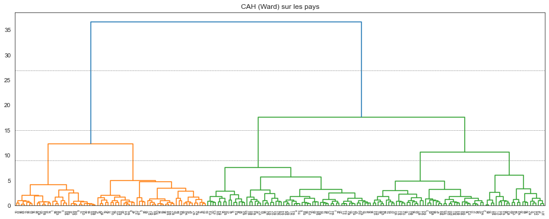
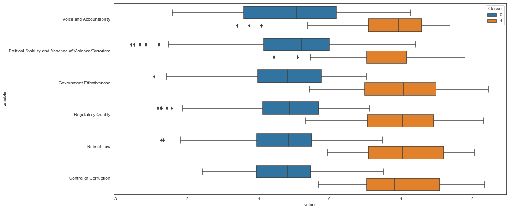
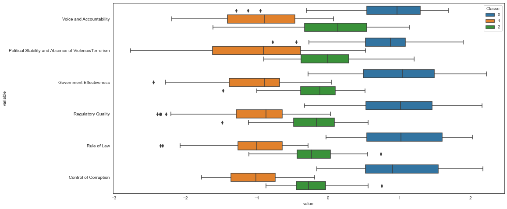
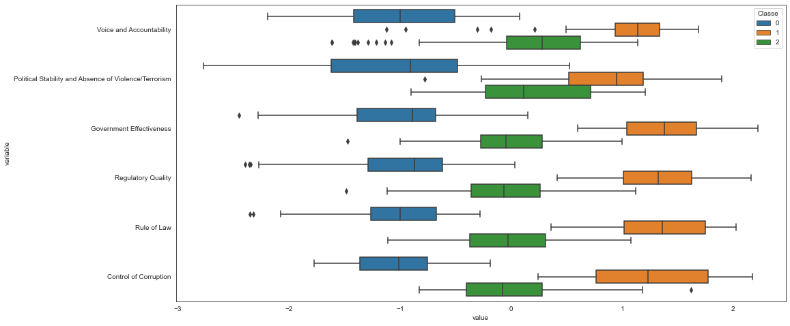
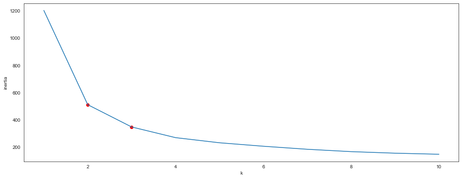

# Classification sous `Python`

Nous utilisons encore le module [`scikit-learn`](http://scikit-learn.org/), dédié au *Machine Learning*. 


```python
import numpy
import pandas
import matplotlib.pyplot as plt
import seaborn
seaborn.set_style("white") # change le style par défaut des graphiques seaborn

%matplotlib inline
```

Pour tester les méthodes de classification, nous allons continuer l'étude de cas sur les données [`WGI`](https://fxjollois.github.io/donnees/WGI/wgi2019.csv). 


```python
# le dropna() permet de supprimer les pays pour lesquels il manque des informations
WGI_complet = pandas.read_csv("https://fxjollois.github.io/donnees/WGI/wgi2019.csv").dropna()
WGI_complet
```


<div>
<style scoped>
    .dataframe tbody tr th:only-of-type {
        vertical-align: middle;
    }

    .dataframe tbody tr th {
        vertical-align: top;
    }

    .dataframe thead th {
        text-align: right;
    }
</style>
<table border="1" class="dataframe">
  <thead>
    <tr style="text-align: right;">
      <th></th>
      <th>Country</th>
      <th>Code</th>
      <th>Voice and Accountability</th>
      <th>Political Stability and Absence of Violence/Terrorism</th>
      <th>Government Effectiveness</th>
      <th>Regulatory Quality</th>
      <th>Rule of Law</th>
      <th>Control of Corruption</th>
    </tr>
  </thead>
  <tbody>
    <tr>
      <th>0</th>
      <td>Aruba</td>
      <td>ABW</td>
      <td>1.294189</td>
      <td>1.357372</td>
      <td>1.029933</td>
      <td>0.857360</td>
      <td>1.263128</td>
      <td>1.217238</td>
    </tr>
    <tr>
      <th>1</th>
      <td>Andorra</td>
      <td>ADO</td>
      <td>1.139154</td>
      <td>1.615139</td>
      <td>1.908749</td>
      <td>1.228176</td>
      <td>1.579939</td>
      <td>1.234392</td>
    </tr>
    <tr>
      <th>2</th>
      <td>Afghanistan</td>
      <td>AFG</td>
      <td>-0.988032</td>
      <td>-2.649407</td>
      <td>-1.463875</td>
      <td>-1.120555</td>
      <td>-1.713527</td>
      <td>-1.401076</td>
    </tr>
    <tr>
      <th>3</th>
      <td>Angola</td>
      <td>AGO</td>
      <td>-0.777283</td>
      <td>-0.311101</td>
      <td>-1.117144</td>
      <td>-0.893871</td>
      <td>-1.054343</td>
      <td>-1.054683</td>
    </tr>
    <tr>
      <th>5</th>
      <td>Albania</td>
      <td>ALB</td>
      <td>0.151805</td>
      <td>0.118570</td>
      <td>-0.061331</td>
      <td>0.274380</td>
      <td>-0.411179</td>
      <td>-0.528758</td>
    </tr>
    <tr>
      <th>...</th>
      <td>...</td>
      <td>...</td>
      <td>...</td>
      <td>...</td>
      <td>...</td>
      <td>...</td>
      <td>...</td>
      <td>...</td>
    </tr>
    <tr>
      <th>209</th>
      <td>Serbia</td>
      <td>SRB</td>
      <td>0.026626</td>
      <td>-0.091665</td>
      <td>0.019079</td>
      <td>0.113867</td>
      <td>-0.119070</td>
      <td>-0.445551</td>
    </tr>
    <tr>
      <th>210</th>
      <td>South Africa</td>
      <td>ZAF</td>
      <td>0.670388</td>
      <td>-0.217931</td>
      <td>0.367380</td>
      <td>0.156172</td>
      <td>-0.076408</td>
      <td>0.084924</td>
    </tr>
    <tr>
      <th>211</th>
      <td>Congo, Dem. Rep.</td>
      <td>ZAR</td>
      <td>-1.365966</td>
      <td>-1.808007</td>
      <td>-1.627429</td>
      <td>-1.509667</td>
      <td>-1.786088</td>
      <td>-1.538931</td>
    </tr>
    <tr>
      <th>212</th>
      <td>Zambia</td>
      <td>ZMB</td>
      <td>-0.286199</td>
      <td>-0.102216</td>
      <td>-0.675215</td>
      <td>-0.554269</td>
      <td>-0.462069</td>
      <td>-0.640345</td>
    </tr>
    <tr>
      <th>213</th>
      <td>Zimbabwe</td>
      <td>ZWE</td>
      <td>-1.141875</td>
      <td>-0.920179</td>
      <td>-1.205337</td>
      <td>-1.463199</td>
      <td>-1.257009</td>
      <td>-1.238796</td>
    </tr>
  </tbody>
</table>
<p>202 rows × 8 columns</p>
</div>


```python

```

## Classification

Nous allons ici réaliser une classification non supervisée avec 3 méthodes (CAH, $k$-means et DBSCAN). Bien évidemment, ici, nous pouvons peut-être supposé qu'une partition en 6 classes (1 par continent) est possible. Mais nous n'avons pas de réelle idée de ce nombre de classes. Pour l'estimer, nous allons utiliser 2 techniques.

### Classification Ascendante Hiérarchique (CAH)

La première possibilité est d'utiliser la CAH, afin d'obtenir un dendrogramme représentant les regroupements 2 à 2 de toutes les classes. 

Tout d'abord, nous importons la méthode, puis nous l'appliquons. Ici, on indique qu'on ne souhaite pas réaliser de *découpage* au préalable, et donc qu'on souhaite garder toute la hiérarchie. Voici pourquoi on choisit `0` pour le paramètre `distance_threshold` et `None` pour `n_clusters`. Le paramètre `affinity` permet de choisir la distance utilisée (`euclidean` par défaut - ce qui nous va bien). Le paramètre `linkage` permet lui de choisir le critère d'aggrégation entre deux classes (`ward` par défaut - ce qui nous va bien aussi).


```python
from sklearn.cluster import AgglomerativeClustering

WGI_num = WGI_complet.drop(columns = ["Country", "Code"])
hac = AgglomerativeClustering(distance_threshold = 0, n_clusters = None)
hac.fit(WGI_num)
```


    AgglomerativeClustering(distance_threshold=0, n_clusters=None)


Cette [page](https://scikit-learn.org/stable/auto_examples/cluster/plot_agglomerative_dendrogram.html#sphx-glr-auto-examples-cluster-plot-agglomerative-dendrogram-py) décrit le programme permettant d'afficher le dendrogramme à partir du résultat de la fonction ci-dessous. Je recopie ici que la fonction (avec un peu d'adaptation).


```python
from scipy.cluster.hierarchy import dendrogram

def plot_dendrogram(model, **kwargs):
    # Create linkage matrix and then plot the dendrogram

    # create the counts of samples under each node
    counts = numpy.zeros(model.children_.shape[0])
    n_samples = len(model.labels_)
    for i, merge in enumerate(model.children_):
        current_count = 0
        for child_idx in merge:
            if child_idx < n_samples:
                current_count += 1  # leaf node
            else:
                current_count += counts[child_idx - n_samples]
        counts[i] = current_count

    linkage_matrix = numpy.column_stack([model.children_, model.distances_, counts]).astype(float)

    # Plot the corresponding dendrogram
    dendrogram(linkage_matrix, **kwargs)
```

Nous utilisons donc cette méthode sur nos pays. On remarque un saut important entre 2 et 3 classes, puis entre 3 et 4 classes (et un peu moindre entre 4 et 5 classes). On imagine donc qu'on pourrait couper la hiérarchie à ces 2 niveaux (cf graphique). Ainsi, cela suggère qu'on pourrait avoir une partition soit en 2 classes, soit en 3 classes.


```python
plt.figure(figsize = (16, 6))
plt.title("CAH (Ward) sur les pays")
# plot the top three levels of the dendrogram
plot_dendrogram(hac)
plt.axhline(y = 27, linewidth = .5, color = "dimgray", linestyle = "--")
plt.axhline(y = 15, linewidth = .5, color = "dimgray", linestyle = "--")
plt.axhline(y = 9, linewidth = .5, color = "dimgray", linestyle = "--")
plt.show()
```


    

    


Pour récupérer la partition, il faut relancer la méthode en changeant le paramètre `n_clusters` (et en laissant la valeur par défaut pour `distance_threshold`). On va tester 2 et 3 classes. Pour chaque partition obtenue, nous allons regarder la taille des classes et les valeurs moyennes de chaque variable.

#### Avec 2 classes


```python
hac2 = AgglomerativeClustering(n_clusters = 2)
hac2.fit(WGI_num)
```


    AgglomerativeClustering()


```python
pandas.DataFrame(hac2.labels_, columns = ["Classe"]).assign(Effectif = 1).groupby("Classe").count()
```


<div>
<style scoped>
    .dataframe tbody tr th:only-of-type {
        vertical-align: middle;
    }

    .dataframe tbody tr th {
        vertical-align: top;
    }

    .dataframe thead th {
        text-align: right;
    }
</style>
<table border="1" class="dataframe">
  <thead>
    <tr style="text-align: right;">
      <th></th>
      <th>Effectif</th>
    </tr>
    <tr>
      <th>Classe</th>
      <th></th>
    </tr>
  </thead>
  <tbody>
    <tr>
      <th>0</th>
      <td>129</td>
    </tr>
    <tr>
      <th>1</th>
      <td>73</td>
    </tr>
  </tbody>
</table>
</div>


```python
WGI_num.assign(Classe = hac2.labels_).groupby("Classe").mean()
```


<div>
<style scoped>
    .dataframe tbody tr th:only-of-type {
        vertical-align: middle;
    }

    .dataframe tbody tr th {
        vertical-align: top;
    }

    .dataframe thead th {
        text-align: right;
    }
</style>
<table border="1" class="dataframe">
  <thead>
    <tr style="text-align: right;">
      <th></th>
      <th>Voice and Accountability</th>
      <th>Political Stability and Absence of Violence/Terrorism</th>
      <th>Government Effectiveness</th>
      <th>Regulatory Quality</th>
      <th>Rule of Law</th>
      <th>Control of Corruption</th>
    </tr>
    <tr>
      <th>Classe</th>
      <th></th>
      <th></th>
      <th></th>
      <th></th>
      <th></th>
      <th></th>
    </tr>
  </thead>
  <tbody>
    <tr>
      <th>0</th>
      <td>-0.498394</td>
      <td>-0.536321</td>
      <td>-0.615752</td>
      <td>-0.603835</td>
      <td>-0.633716</td>
      <td>-0.641430</td>
    </tr>
    <tr>
      <th>1</th>
      <td>0.854999</td>
      <td>0.824537</td>
      <td>1.006136</td>
      <td>0.996369</td>
      <td>1.032080</td>
      <td>1.023469</td>
    </tr>
  </tbody>
</table>
</div>


On a ici une classe avec des valeurs plutôt négatives pour chaque variable et une autre avec des valeurs positives.


```python
plt.figure(figsize = (16, 8))
df = pandas.melt(WGI_num.assign(Classe = hac2.labels_), id_vars = 'Classe')
seaborn.boxplot(data = df, y = "variable", x = "value", hue = "Classe")
plt.show()
```


    

    


#### Avec 3 classes


```python
hac3 = AgglomerativeClustering(n_clusters = 3)
hac3.fit(WGI_num)
```


    AgglomerativeClustering(n_clusters=3)


```python
pandas.DataFrame(hac3.labels_, columns = ["Classe"]).assign(Effectif = 1).groupby("Classe").count()
```


<div>
<style scoped>
    .dataframe tbody tr th:only-of-type {
        vertical-align: middle;
    }

    .dataframe tbody tr th {
        vertical-align: top;
    }

    .dataframe thead th {
        text-align: right;
    }
</style>
<table border="1" class="dataframe">
  <thead>
    <tr style="text-align: right;">
      <th></th>
      <th>Effectif</th>
    </tr>
    <tr>
      <th>Classe</th>
      <th></th>
    </tr>
  </thead>
  <tbody>
    <tr>
      <th>0</th>
      <td>73</td>
    </tr>
    <tr>
      <th>1</th>
      <td>66</td>
    </tr>
    <tr>
      <th>2</th>
      <td>63</td>
    </tr>
  </tbody>
</table>
</div>


```python
WGI_num.assign(Classe = hac3.labels_).groupby("Classe").mean()
```


<div>
<style scoped>
    .dataframe tbody tr th:only-of-type {
        vertical-align: middle;
    }

    .dataframe tbody tr th {
        vertical-align: top;
    }

    .dataframe thead th {
        text-align: right;
    }
</style>
<table border="1" class="dataframe">
  <thead>
    <tr style="text-align: right;">
      <th></th>
      <th>Voice and Accountability</th>
      <th>Political Stability and Absence of Violence/Terrorism</th>
      <th>Government Effectiveness</th>
      <th>Regulatory Quality</th>
      <th>Rule of Law</th>
      <th>Control of Corruption</th>
    </tr>
    <tr>
      <th>Classe</th>
      <th></th>
      <th></th>
      <th></th>
      <th></th>
      <th></th>
      <th></th>
    </tr>
  </thead>
  <tbody>
    <tr>
      <th>0</th>
      <td>0.854999</td>
      <td>0.824537</td>
      <td>1.006136</td>
      <td>0.996369</td>
      <td>1.032080</td>
      <td>1.023469</td>
    </tr>
    <tr>
      <th>1</th>
      <td>-0.959242</td>
      <td>-1.062068</td>
      <td>-1.052668</td>
      <td>-0.990906</td>
      <td>-1.041426</td>
      <td>-1.029118</td>
    </tr>
    <tr>
      <th>2</th>
      <td>-0.015602</td>
      <td>0.014461</td>
      <td>-0.158030</td>
      <td>-0.198332</td>
      <td>-0.206592</td>
      <td>-0.235281</td>
    </tr>
  </tbody>
</table>
</div>


On a maintenant une classe avec des valeurs négatives (proches de -1), une autre avec des valeurs positives (proche de 1), et une dernière classe avec des valeurs autour de 0. C'est la classe avec les valeurs positives qui a été coupée en deux.


```python
plt.figure(figsize = (16, 8))
df = pandas.melt(WGI_num.assign(Classe = hac3.labels_), id_vars = 'Classe')
seaborn.boxplot(data = df, y = "variable", x = "value", hue = "Classe")
plt.show()
```


    

    


### $k$-means

L'autre méthode de classification classique est la méthode des $k$-means. Elle est très rapide, mais nécessite de déterminer à l'avance le nombre de classes. Nous allons l'appliquer avec 2 et 3 classes afin de voir quelle partition serait la plus intéressante.

#### 2 classes


```python
from sklearn.cluster import KMeans

kmeans2 = KMeans(n_clusters = 2)
kmeans2.fit(WGI_num)
```


    KMeans(n_clusters=2)


On peut avoir ainsi les classes de chaque individus (qui nous servent ici à calculer la taille de chaque classe), ainsi que les centres des classes.


```python
pandas.DataFrame(kmeans2.labels_, columns = ["Classe"]).assign(Effectif = 1).groupby("Classe").count()
```


<div>
<style scoped>
    .dataframe tbody tr th:only-of-type {
        vertical-align: middle;
    }

    .dataframe tbody tr th {
        vertical-align: top;
    }

    .dataframe thead th {
        text-align: right;
    }
</style>
<table border="1" class="dataframe">
  <thead>
    <tr style="text-align: right;">
      <th></th>
      <th>Effectif</th>
    </tr>
    <tr>
      <th>Classe</th>
      <th></th>
    </tr>
  </thead>
  <tbody>
    <tr>
      <th>0</th>
      <td>82</td>
    </tr>
    <tr>
      <th>1</th>
      <td>120</td>
    </tr>
  </tbody>
</table>
</div>


```python
kmeans2.cluster_centers_
```


    array([[ 0.83555058,  0.81293581,  0.90273293,  0.87084453,  0.94783308,
             0.92581433],
           [-0.58660919, -0.63045795, -0.66673415, -0.63807482, -0.70108263,
            -0.6995669 ]])


La première classe concerne les pays avec des valeurs positives sur tous les indicateurs, la seconde classe étant ceux avec des valeurs négatives.


```python
WGI_num.assign(Classe = kmeans2.labels_).groupby("Classe").mean()
```


<div>
<style scoped>
    .dataframe tbody tr th:only-of-type {
        vertical-align: middle;
    }

    .dataframe tbody tr th {
        vertical-align: top;
    }

    .dataframe thead th {
        text-align: right;
    }
</style>
<table border="1" class="dataframe">
  <thead>
    <tr style="text-align: right;">
      <th></th>
      <th>Voice and Accountability</th>
      <th>Political Stability and Absence of Violence/Terrorism</th>
      <th>Government Effectiveness</th>
      <th>Regulatory Quality</th>
      <th>Rule of Law</th>
      <th>Control of Corruption</th>
    </tr>
    <tr>
      <th>Classe</th>
      <th></th>
      <th></th>
      <th></th>
      <th></th>
      <th></th>
      <th></th>
    </tr>
  </thead>
  <tbody>
    <tr>
      <th>0</th>
      <td>0.835551</td>
      <td>0.812936</td>
      <td>0.902733</td>
      <td>0.870845</td>
      <td>0.947833</td>
      <td>0.925814</td>
    </tr>
    <tr>
      <th>1</th>
      <td>-0.586609</td>
      <td>-0.630458</td>
      <td>-0.666734</td>
      <td>-0.638075</td>
      <td>-0.701083</td>
      <td>-0.699567</td>
    </tr>
  </tbody>
</table>
</div>


On retrouve ici les deux mêmes classes que la méthode CAH avec 2 classes.


```python
plt.figure(figsize = (16, 8))
df = pandas.melt(WGI_num.assign(Classe = kmeans2.labels_), id_vars = 'Classe')
seaborn.boxplot(data = df, y = "variable", x = "value", hue = "Classe")
plt.show()
```


    

    


En croisant les deux partitions, on voit bien que ce sont les mêmes, à quelques individus prêts.


```python
pandas.crosstab(hac2.labels_, kmeans2.labels_)
```


<div>
<style scoped>
    .dataframe tbody tr th:only-of-type {
        vertical-align: middle;
    }

    .dataframe tbody tr th {
        vertical-align: top;
    }

    .dataframe thead th {
        text-align: right;
    }
</style>
<table border="1" class="dataframe">
  <thead>
    <tr style="text-align: right;">
      <th>col_0</th>
      <th>0</th>
      <th>1</th>
    </tr>
    <tr>
      <th>row_0</th>
      <th></th>
      <th></th>
    </tr>
  </thead>
  <tbody>
    <tr>
      <th>0</th>
      <td>9</td>
      <td>120</td>
    </tr>
    <tr>
      <th>1</th>
      <td>73</td>
      <td>0</td>
    </tr>
  </tbody>
</table>
</div>


#### 3 classes


```python
kmeans3 = KMeans(n_clusters = 3)
kmeans3.fit(WGI_num)
```


    KMeans(n_clusters=3)


La plus grande classe semble être coupée en 2.


```python
pandas.DataFrame(kmeans3.labels_, columns = ["Classe"]).assign(Effectif = 1).groupby("Classe").count()
```


<div>
<style scoped>
    .dataframe tbody tr th:only-of-type {
        vertical-align: middle;
    }

    .dataframe tbody tr th {
        vertical-align: top;
    }

    .dataframe thead th {
        text-align: right;
    }
</style>
<table border="1" class="dataframe">
  <thead>
    <tr style="text-align: right;">
      <th></th>
      <th>Effectif</th>
    </tr>
    <tr>
      <th>Classe</th>
      <th></th>
    </tr>
  </thead>
  <tbody>
    <tr>
      <th>0</th>
      <td>66</td>
    </tr>
    <tr>
      <th>1</th>
      <td>49</td>
    </tr>
    <tr>
      <th>2</th>
      <td>87</td>
    </tr>
  </tbody>
</table>
</div>


On retrouve les 3 mêmes classes que pour la CAH :

- une présente des valeurs très positives ;
- une autre semble être la classe des pays avec des valeurs proches de zéro ;
- une dernère avec des valeurs très faibles.


```python
WGI_num.assign(Classe = kmeans3.labels_).groupby("Classe").mean()
```


<div>
<style scoped>
    .dataframe tbody tr th:only-of-type {
        vertical-align: middle;
    }

    .dataframe tbody tr th {
        vertical-align: top;
    }

    .dataframe thead th {
        text-align: right;
    }
</style>
<table border="1" class="dataframe">
  <thead>
    <tr style="text-align: right;">
      <th></th>
      <th>Voice and Accountability</th>
      <th>Political Stability and Absence of Violence/Terrorism</th>
      <th>Government Effectiveness</th>
      <th>Regulatory Quality</th>
      <th>Rule of Law</th>
      <th>Control of Corruption</th>
    </tr>
    <tr>
      <th>Classe</th>
      <th></th>
      <th></th>
      <th></th>
      <th></th>
      <th></th>
      <th></th>
    </tr>
  </thead>
  <tbody>
    <tr>
      <th>0</th>
      <td>-0.992739</td>
      <td>-1.075007</td>
      <td>-1.030913</td>
      <td>-0.981857</td>
      <td>-1.049120</td>
      <td>-1.033342</td>
    </tr>
    <tr>
      <th>1</th>
      <td>1.020859</td>
      <td>0.889478</td>
      <td>1.344081</td>
      <td>1.338705</td>
      <td>1.327762</td>
      <td>1.272946</td>
    </tr>
    <tr>
      <th>2</th>
      <td>0.156560</td>
      <td>0.211170</td>
      <td>-0.043721</td>
      <td>-0.068433</td>
      <td>-0.025587</td>
      <td>-0.025345</td>
    </tr>
  </tbody>
</table>
</div>


```python
plt.figure(figsize = (16, 8))
df = pandas.melt(WGI_num.assign(Classe = kmeans3.labels_), id_vars = 'Classe')
seaborn.boxplot(data = df, y = "variable", x = "value", hue = "Classe")
plt.show()
```


    

    


En croisant les deux partitions à 3 classes (CAH et $k$-means), on voit qu'on retrouve les mêmes.


```python
pandas.crosstab(hac3.labels_, kmeans3.labels_)
```


<div>
<style scoped>
    .dataframe tbody tr th:only-of-type {
        vertical-align: middle;
    }

    .dataframe tbody tr th {
        vertical-align: top;
    }

    .dataframe thead th {
        text-align: right;
    }
</style>
<table border="1" class="dataframe">
  <thead>
    <tr style="text-align: right;">
      <th>col_0</th>
      <th>0</th>
      <th>1</th>
      <th>2</th>
    </tr>
    <tr>
      <th>row_0</th>
      <th></th>
      <th></th>
      <th></th>
    </tr>
  </thead>
  <tbody>
    <tr>
      <th>0</th>
      <td>0</td>
      <td>49</td>
      <td>24</td>
    </tr>
    <tr>
      <th>1</th>
      <td>64</td>
      <td>0</td>
      <td>2</td>
    </tr>
    <tr>
      <th>2</th>
      <td>2</td>
      <td>0</td>
      <td>61</td>
    </tr>
  </tbody>
</table>
</div>


### Choix du nombre de classes avec $k$-means

L'algorithme $k$-means nous permet d'avoir à la fin l'inertie intra-classes, qui représente la disparité des individus à l'intérieur des classes. Plus cette valeur est proche de 0, meilleur est la partition. Malheureusement, la meilleure partition selon ce critère est donc celle avec autant de classes que d'individus (ce qui n'est pas très utile...).

On va donc chercher un point d'inflexion dans la courbe d'évolution de ce critère. Voici comment faire pour avoir ce graphique. Et ici, le point le plus marquant est celui à 2 classes. Ensuite, celui à 3 classes peut montrer aussi une certaine cassure dans l'évolution du critère.


```python
plt.figure(figsize = (16, 6))
inertia = []
for k in range(1, 11):
    kmeans = KMeans(n_clusters = k, init = "random", n_init = 20).fit(WGI_num)
    inertia = inertia + [kmeans.inertia_]
inertia = pandas.DataFrame({"k": range(1, 11), "inertia": inertia})
seaborn.lineplot(data = inertia, x = "k", y = "inertia")
plt.scatter(2, inertia.query('k == 2')["inertia"], c = "red")
plt.scatter(3, inertia.query('k == 3')["inertia"], c = "red")
plt.show()
```


    

    


## A faire

### Températures mondiales (anomalies)

Nous continuons de travailler ici sur les données de température mondiale HadCRUT4, fournies par [Climate Research Unit](https://crudata.uea.ac.uk/). 

Pour rappel, voici le code pour l'importer avec la nouvelle version.


```python
had = pandas.read_csv("https://crudata.uea.ac.uk/cru/data/temperature/HadCRUT5.0Analysis_gl.txt", header=None)
donnees = pandas.DataFrame(
    [list(map(lambda v: float(v), filter(lambda v: v!= "", h.split(" ")))) for h in had[0][::2]],
    columns = ["Year", "Jan", "Feb", "Mar", "Apr", "May", "Jun", "Jul", "Aug", "Sep", "Oct", "Nov", "Dec", "Annual"]
).query("Year < 2022")
donnees.tail()
```


<div>
<style scoped>
    .dataframe tbody tr th:only-of-type {
        vertical-align: middle;
    }

    .dataframe tbody tr th {
        vertical-align: top;
    }

    .dataframe thead th {
        text-align: right;
    }
</style>
<table border="1" class="dataframe">
  <thead>
    <tr style="text-align: right;">
      <th></th>
      <th>Year</th>
      <th>Jan</th>
      <th>Feb</th>
      <th>Mar</th>
      <th>Apr</th>
      <th>May</th>
      <th>Jun</th>
      <th>Jul</th>
      <th>Aug</th>
      <th>Sep</th>
      <th>Oct</th>
      <th>Nov</th>
      <th>Dec</th>
      <th>Annual</th>
    </tr>
  </thead>
  <tbody>
    <tr>
      <th>167</th>
      <td>2017.0</td>
      <td>0.952</td>
      <td>1.067</td>
      <td>1.065</td>
      <td>0.846</td>
      <td>0.780</td>
      <td>0.658</td>
      <td>0.805</td>
      <td>0.811</td>
      <td>0.729</td>
      <td>0.809</td>
      <td>0.806</td>
      <td>0.815</td>
      <td>0.845</td>
    </tr>
    <tr>
      <th>168</th>
      <td>2018.0</td>
      <td>0.711</td>
      <td>0.796</td>
      <td>0.790</td>
      <td>0.822</td>
      <td>0.713</td>
      <td>0.738</td>
      <td>0.733</td>
      <td>0.735</td>
      <td>0.676</td>
      <td>0.869</td>
      <td>0.745</td>
      <td>0.824</td>
      <td>0.763</td>
    </tr>
    <tr>
      <th>169</th>
      <td>2019.0</td>
      <td>0.800</td>
      <td>0.844</td>
      <td>1.076</td>
      <td>0.939</td>
      <td>0.778</td>
      <td>0.809</td>
      <td>0.857</td>
      <td>0.858</td>
      <td>0.803</td>
      <td>0.956</td>
      <td>0.937</td>
      <td>1.037</td>
      <td>0.891</td>
    </tr>
    <tr>
      <th>170</th>
      <td>2020.0</td>
      <td>1.069</td>
      <td>1.113</td>
      <td>1.094</td>
      <td>1.063</td>
      <td>0.908</td>
      <td>0.825</td>
      <td>0.816</td>
      <td>0.801</td>
      <td>0.867</td>
      <td>0.811</td>
      <td>1.013</td>
      <td>0.693</td>
      <td>0.923</td>
    </tr>
    <tr>
      <th>171</th>
      <td>2021.0</td>
      <td>0.701</td>
      <td>0.565</td>
      <td>0.726</td>
      <td>0.760</td>
      <td>0.706</td>
      <td>0.713</td>
      <td>0.792</td>
      <td>0.799</td>
      <td>0.867</td>
      <td>0.907</td>
      <td>0.854</td>
      <td>0.751</td>
      <td>0.762</td>
    </tr>
  </tbody>
</table>
</div>


Vous devez donc réaliser les étapes suivantes, au propre dans un notebook :

- Rechercher une partition intéressante des années
- Représenter cette partition sur le résultat de l'ACP
- Décrire les classes ainsi obtenues

Que peut-on dire globalement ?


```python

```
