# Application - *correction*


```python
import numpy
import pandas
import matplotlib.pyplot as plt

%matplotlib inline
```


```python
pen_tes = pandas.read_csv("http://archive.ics.uci.edu/ml/machine-learning-databases/pendigits/pendigits.tes", 
                          header=None)
pen_tra = pandas.read_csv("http://archive.ics.uci.edu/ml/machine-learning-databases/pendigits/pendigits.tra", 
                          header=None)
pen = pen_tes.copy().append(pen_tra, ignore_index = True)
a = [c + n for c, n in zip(["x", "y"] * 8, [str(x) for x in range(1, 9) for i in range(2)])]
a.append("chiffre")
pen.columns = a

pen.head()
```


<div>
<style scoped>
    .dataframe tbody tr th:only-of-type {
        vertical-align: middle;
    }

    .dataframe tbody tr th {
        vertical-align: top;
    }

    .dataframe thead th {
        text-align: right;
    }
</style>
<table border="1" class="dataframe">
  <thead>
    <tr style="text-align: right;">
      <th></th>
      <th>x1</th>
      <th>y1</th>
      <th>x2</th>
      <th>y2</th>
      <th>x3</th>
      <th>y3</th>
      <th>x4</th>
      <th>y4</th>
      <th>x5</th>
      <th>y5</th>
      <th>x6</th>
      <th>y6</th>
      <th>x7</th>
      <th>y7</th>
      <th>x8</th>
      <th>y8</th>
      <th>chiffre</th>
    </tr>
  </thead>
  <tbody>
    <tr>
      <th>0</th>
      <td>88</td>
      <td>92</td>
      <td>2</td>
      <td>99</td>
      <td>16</td>
      <td>66</td>
      <td>94</td>
      <td>37</td>
      <td>70</td>
      <td>0</td>
      <td>0</td>
      <td>24</td>
      <td>42</td>
      <td>65</td>
      <td>100</td>
      <td>100</td>
      <td>8</td>
    </tr>
    <tr>
      <th>1</th>
      <td>80</td>
      <td>100</td>
      <td>18</td>
      <td>98</td>
      <td>60</td>
      <td>66</td>
      <td>100</td>
      <td>29</td>
      <td>42</td>
      <td>0</td>
      <td>0</td>
      <td>23</td>
      <td>42</td>
      <td>61</td>
      <td>56</td>
      <td>98</td>
      <td>8</td>
    </tr>
    <tr>
      <th>2</th>
      <td>0</td>
      <td>94</td>
      <td>9</td>
      <td>57</td>
      <td>20</td>
      <td>19</td>
      <td>7</td>
      <td>0</td>
      <td>20</td>
      <td>36</td>
      <td>70</td>
      <td>68</td>
      <td>100</td>
      <td>100</td>
      <td>18</td>
      <td>92</td>
      <td>8</td>
    </tr>
    <tr>
      <th>3</th>
      <td>95</td>
      <td>82</td>
      <td>71</td>
      <td>100</td>
      <td>27</td>
      <td>77</td>
      <td>77</td>
      <td>73</td>
      <td>100</td>
      <td>80</td>
      <td>93</td>
      <td>42</td>
      <td>56</td>
      <td>13</td>
      <td>0</td>
      <td>0</td>
      <td>9</td>
    </tr>
    <tr>
      <th>4</th>
      <td>68</td>
      <td>100</td>
      <td>6</td>
      <td>88</td>
      <td>47</td>
      <td>75</td>
      <td>87</td>
      <td>82</td>
      <td>85</td>
      <td>56</td>
      <td>100</td>
      <td>29</td>
      <td>75</td>
      <td>6</td>
      <td>0</td>
      <td>0</td>
      <td>9</td>
    </tr>
  </tbody>
</table>
</div>


```python
xN = ["x" + str(i + 1) for i in range(8)]
yN = ["y" + str(i + 1) for i in range(8)]
xyN = [a + b for a,b in zip(["x", "y"] * 8, [str(i + 1) for i in range(8) for j in range(2)])]
```


```python
sub = [pen.query("chiffre == " + str(i)).reset_index(drop = True) for i in range(10)]
```

## Calcul des coordonnées moyennes


```python
pen.groupby("chiffre").mean().round(2)
```


<div>
<style scoped>
    .dataframe tbody tr th:only-of-type {
        vertical-align: middle;
    }

    .dataframe tbody tr th {
        vertical-align: top;
    }

    .dataframe thead th {
        text-align: right;
    }
</style>
<table border="1" class="dataframe">
  <thead>
    <tr style="text-align: right;">
      <th></th>
      <th>x1</th>
      <th>y1</th>
      <th>x2</th>
      <th>y2</th>
      <th>x3</th>
      <th>y3</th>
      <th>x4</th>
      <th>y4</th>
      <th>x5</th>
      <th>y5</th>
      <th>x6</th>
      <th>y6</th>
      <th>x7</th>
      <th>y7</th>
      <th>x8</th>
      <th>y8</th>
    </tr>
    <tr>
      <th>chiffre</th>
      <th></th>
      <th></th>
      <th></th>
      <th></th>
      <th></th>
      <th></th>
      <th></th>
      <th></th>
      <th></th>
      <th></th>
      <th></th>
      <th></th>
      <th></th>
      <th></th>
      <th></th>
      <th></th>
    </tr>
  </thead>
  <tbody>
    <tr>
      <th>0</th>
      <td>35.37</td>
      <td>86.06</td>
      <td>11.58</td>
      <td>58.31</td>
      <td>14.94</td>
      <td>19.60</td>
      <td>51.17</td>
      <td>7.29</td>
      <td>85.94</td>
      <td>31.30</td>
      <td>89.29</td>
      <td>68.49</td>
      <td>59.01</td>
      <td>89.31</td>
      <td>22.10</td>
      <td>75.24</td>
    </tr>
    <tr>
      <th>1</th>
      <td>14.70</td>
      <td>61.39</td>
      <td>44.35</td>
      <td>77.94</td>
      <td>69.86</td>
      <td>89.51</td>
      <td>77.50</td>
      <td>79.80</td>
      <td>67.64</td>
      <td>54.06</td>
      <td>47.80</td>
      <td>32.66</td>
      <td>44.60</td>
      <td>16.16</td>
      <td>59.91</td>
      <td>1.38</td>
    </tr>
    <tr>
      <th>2</th>
      <td>18.39</td>
      <td>76.95</td>
      <td>42.13</td>
      <td>99.39</td>
      <td>67.46</td>
      <td>79.76</td>
      <td>51.28</td>
      <td>46.05</td>
      <td>19.83</td>
      <td>19.38</td>
      <td>11.64</td>
      <td>9.09</td>
      <td>53.06</td>
      <td>5.25</td>
      <td>98.71</td>
      <td>4.17</td>
    </tr>
    <tr>
      <th>3</th>
      <td>24.78</td>
      <td>84.06</td>
      <td>56.66</td>
      <td>99.52</td>
      <td>86.64</td>
      <td>84.69</td>
      <td>64.53</td>
      <td>60.59</td>
      <td>82.13</td>
      <td>43.22</td>
      <td>90.88</td>
      <td>17.26</td>
      <td>50.01</td>
      <td>2.28</td>
      <td>3.47</td>
      <td>6.24</td>
    </tr>
    <tr>
      <th>4</th>
      <td>42.96</td>
      <td>99.54</td>
      <td>22.13</td>
      <td>79.38</td>
      <td>5.75</td>
      <td>51.16</td>
      <td>42.83</td>
      <td>40.47</td>
      <td>85.10</td>
      <td>49.56</td>
      <td>86.30</td>
      <td>59.72</td>
      <td>70.99</td>
      <td>31.45</td>
      <td>62.60</td>
      <td>0.00</td>
    </tr>
    <tr>
      <th>5</th>
      <td>41.24</td>
      <td>90.94</td>
      <td>42.60</td>
      <td>75.83</td>
      <td>57.31</td>
      <td>59.18</td>
      <td>36.46</td>
      <td>29.36</td>
      <td>26.18</td>
      <td>33.15</td>
      <td>37.64</td>
      <td>50.24</td>
      <td>42.83</td>
      <td>57.69</td>
      <td>59.46</td>
      <td>60.31</td>
    </tr>
    <tr>
      <th>6</th>
      <td>87.52</td>
      <td>98.72</td>
      <td>51.75</td>
      <td>86.72</td>
      <td>20.71</td>
      <td>58.48</td>
      <td>6.94</td>
      <td>26.93</td>
      <td>32.61</td>
      <td>3.14</td>
      <td>81.11</td>
      <td>11.02</td>
      <td>61.57</td>
      <td>30.54</td>
      <td>11.00</td>
      <td>23.35</td>
    </tr>
    <tr>
      <th>7</th>
      <td>3.50</td>
      <td>91.01</td>
      <td>45.37</td>
      <td>98.25</td>
      <td>78.85</td>
      <td>80.76</td>
      <td>71.27</td>
      <td>47.47</td>
      <td>52.73</td>
      <td>14.93</td>
      <td>33.60</td>
      <td>18.47</td>
      <td>39.51</td>
      <td>33.80</td>
      <td>81.14</td>
      <td>34.31</td>
    </tr>
    <tr>
      <th>8</th>
      <td>56.95</td>
      <td>82.08</td>
      <td>39.83</td>
      <td>79.62</td>
      <td>51.81</td>
      <td>51.93</td>
      <td>50.56</td>
      <td>24.22</td>
      <td>35.25</td>
      <td>17.07</td>
      <td>39.93</td>
      <td>36.90</td>
      <td>67.78</td>
      <td>68.49</td>
      <td>49.00</td>
      <td>81.40</td>
    </tr>
    <tr>
      <th>9</th>
      <td>69.26</td>
      <td>81.32</td>
      <td>52.79</td>
      <td>83.26</td>
      <td>45.45</td>
      <td>81.28</td>
      <td>56.57</td>
      <td>82.96</td>
      <td>79.06</td>
      <td>71.09</td>
      <td>89.78</td>
      <td>43.23</td>
      <td>61.48</td>
      <td>14.34</td>
      <td>18.15</td>
      <td>4.54</td>
    </tr>
  </tbody>
</table>
</div>


## Récriture de la fonction `dessin()`


```python
def dessin(p, x, y, chiffre, pos = False, titre = "Chiffre"):
    p.plot(x, y)
    if (pos):
        for i in range(8):
            p.text(x[i], y[i], str(i+1), va = "center", ha = "center", weight = "bold", size = "x-large")
    p.set_title(titre + " : " + str(chiffre))
    p.axis("off")
    p.set_xlim([-1, 101])
    p.set_ylim([-1, 101])

```

## Représentation des *chiffres moyens*


```python
cmoy = pen.groupby("chiffre").mean().round(2)

fig = plt.figure(figsize = (15, 5))
for i in range(10):
    ax = fig.add_subplot(2, 5, i + 1) # on ajoute un sous-graphique à la position i+1
    dessin(ax, cmoy.loc[i,xN], cmoy.loc[i,yN], str(i), pos = True)
```


    
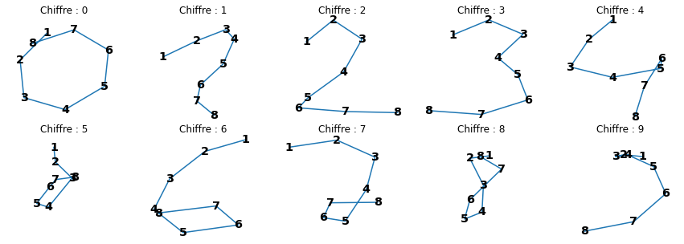
    


*A noter* :

- Les chiffres 0, 1, 2, 3, 4, 6 semblent cohérent ;
- Le chiffre 8 paraît concentré sur la zone centrale ;
- Le chiffre 7, bien que reconnaissable, semble étonnant ;
- Les chiffres 5 et 9 sont difficilement reconnaissable.

## Représentation des tracés sur un plan en 2D

### sur données originales


```python
from sklearn.decomposition import PCA
from sklearn.preprocessing import scale

pca_original = PCA()
pca_original.fit(pen.loc[:,xyN])
pen_original_pca = pca_original.transform(pen.loc[:,xyN])
pen_original_df = pandas.DataFrame({
    "Dim1" : pen_original_pca[:,0], 
    "Dim2" : pen_original_pca[:,1],
    "Chiffre" : pen["chiffre"]
})
```


```python
import seaborn

seaborn.lmplot(data = pen_original_df, x = "Dim1", y = "Dim2", hue = "Chiffre",
              fit_reg = False, height = 8, aspect = 1)
plt.show()
```


    
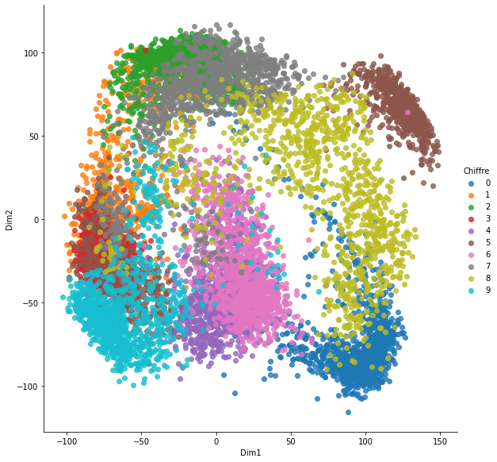
    


```python
import seaborn

seaborn.lmplot(data = pen_original_df, x = "Dim1", y = "Dim2", hue = "Chiffre", 
               col = "Chiffre", col_wrap = 5,
              fit_reg = False)
plt.show()
```


    
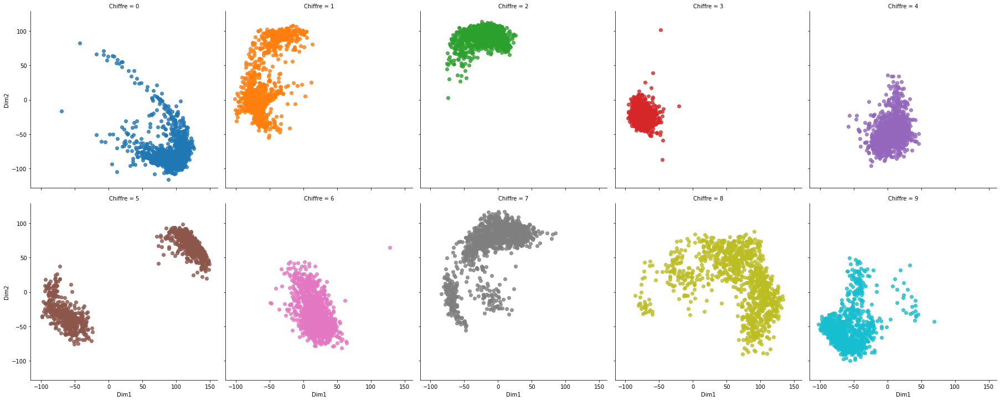
    


*A noter* :

- Les chiffres 2, 3, 4 et 6 dans une moindre mesure, sont regroupés sur une zone restreinte du graphique ;
- Les chiffres 1, 5 (particulièrement), 7, 8 et 9 présentent des groupes séparés ;
- Le chiffre 0 a une forme allongée courbe.

### sur données standardisées


```python
pca_scale = PCA()
pca_scale.fit(scale(pen.loc[:,xyN]))
pen_scale_pca = pca_scale.transform(scale(pen.loc[:,xyN]))
pen_scale_df = pandas.DataFrame({
    "Dim1" : pen_scale_pca[:,0], 
    "Dim2" : pen_scale_pca[:,1],
    "Chiffre" : pen["chiffre"]
})
```


```python
import seaborn

seaborn.lmplot(data = pen_scale_df, x = "Dim1", y = "Dim2", hue = "Chiffre",
              fit_reg = False, height = 8, aspect = 1)
plt.show()
```


    
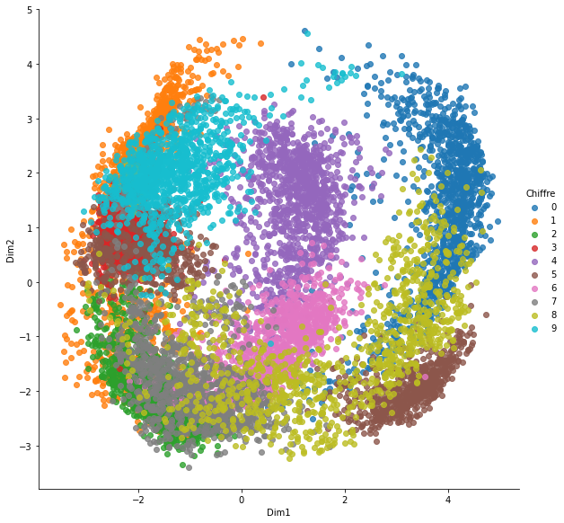
    


```python
import seaborn

seaborn.lmplot(data = pen_scale_df, x = "Dim1", y = "Dim2", hue = "Chiffre", 
               col = "Chiffre", col_wrap = 5,
              fit_reg = False)
plt.show()
```


    
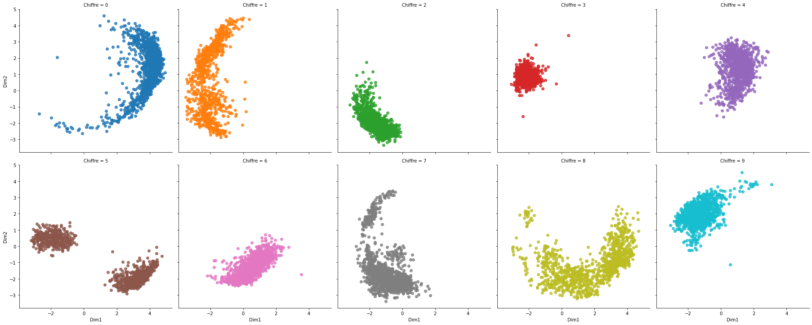
    


*A noter* :

- Le nuage de points a globalement une forme sphérique, due aux valeurs restreintes entre 0 et 100 d'une part, et à la standardisation d'autre part ;
- Les chiffres 2, 3, 4 et 6 dans une moindre mesure, sont la aussi regroupés sur une zone restreinte du graphique ;
- Les chiffres 1, 5 (particulièrement), 7, 8 et 9 présentent encore des groupes séparés ;
- Le chiffre 0 a toujours une forme allongée courbe.

## Recherche des différentes manières d'écrire chaque chiffre

### Importation des élements de `scikit-learn` pour l'utilisation


```python
from sklearn.cluster import AgglomerativeClustering
from sklearn.cluster import KMeans
from scipy.cluster.hierarchy import dendrogram

def plot_dendrogram(model, **kwargs):
    # Create linkage matrix and then plot the dendrogram

    # create the counts of samples under each node
    counts = numpy.zeros(model.children_.shape[0])
    n_samples = len(model.labels_)
    for i, merge in enumerate(model.children_):
        current_count = 0
        for child_idx in merge:
            if child_idx < n_samples:
                current_count += 1  # leaf node
            else:
                current_count += counts[child_idx - n_samples]
        counts[i] = current_count

    linkage_matrix = numpy.column_stack([model.children_, model.distances_, counts]).astype(float)

    # Plot the corresponding dendrogram
    dendrogram(linkage_matrix, **kwargs)
```

### Définition des fonctions

Il est finalement préférable de découper en 2 fonctions :

- une de recherche permettant de représenter le dendrogramme de la CAH et l'évolution de l'inertie intra-classe avec $k$-means
- une appliquant $k$-means avec un nombre de classes choisi, via la précédente


```python
def recherche(chiffre):
    # Restriction aux données d'intérêts + standardisation (nécessaire pour CAH et k-means)
    pen_chiffre = pen.query("chiffre == " + str(chiffre)).drop(columns = "chiffre")
    pen_chiffre_scale = scale(pen_chiffre)
    
    # Réalisation de la CAH avec affichage du dendrogramme
    fig = plt.figure(figsize = (15, 5))
    hac = AgglomerativeClustering(distance_threshold=0, n_clusters=None)
    hac.fit(pen_chiffre_scale)
    plot_dendrogram(hac, ax = fig.add_subplot(1, 2, 1))

    # Réalisation de k-means et affichage de l'évolution de l'intertie intra-classe
    inertia = []
    for k in range(1, 11):
        kmeans = KMeans(n_clusters = k, init = "random", n_init = 20).fit(pen_chiffre_scale)
        inertia = inertia + [kmeans.inertia_]
    ax = fig.add_subplot(1, 2, 2)
    ax.plot(range(1, 11), inertia)
```


```python
def application(chiffre, nb_classes):
    # Restriction aux données d'intérêts + standardisation (nécessaire pour CAH et k-means)
    pen_chiffre = pen.query("chiffre == " + str(chiffre)).drop(columns = "chiffre")
    pen_chiffre_scale = scale(pen_chiffre)
    
    # Réalisation de k-means avec affichage du nombre de tracés pour chaque classe, 
    # des tracés sur le plan factoriel et des tracés moyens de chaque classe
    kmeans = KMeans(n_clusters = nb_classes)
    kmeans.fit(pen_chiffre_scale)
    print("Effectifs des classes")
    for k in range(nb_classes):
        print("Classe {} : {}".format(k, numpy.sum([i == k for i in kmeans.labels_])))
    pca_chiffre = pen_scale_df.query("Chiffre == " + str(chiffre)).assign(classe = kmeans.labels_)
    g = seaborn.lmplot(data = pca_chiffre, x = "Dim1", y = "Dim2", hue = "classe", 
                   col = "classe", fit_reg = False)
    g.set(xlim=(-4, 5), ylim=(-4,5))
    km_centres = pen_chiffre.assign(classe = kmeans.labels_).groupby("classe").mean()
    fig = plt.figure(figsize = (15, 5))
    for k in range(nb_classes):
        ax = fig.add_subplot(1, nb_classes, k + 1) # on ajoute un sous-graphique à la position i+1
        dessin(ax, km_centres.loc[k,xN], km_centres.loc[k,yN], str(k), pos = True, titre = "Classe")
```

### Chiffre 0


```python
recherche(0)
```


    

    


```python
application(0, 4)
```

    Effectifs des classes
    Classe 0 : 260
    Classe 1 : 470
    Classe 2 : 352
    Classe 3 : 61


    
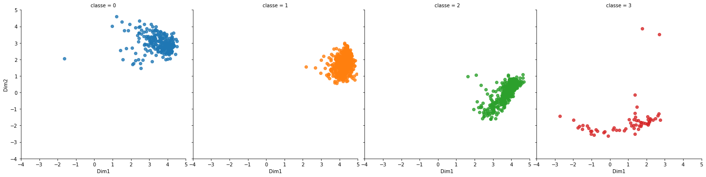
    


    
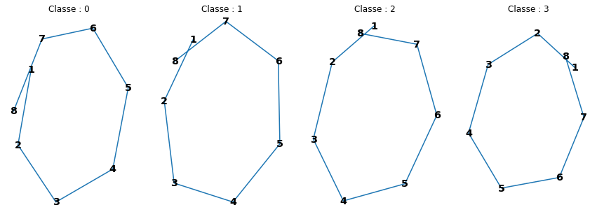
    


*A noter* :

- La partition en 4 classes semble être la plus intéressante ;
- Les représentations sont les mêmes, la différence entre les 4 types de tracés vient du démarrage de celui-ci.

### Chiffre 1


```python
recherche(1)
```


    
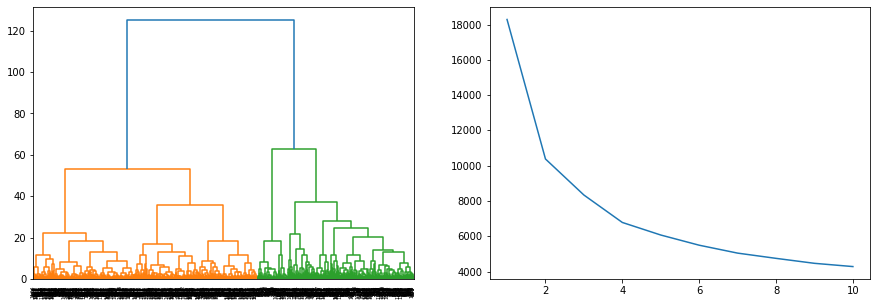
    


```python
application(1, 4)
```

    Effectifs des classes
    Classe 0 : 377
    Classe 1 : 324
    Classe 2 : 96
    Classe 3 : 346


    
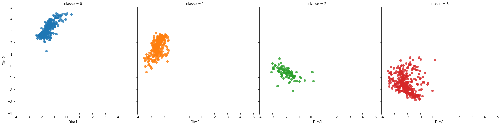
    


    
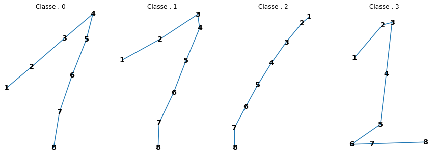
    


*A noter* :

- On peut hésiter entre 2 et 4 classes ;
- Avec 4 classes, on est plus fin sur les distinctions entre les types de tracé :
    - deux classes ont un tracé similaire
    - une classe concerne les tracés avec une barre en bas ;
    - une concerne elle les tracés en un seul trait vertical.

### Chiffre 2


```python
recherche(2)
```


    
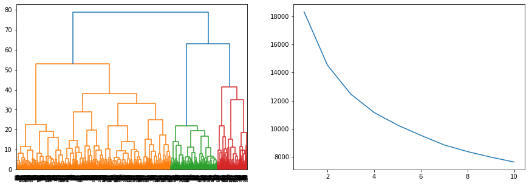
    


```python
application(2, 1)
```

    Effectifs des classes
    Classe 0 : 1144


    
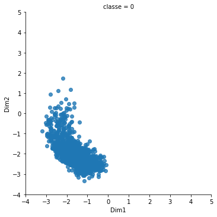
    


    
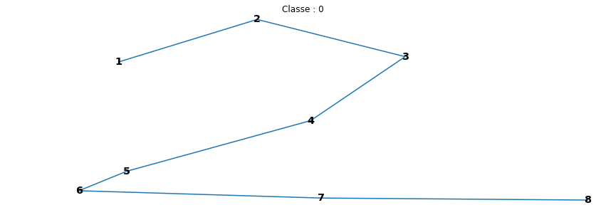
    


*A noter* :

- Il ne semble pas vraiment y avoir plus d'une classe ;
- En testant 2, 3 ou 4 classes (qui peuvent se justifier via la CAH), on remarque que les tracés moyens des classes sont tous identiques.

### Chiffre 3


```python
recherche(3)
```


    
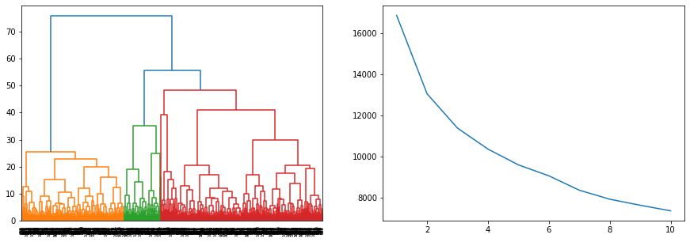
    


```python
application(3, 1)
```

    Effectifs des classes
    Classe 0 : 1055


    
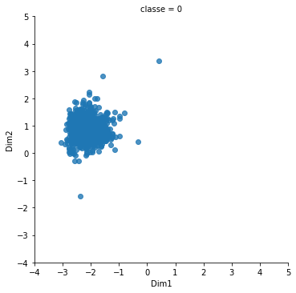
    


    
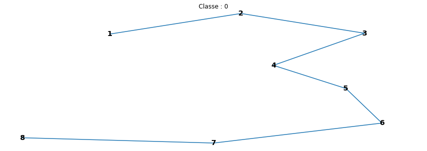
    


*A noter* :

- Il ne semble pas vraiment y avoir plus d'une classe ;
- En testant 2 classes (qui peut se justifier via la CAH), on remarque que les tracés moyens des 2 classes sont identiques.

### Chiffre 4


```python
recherche(4)
```


    
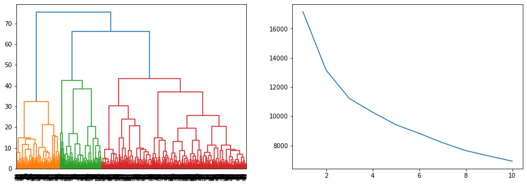
    


```python
application(4, 3)
```

    Effectifs des classes
    Classe 0 : 323
    Classe 1 : 312
    Classe 2 : 509


    
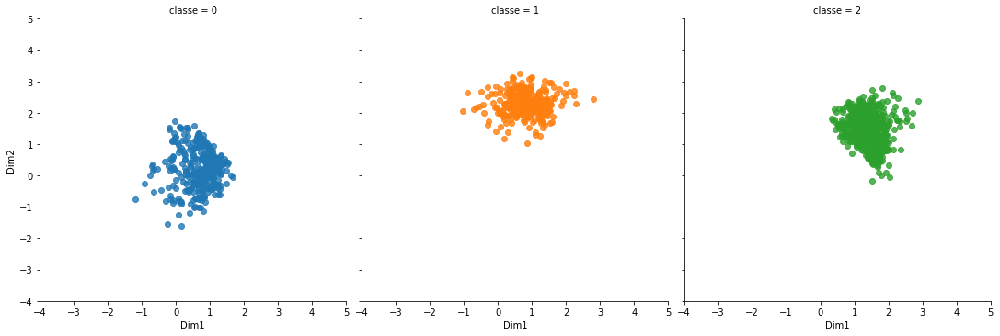
    


    
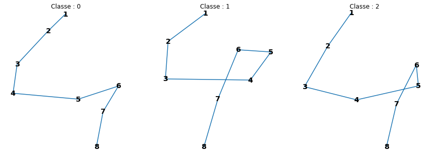
    


*A noter* :

- Ici, seule une partition en 3 classes semble avoir du sens ;
- Les tracés sont assez similaires et divergent entre eux principalement sur la deuxième partie du dessin.

### Chiffre 5


```python
recherche(5)
```


    
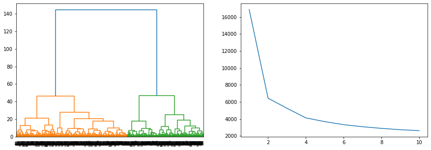
    


```python
application(5, 2)
```

    Effectifs des classes
    Classe 0 : 428
    Classe 1 : 627


    
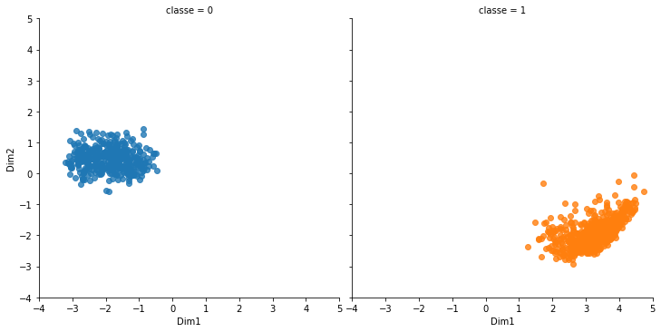
    


    
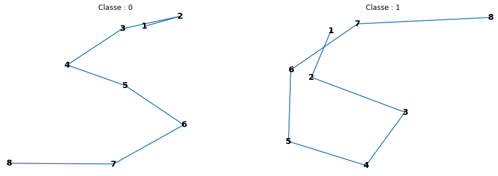
    


*A noter* :

- Il semble assez clair qu'il y a 2 classes très différentes ;
- Une classe concerne les tracés en un seul mouvement, l'autre concernant les tracés en 2 mouvements (avec soulèvement du stylo donc).

### Chiffre 6


```python
recherche(6)
```


    
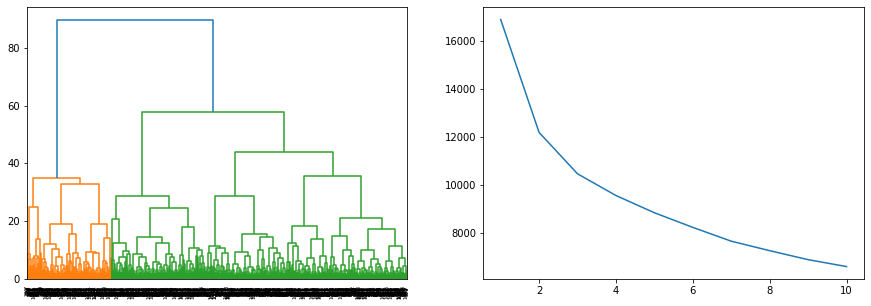
    


```python
application(6, 2)
```

    Effectifs des classes
    Classe 0 : 630
    Classe 1 : 426


    
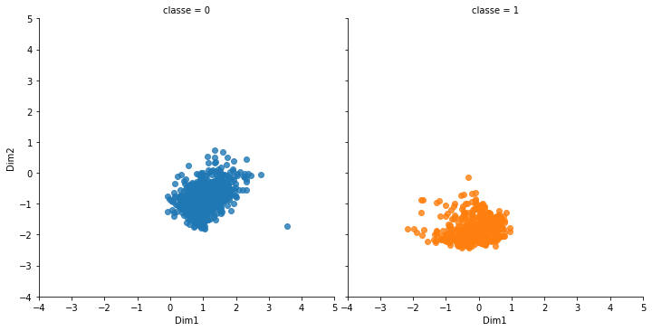
    


    
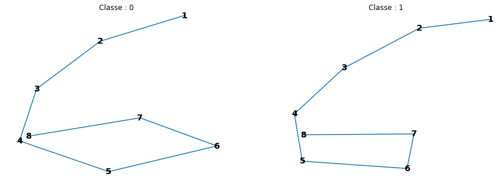
    


*A noter* :

- Il ne semble pas vraiment y avoir plus d'une classe, même si la recherche tend à choisir 2 classes ;
- Les 2 classes ont des tracés moyens quasiment identiques.

### Chiffre 7


```python
recherche(7)
```


    
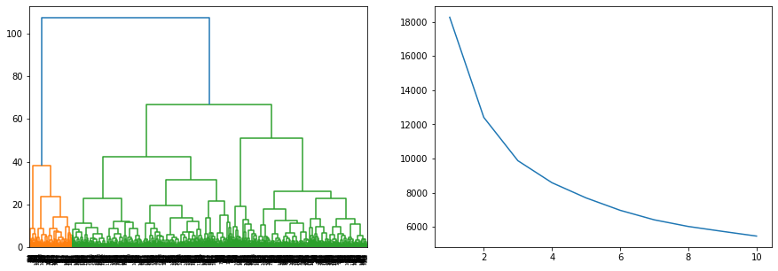
    


```python
application(7, 2)
```

    Effectifs des classes
    Classe 0 : 158
    Classe 1 : 984


    
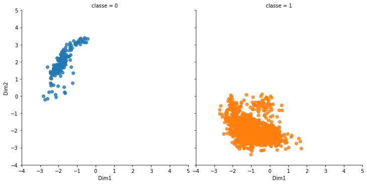
    


    
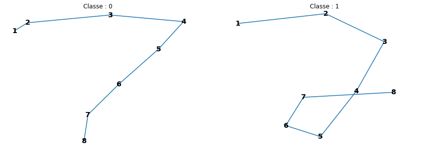
    


*A noter* :

- On peut hésiter entre 2 et 3 classes ;
- La différence est flagrante entre les deux :
    - une classe majoritaire contient les tracés avec une barre au milieu ;
    - une classe minoritaire contient les tracés sans barre au milieu.

### Chiffre 8


```python
recherche(8)
```


    
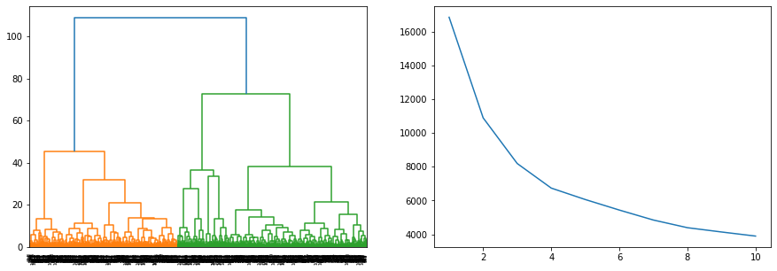
    


```python
application(8, 8)
```

    Effectifs des classes
    Classe 0 : 167
    Classe 1 : 205
    Classe 2 : 54
    Classe 3 : 133
    Classe 4 : 37
    Classe 5 : 167
    Classe 6 : 48
    Classe 7 : 244


    
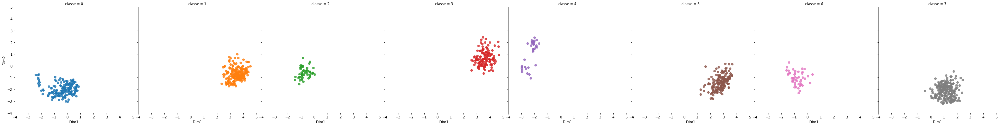
    


    
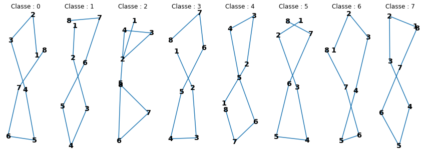
    


*A noter* :

- On pourrait être tenter de choisir 2 ou 3 classes ;
- La partition en 8 classes, bien que sûrement trop fine, dégagent tout de même des profils différents de tracés :
    - en partant du haut (assez classiquement), avec des points de départs différents ;
    - en partant du bas (une classe) ;
    - en réalisant 2 ronds (une classe) ;
    - en tournant dans l'autre sens pour une classe.

### Chiffre 9


```python
recherche(9)
```


    
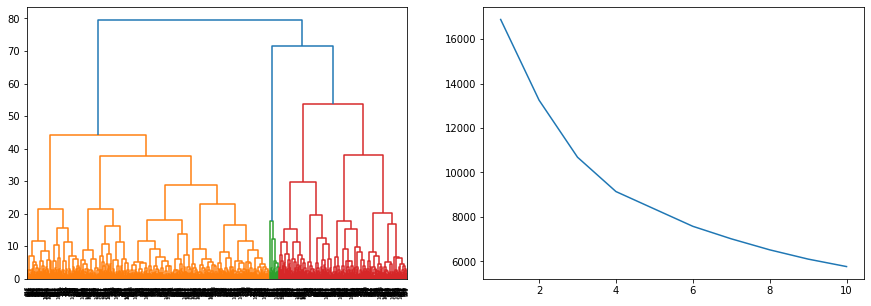
    


```python
application(9, 4)
```

    Effectifs des classes
    Classe 0 : 239
    Classe 1 : 570
    Classe 2 : 25
    Classe 3 : 221


    
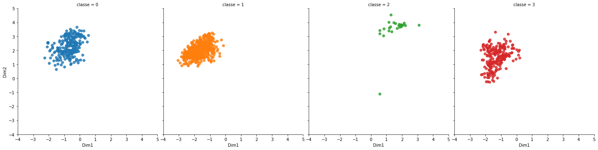
    


    
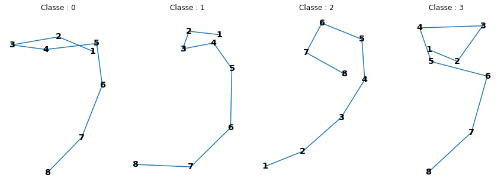
    


*A noter* :

- Le choix de 4 classes semble assez évident ;
- Les tracés sont ainsi assez différents :
    - une classe avec des tracés partant du bas ;
    - une classe avec un rond assez prononcé au début, puis la descente ;
    - deux classes assez proches dans la réalisation au début, et qui divergent sur la fin du dessin.

## Conclusion

Il semble bien que pour certains chiffres, il y ait plusieurs façons de réaliser leur tracé.


```python

```


```python

```
