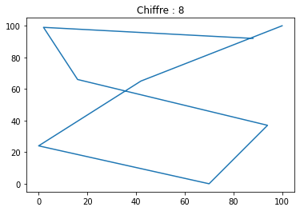
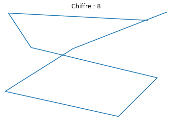
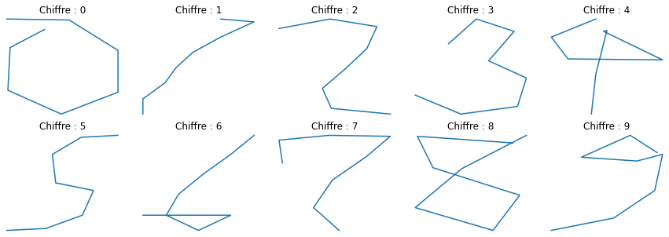

# Application

Dans cette séance, nous verrons l'application des 2 méthodes (ACP et classification) pour rechercher les différentes façons d'écrire chaque chiffre.


```python
import numpy
import pandas
import matplotlib.pyplot as plt

%matplotlib inline
```

Nous allons utiliser les données [`pendigits`](https://archive.ics.uci.edu/ml/datasets/Pen-Based+Recognition+of+Handwritten+Digits) de l'*UCI Machine Learning Repository*. Ces données représentent le tracé des chiffres de 0 à 9 par plusieurs personnes. Pour chaque tracé, nous n'avons au final que les coordonnées $(X,Y)$ de 8 points et le chiffre tracé.

Voici ci dessous comment importer les données directement.


```python
pen_tes = pandas.read_csv("http://archive.ics.uci.edu/ml/machine-learning-databases/pendigits/pendigits.tes", 
                          header=None)
pen_tra = pandas.read_csv("http://archive.ics.uci.edu/ml/machine-learning-databases/pendigits/pendigits.tra", 
                          header=None)
pen = pen_tes.copy().append(pen_tra, ignore_index = True)
print(pen.shape)
pen.head()
```

    (10992, 17)


<div>
<style scoped>
    .dataframe tbody tr th:only-of-type {
        vertical-align: middle;
    }

    .dataframe tbody tr th {
        vertical-align: top;
    }

    .dataframe thead th {
        text-align: right;
    }
</style>
<table border="1" class="dataframe">
  <thead>
    <tr style="text-align: right;">
      <th></th>
      <th>0</th>
      <th>1</th>
      <th>2</th>
      <th>3</th>
      <th>4</th>
      <th>5</th>
      <th>6</th>
      <th>7</th>
      <th>8</th>
      <th>9</th>
      <th>10</th>
      <th>11</th>
      <th>12</th>
      <th>13</th>
      <th>14</th>
      <th>15</th>
      <th>16</th>
    </tr>
  </thead>
  <tbody>
    <tr>
      <th>0</th>
      <td>88</td>
      <td>92</td>
      <td>2</td>
      <td>99</td>
      <td>16</td>
      <td>66</td>
      <td>94</td>
      <td>37</td>
      <td>70</td>
      <td>0</td>
      <td>0</td>
      <td>24</td>
      <td>42</td>
      <td>65</td>
      <td>100</td>
      <td>100</td>
      <td>8</td>
    </tr>
    <tr>
      <th>1</th>
      <td>80</td>
      <td>100</td>
      <td>18</td>
      <td>98</td>
      <td>60</td>
      <td>66</td>
      <td>100</td>
      <td>29</td>
      <td>42</td>
      <td>0</td>
      <td>0</td>
      <td>23</td>
      <td>42</td>
      <td>61</td>
      <td>56</td>
      <td>98</td>
      <td>8</td>
    </tr>
    <tr>
      <th>2</th>
      <td>0</td>
      <td>94</td>
      <td>9</td>
      <td>57</td>
      <td>20</td>
      <td>19</td>
      <td>7</td>
      <td>0</td>
      <td>20</td>
      <td>36</td>
      <td>70</td>
      <td>68</td>
      <td>100</td>
      <td>100</td>
      <td>18</td>
      <td>92</td>
      <td>8</td>
    </tr>
    <tr>
      <th>3</th>
      <td>95</td>
      <td>82</td>
      <td>71</td>
      <td>100</td>
      <td>27</td>
      <td>77</td>
      <td>77</td>
      <td>73</td>
      <td>100</td>
      <td>80</td>
      <td>93</td>
      <td>42</td>
      <td>56</td>
      <td>13</td>
      <td>0</td>
      <td>0</td>
      <td>9</td>
    </tr>
    <tr>
      <th>4</th>
      <td>68</td>
      <td>100</td>
      <td>6</td>
      <td>88</td>
      <td>47</td>
      <td>75</td>
      <td>87</td>
      <td>82</td>
      <td>85</td>
      <td>56</td>
      <td>100</td>
      <td>29</td>
      <td>75</td>
      <td>6</td>
      <td>0</td>
      <td>0</td>
      <td>9</td>
    </tr>
  </tbody>
</table>
</div>


Comme vous le pouvez le remarquer, les noms des variables ne sont pas renseignés. Celles-ci sont $(x_j, y_j)_{j = 1,\ldots,8}$ et le chiffre. On va donc déjà créer le vecteur correspondant.


```python
a = [c + n for c, n in zip(["x", "y"] * 8, [str(x) for x in range(1, 9) for i in range(2)])]
a.append("chiffre")
print(a)
```

    ['x1', 'y1', 'x2', 'y2', 'x3', 'y3', 'x4', 'y4', 'x5', 'y5', 'x6', 'y6', 'x7', 'y7', 'x8', 'y8', 'chiffre']


On va ensuite renommer les colonnes avec ce vecteur.


```python
pen.columns = a
pen.head()
```


<div>
<style scoped>
    .dataframe tbody tr th:only-of-type {
        vertical-align: middle;
    }

    .dataframe tbody tr th {
        vertical-align: top;
    }

    .dataframe thead th {
        text-align: right;
    }
</style>
<table border="1" class="dataframe">
  <thead>
    <tr style="text-align: right;">
      <th></th>
      <th>x1</th>
      <th>y1</th>
      <th>x2</th>
      <th>y2</th>
      <th>x3</th>
      <th>y3</th>
      <th>x4</th>
      <th>y4</th>
      <th>x5</th>
      <th>y5</th>
      <th>x6</th>
      <th>y6</th>
      <th>x7</th>
      <th>y7</th>
      <th>x8</th>
      <th>y8</th>
      <th>chiffre</th>
    </tr>
  </thead>
  <tbody>
    <tr>
      <th>0</th>
      <td>88</td>
      <td>92</td>
      <td>2</td>
      <td>99</td>
      <td>16</td>
      <td>66</td>
      <td>94</td>
      <td>37</td>
      <td>70</td>
      <td>0</td>
      <td>0</td>
      <td>24</td>
      <td>42</td>
      <td>65</td>
      <td>100</td>
      <td>100</td>
      <td>8</td>
    </tr>
    <tr>
      <th>1</th>
      <td>80</td>
      <td>100</td>
      <td>18</td>
      <td>98</td>
      <td>60</td>
      <td>66</td>
      <td>100</td>
      <td>29</td>
      <td>42</td>
      <td>0</td>
      <td>0</td>
      <td>23</td>
      <td>42</td>
      <td>61</td>
      <td>56</td>
      <td>98</td>
      <td>8</td>
    </tr>
    <tr>
      <th>2</th>
      <td>0</td>
      <td>94</td>
      <td>9</td>
      <td>57</td>
      <td>20</td>
      <td>19</td>
      <td>7</td>
      <td>0</td>
      <td>20</td>
      <td>36</td>
      <td>70</td>
      <td>68</td>
      <td>100</td>
      <td>100</td>
      <td>18</td>
      <td>92</td>
      <td>8</td>
    </tr>
    <tr>
      <th>3</th>
      <td>95</td>
      <td>82</td>
      <td>71</td>
      <td>100</td>
      <td>27</td>
      <td>77</td>
      <td>77</td>
      <td>73</td>
      <td>100</td>
      <td>80</td>
      <td>93</td>
      <td>42</td>
      <td>56</td>
      <td>13</td>
      <td>0</td>
      <td>0</td>
      <td>9</td>
    </tr>
    <tr>
      <th>4</th>
      <td>68</td>
      <td>100</td>
      <td>6</td>
      <td>88</td>
      <td>47</td>
      <td>75</td>
      <td>87</td>
      <td>82</td>
      <td>85</td>
      <td>56</td>
      <td>100</td>
      <td>29</td>
      <td>75</td>
      <td>6</td>
      <td>0</td>
      <td>0</td>
      <td>9</td>
    </tr>
  </tbody>
</table>
</div>


Par la suite, nous aurons besoin d'accéder aux $x_j$ uniquement, ou aux $y_j$, voire aux deux. Nous créons donc des vecteurs avec les noms de variables. 


```python
xN = ["x" + str(i + 1) for i in range(8)]
print(xN)
yN = ["y" + str(i + 1) for i in range(8)]
print(yN)
xyN = [a + b for a,b in zip(["x", "y"] * 8, [str(i + 1) for i in range(8) for j in range(2)])]
print(xyN)
```

    ['x1', 'x2', 'x3', 'x4', 'x5', 'x6', 'x7', 'x8']
    ['y1', 'y2', 'y3', 'y4', 'y5', 'y6', 'y7', 'y8']
    ['x1', 'y1', 'x2', 'y2', 'x3', 'y3', 'x4', 'y4', 'x5', 'y5', 'x6', 'y6', 'x7', 'y7', 'x8', 'y8']


Ces données ont l'avantage d'être graphique. Nous allons donc représenter le premier tracé, qui est un $8$.


```python
x = pen.loc[0, xN]
y = pen.loc[0, yN]
chiffre = pen.loc[0, "chiffre"]
plt.plot(x, y)
plt.title("Chiffre : " + str(chiffre))
plt.show()
```


    

    


Nous allons régulièrement utiliser ce code, donc nous allons le stocker dans une fonction nommée `dessin()`. Dans celle-ci, nous allons mettre en paramètre les $x_j$ et les $y_j$, le chiffre, ainsi qu'un graphique dans lequel nous allons mettre le dessin. Ceci nous sera utile pour faire plusieurs représentations de chiffres.


```python
def dessin(p, x, y, chiffre):
    p.plot(x, y)
    p.set_title("Chiffre : " + str(chiffre))
    p.axis("off")
    p.set_xlim([-1, 101])
    p.set_ylim([-1, 101])

fig, ax = plt.subplots()
dessin(ax, x, y, chiffre)
```


    

    


Ensuite, nous créons une liste de `DataFrame`, un pour chaque chiffre. La fonction `query()` permet donc de sélectionner des lignes d'un `DataFrame` en fonction d'une condition (ici, `chiffre` égal 0, 1, ..., 9). Pour éviter les problèmes d'index plus tard, nous devons les réinitialiser pour chaque `DataFrame`, avec la fonction `reset_index()`, en mettant `drop` à vrai. Ceci permet d'oublier les numéros de ligne du `DataFrame` global et que ceux-ci recommencent de 0 pour chaque sous-ensemble.


```python
sub = [pen.query("chiffre == " + str(i)).reset_index(drop = True) for i in range(10)]
```

Nous voulons maintenant représenter chaque premier exemple de chaque chiffre. Pour cela, nous recherchons la première ligne (`index = 0`) pour chaque sous-ensemble précédemment créé. Et pour simplifier le travail ensuite, nous renvoyons pour chaque chiffre, trois éléments : les $x_j$, les $y_j$ et le chiffre.


```python
sub_first_xyc = [[s.loc[0, xN], s.loc[0, yN], s.loc[0, "chiffre"]] for s in sub]
```

Puis, nous créons une figure (en spécifiant la taille). Et pour chaque chiffre, nous ajoutons un graphique à la figure avec la fonction `add_subplot()`. Celle-ci prend trois paramètres : le nombre de lignes, le nombre de colonnes et le numéro de placement du prochain graphique. Grâce à l'utilisation de la fonction  `dessin()` et de l'objet `subxyc`, la réalisation est simple.


```python
fig = plt.figure(figsize = (15, 5))
for i in range(10):
    ax = fig.add_subplot(2, 5, i + 1) # on ajoute un sous-graphique à la position i+1
    dessin(ax, sub_first_xyc[i][0], sub_first_xyc[i][1], sub_first_xyc[i][2])
```


    

    


Le but de ce TP va être de réfléchir à comment répondre à la question suivante :

> Existe-t'il plusieurs façons d'écrire chaque chiffre ?

Pour cela, nous allons dérouler les étapes suivantes :

1. Calculer la moyenne de chaque coordonnée $x_j$ et $y_j$, pour chaque chiffre
1. Représenter le tracé des *chiffres moyens* (i.e. en prenant les coordonnées moyennes donc)
    - Améliorer éventuellement la fonction `dessin()` pour ajouter, si demandé, les numéros des points
1. Réaliser une ACP sur les données (en comparant avec ou sans standardisation)
1. Représenter les chiffres sur le plan factoriel
    - sur un seul graphique
    - avec un graphique par chiffre, sur la même figure
1. Réaliser une classification via HAC et $k$-means pour chaque chiffre
    - créer une fonction prenant en paramètre un nombre de classes à tester et qui réalise les opérations suivantes :
        - calcul de la partition
        - affichage de la répartition des classes (*i.e* combien d'individus dans chaque classe ?)
        - représentation des classes sur le plan factoriel (un graphique par classe éventuellement)
        - représentation des tracés moyens pour chaque classe afin de mieux comprendre les différences entre les classes
    - A l'aide de cette fonction, choisir un nombre de classes approprié


```python

```
