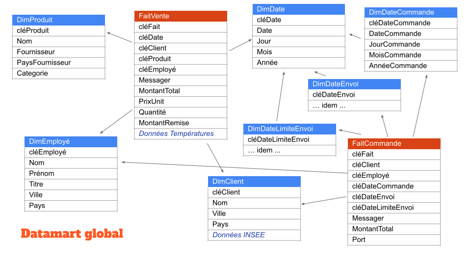

# Intégration de données

Nous allons réaliser le processus ETL sur le datamart vu en cours. Vous devez d'abord télécharger la base [`Comptoir2000`](https://fxjollois.github.io/donnees/Comptoir2000/Comptoir2000.sqlite) au format `SQLite`. Pour rappel, voici le schéma du datamart souhaité.



## Création d'un cube et Manipulation sous R

A l'heure actuelle, il existe un package permettant la création et la manipulation de cube au sens OLAP dans R, c'est [`hypercube`](https://cran.r-project.org/package=hypercube). Il existe aussi le package [`data.cube`](https://gitlab.com/jangorecki/data.cube), mais qui ne semble plus maintenu. Et nous verrons d'autres outils intéressant sur [`shiny`](https://shiny.rstudio.com/) dans la suite du cours, en particulier [`rpivotTable`](https://github.com/jangorecki/rpivotTable).

R peut stocker des données dans des tableaux à $n$ dimensions, grâce au type `array` ce qui s'apparente à des hypercubes donc. La librairie `hypercube` surcharge ce type permettant quelques opérations OLAP classiques.

### Création d'un cube

Nous allons utiliser les données `CA`, du premier TP, mais au format R cette fois-ci. Elles sont disponibles sur [ce lien](https://fxjollois.github.io/donnees/ca/ca.RData) (fichier `.RData`). Une fois chargée dans l'espace de travail de R, vous devriez trouver la table `ca_tout`, résultat de la jointure entre toutes les tables du data-mart.

Il est donc possible de créer un cube dans la commande `generateCube()` :

- on se base donc sur un data-frame
- les colonnes sont la listes des dimensions, avec la possibilité de créer une hiérarchie (ici, `groupe`  et `mois`)
- les valeurs du cube sont prises à partir d'une variable

```r
library(hypercube)
cub = generateCube(
  ca_tout, 
  columns = list(
    groupe = c("departement", "groupe", "sous_groupe"),
    mois = c("annee", "mois_numero"),
    provenance = "provenance"
  ),
  valueColumn = "ca"
)
```

### Manipulation du cube

L'affichage du cube obtenu n'est pas très intéressant directement.

#### Sélection 

Pour ne sélectionner qu'une partie du cube, on utilise la fonction `agg.selection()` comme ci-dessous :

```r
add.selection(
  cub, 
  criteria = list(
    annee = 2004,
    departement = "Meubles",
    groupe = "Meubles intérieurs",
    sous_groupe = as.character(
      subset(groupe, departement == "Meubles" & groupe == "Meubles intérieurs")$sous_groupe
    )
  )
)
```

Ici, nous avons tous les CA pour 2004, pour le département "Meubles", et plus particulièrement le groupe "Meubles intérieurs", pour tous les sous-groupes et toutes les provenances. On voit ici que la notion de hiérarchie n'est pas correctement gérée, puisque nous devons spécifié les sous-groupes à garder (alors que cela devrait être automatique finalement).

Il faut noter qu'on peut ajouter des éléments dans notre sélection, sans avoir besoin de reprendre le cube initial. Toutes les données sont conservées dans le cube résultat. De plus, on peut supprimer une sélection avec la fonction `remove.selection()`.

#### Aggrégation

Il est aussi possible de résumer le cube selon un ou plusieurs dimensions, en utilisant une fonction d'aggrégat (généralement `sum()`, mais cela peut aussi être `min()`, `max()`, `mean()`, ...). Pour cela, nous utilisons la fonction `add.aggregation()` :


```r
add.aggregation(
  cub,
  dimensions = c("departement", "mois_numero"),
  fun = "sum"
)
```

Dans l'exemple ci-dessus, nous avons les CA par département et par mois (les deux années cumulées).

Comme pour la sélection, il est possible d'ajouter un agrégat sur le résultat, ou de "revenir en arrière" et donc retrouver les données initiales ou désagrégées, avec la fonction `remove.aggregation()`.

### Travail à faire

1. Créer un cube pour chaque processus, avec les dimensions suivantes (et comme valeur le montant de la vente)
    - Fait Vente d'un produit : 
        - Date : Mois, Année
        - Client : Ville, Pays
        - Produit : Fournisseur, Catégorie
        - Employé : Ville, Pays
    - Fait Commande d'un client :
        - Date de commande : Mois, Année
        - Client : Ville, Pays
        - Employe : Ville, Pays
1. Essayez de réaliser quelques sélections et aggrégations sur ces 2 cubes


